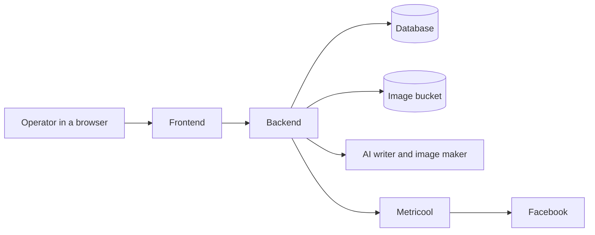
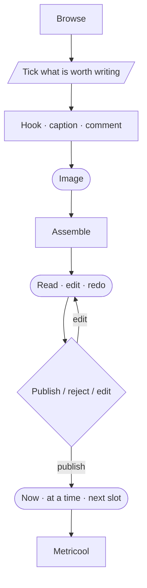
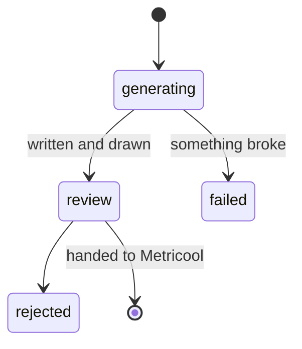
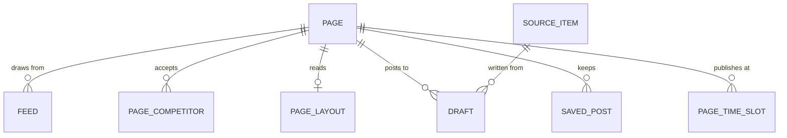

# fb-agent


The agent helps manage several Facebook Pages. It gathers material worth
posting, writes a draft in the Page's voice, and produces the image that goes
with it. A person reviews the draft, edits as needed, and either publishes it or
discards it. Metricool handles the actual posting and adds the first comment.

## Pages

The Pages this agent currently writes for.

| | Page | Facebook |
|---|---|---|
|  | History Retraced | [facebook.com](https://www.facebook.com/569035169625026) |
|  | The Fact Feed | [facebook.com](https://www.facebook.com/603815099479680) |
|  | Bible Focus | [facebook.com](https://www.facebook.com/716243634914791) |
|  | Bodybuilding Tips N Tricks | [facebook.com](https://www.facebook.com/335270636513940) |
|  | Fitness Girls | [facebook.com](https://www.facebook.com/190385971070847) |
|  | Fitness Recipes | [facebook.com](https://www.facebook.com/174689475989202) |
|  | GYM Motivation | [facebook.com](https://www.facebook.com/242430195788437) |
|  | House of Common Sense | [facebook.com](https://www.facebook.com/518809444814591) |

## Language

One meaning each, in the code and on screen.

| Word | What it means | Avoid |
|---|---|---|
| **Page** | An owned Facebook Page. Owns its watermark, feeds, competitor assignments, and any layout overrides. Adding one is an insert | brand, blog, `hr`/`tff` |
| **Source Item** | A piece of outside material chosen as input. Exactly three kinds | inspiration post, article |
| **Competitor** | A Page not ours, synced from Metricool. Metricool owns the list; we store their *posts*. The word is Metricool's own, its endpoint is `/analytics/competitors` | rival |
| **Binding subject** | Every Source Item's subject binds, the post is about that same story. Competitor posts no longer do | Style Source, Factual Source |
| **Cart** | Source Items ticked for the next run | selection, basket |
| **Draft** | A generated post awaiting review: hook, caption, first comment, highlighted phrases, image. One Source Item yields one Draft per Page | post, candidate |
| **Approve** | A legacy status nothing new writes, kept only for rows that already carry it. Publishing is its own decision | schedule, publish |
| **Warning** | A style rule the writer still broke after its retries. Residue, not advice, never blocks Approve | |
| **Composed Image** | The finished 896×1120 image: hero photograph, text panel, gold highlights, watermark. Two forms, `card` and `full_overlay` | overlay, composite |
| **Highlight Phrase** | An exact substring of the panel text, copied verbatim, rendered in gold | |

## Background

Posts used to be made by hand: scrolling for material, holding a voice in your
head, a second tool for the picture and a third for scheduling.

An earlier system automated parts of it and made one bad mistake: **it kept its
own copies of things it did not own** - the schedule, the competitor list, and
every writing instruction. The copies drifted, and a drifted copy produces
confident, well-formed output about the wrong thing. So this system reads that
kind of thing live and stores none of it.

## Features

**Gathering.** Material is read live and stored only once chosen.

| | |
|---|---|
| Competitor posts | Synced from Metricool, a week back, sorted by reactions with newest kept beside it. Reach shown per competitor |
| RSS | Per-Page feeds, added and removed on Settings. Seven-day window, newest first, capped at 50 |
| Tweets | Paste an X link |
| Cart | Tick across all three kinds; one run yields one Draft per ticked item per Page |

**Writing.**

| | |
|---|---|
| Hook, caption, first comment | Written in the Page's voice from `prompts/*.txt`, per-Page overrides editable on screen |
| Style rules | Hook length, no question mark, paragraph counts, body length, birth-death years, meta phrases. Enforced with retries first; what survives is a **warning**, never a block |
| Highlight phrases | Exact substrings of the panel text, chosen by the writer, drawn in gold |
| Vision input | A competitor post's picture is sent to the writer, not just its words |
| Rewrite one field | Re-ask for the hook, caption or first comment while the rest is held. Optional instruction ("too short", "mention the year"). **A proposal, not a save** |
| Manual | A Draft with no source: type it whole, or give a topic. Typed text calls no model, and its rule breaks are recorded as warnings |

**The picture.** 896×1120, `card` (hero above panel) or `full_overlay`.

| | |
|---|---|
| Hero | Generated by Gemini, or taken from the source's own photograph |
| Upload your own | For subjects the model never gets right - the panel, highlights and watermark are still drawn on top |
| Image prompt | Editable per Draft, so the next hero is drawn from your words |
| Panel | Grows to fit the text, gold highlights, Page watermark, optional circular inset with its own size, border and placement |
| Layout | Form, panel size, type size, colours, capitals - global defaults in `layout.yml`, per-Page overrides with a sample render and a reset |
| Text-only | `no_image` is a deliberate choice, distinct from a picture that failed |

**Review and publish.**

| | |
|---|---|
| Queue | The Draft, its Facebook preview, the source it came from, its warnings |
| Three ways out | Now, at a time, or the Page's next free slot - free measured against Metricool's planner, never a local mirror |
| Rehearsal | The screen says whether Publish reaches an audience before it is pressed |
| Queued stays yours | Caption and first comment edit in place and push to Metricool. Anything **drawn** needs the post removed first. Move it, or remove it and it returns to review |
| Frozen | A published Draft takes no edits and no image rebuild |

**After it goes out.**

| | |
|---|---|
| Overview | How the Page's posts did, read live from Metricool |
| Save | Keep a top performer with its metrics as they were |
| Write again | The same story back through the writer - fresh hook, copy and picture |
| Repost | The original caption, first comment and picture as published, put back in the queue as a Draft |

**Running it.** Sign-in on a signed cookie; generation runs in the background with
a progress figure, a restart fails its stragglers rather than leaving them
looking ready, and `GET /health` reports the bucket, the models and the *names*
of any missing secrets.

## Architecture



Two deployables. The **frontend** holds no data and can only ask the backend for
things. The **backend** owns the database, the pictures, the AI calls and every
outside connection.

## Workflow



State lives in exactly two places: the `draft` row and Metricool's planner. The
agent never reaches Metricool on its own; a person always reviews before publish.

**Material.** Three kinds, read live and never stored:

| Kind | Source | The writer treats it as |
|---|---|---|
| Competitor post | Metricool's tracking | Tone only - not about their subject |
| RSS item | Feeds chosen for the Page | Binding - about that story |
| Tweet | An X link the operator pastes | Binding |

**A run.** Material becomes a Draft row only when actually chosen. The writer
then makes hook, caption and first comment, checks itself against the writer's
instructions and retries; the image is generated and assembled after. Anything
still broken is a **warning, not a block** - the operator decides.

**Publishing.** Refused for a Draft already sent, and a published Draft
**freezes** - no edits, no image rebuild. Metricool stores a *link* that
Facebook fetches when the post is due, possibly days later, so the file must
still be there.

**Queued stays yours.** In the planner the drawer can edit text, **move** the
post, or **remove** it - no trip to Metricool. The picture stays frozen unless
removed first. Metricool has no in-place update, so every edit changes the
post's id; the app follows the new one.

**Rehearsal mode** (on by default) stops Metricool pushing posts on to Facebook.
They still reach Metricool and appear in the planner.

## Draft Lifecycle



| | |
|---|---|
| `failed` is not `review` | A failed run is not a post awaiting a decision |
| A restart mid-run fails the stragglers | Otherwise they sit in the queue looking ready |
| Publishing is not approval | Approve is legacy and nothing writes it now. Three ways out: now, at a time, or the next free slot |
| Queued is recoverable; posted is not | Once Facebook has it, the app is done |

## Data Model



| Table | Holds |
|---|---|
| **page** | Name, Facebook and Metricool ids, watermark and avatar files |
| **feed** | One RSS feed a Page reads. Added and removed on screen |
| **saved_post** | A published post the operator kept for reference, with its metrics as saved |
| **page_time_slot** | A Page's standing publishing times. Policy, not schedule state, so no contradiction with the "no schedule table" rule |
| **page_competitor** | Which competitors each Page reads. **Not a copy of Metricool's list** - a decision on top of it |
| **page_layout** | Per-Page overrides: which of the two forms, panel size, text size, colours, watermark and inset placement. **Only what that Page changed** - the rest tracks the defaults file, so resetting a Page is deleting its row |
| **source_item** | Material actually chosen. One table for all three kinds |
| **draft** | The post: words, pictures, progress, warnings, and Metricool's id once sent |

Three absences, each deliberate:

| Not here | Why |
|---|---|
| **No schedule table** | Metricool's planner is the truth and is read live. The most important thing in this data model, and why the old system ran empty |
| **No competitor list table** | The list belongs to Metricool |
| **No user accounts** | One operator, no roles, no tenancy - which is also why signing in is a password against an environment variable and a signed cookie |

**Competitors are a shared pool.** Metricool allows 100 per *account*, not per
Page, so five Pages watching the same twenty sources cannot each be given them.
A competitor is added once under whichever Page has room, then assigned to every
Page that should read it.

### Image Storage

Supabase Storage, not the database. Rows store a **path**, never a web address,
so changing bucket or project is configuration rather than a migration.

| In the bucket | Committed with the code |
|---|---|
| Generated photographs | Page watermarks |
| Finished cards (JPEG) | Page avatars |
| Operator-uploaded inset photos | The font |

## Screens

| Screen | For |
|---|---|
| **Sign in** | Email and password. Everything else is behind it |
| **Overview** | How the Page's posts did, read live from Metricool, and the posts worth keeping |
| **Sources** | Browse material and gather what is worth writing |
| **Manual** | Start a post with no source behind it: write it by hand, or from a topic |
| **Review** | The queue of Drafts, and the decision on each |
| **Schedule** | What is actually planned, read live from Metricool |
| **Settings** | This Page: feeds, watermark, publishing times, which competitors it reads |
| **Global** | The whole account: the competitor pool and its budget, the card layout, the writing instructions |

Every screen after sign-in is scoped to the selected Page, remembered between
visits - except Global, which is the whole account.

## Running it

```bash
cp .env.example .env              # backend, then fill it in
cp web/.env.example web/.env.local # frontend, then fill it in

cd api && uv sync
uv run python scripts/seed_page.py     # once; idempotent
uv run fastapi dev app/main.py         # :8000

cd web && npm install
npm run dev                            # :3000
```

Drive **`http://localhost:3000`**, never `127.0.0.1:3000` - Next blocks
`/_next/*` from an origin it does not know, and the page then renders as
skeletons that never resolve, with the warning only on the dev server's stdout.

Checks, all of which should be clean:

```bash
api/  uv run pytest -q
api/  uv run alembic check      # "No new upgrade operations detected"
web/  npx tsc --noEmit
web/  npx eslint src
```

`alembic check` is the one tests cannot cover: the suite builds its schema from
the models, so it verifies the models and never the migrations. Schema changed?

```bash
cd api
uv run alembic revision --autogenerate -m "what changed"
uv run alembic upgrade head
```

The app also runs `upgrade head` at startup, so a deploy migrates itself.

**Configuration is a file, not a row:**

| | |
|---|---|
| `api/config/layout.yml` | The Composed Image's defaults. A `page_layout` row overrides individual values |
| `api/config/sources.yml` | Windows and grid caps. **Not the feed list** - those are `feed` rows, edited from Settings |
| `api/prompts/*.txt` | `system`, `overlay`, `image`. Read on every generation, so no restart. `{panel_pct}` and `{highlight_color}` are filled from `layout.yml` - do not paste the numbers in |

Both YAML files are parsed at import, so a bad value fails the boot rather than
the render. `GET /health` reports the bucket, image size, models, and the *names*
of any missing secrets. On Windows, set `PYTHONIOENCODING=utf-8` before
redirecting output.

## Environment

### Backend

| Key | For |
|---|---|
| `API_KEY` | Shared secret every request must carry |
| `DATABASE_URL` | Supabase Postgres |
| `SUPABASE_URL` · `SERVICE_KEY` · `BUCKET` | Where pictures are stored and served |
| `GEMINI_API_KEY` | The writer and image maker |
| `GEMINI_*_MODEL` | Model choices - see Choosing models below |
| `METRICOOL_API_TOKEN` · `USER_ID` | Competitor posts, planner, publishing |
| `METRICOOL_PUBLISH_AS_DRAFT` | Rehearsal mode: keeps posts as drafts |
| `X_BEARER_TOKEN` | Reading pasted tweets |
| `APP_EMAIL` · `APP_PASSWORD` | The sign-in |
| `AUTH_SECRET` | Signs the session cookie. Blank denies every session |
| `API_ORIGIN` | Where the backend is |

None are exposed to the browser; a `NEXT_PUBLIC_` prefix would. Model names live
in `.env`, never code, so an upstream retirement is an env change, not a
release. **Verify a candidate by generating from it** - `models.list()` reports
ids that 404 on use.

### Choosing models

| | Now | Chain |
|---|---|---|
| Writer | `gemini-3.5-flash` | `gemini-3.6-flash` |
| Image | `gemini-2.5-flash-image` | *none* |

Text has a fallback chain tried on 503/429; the image does not because
`image/hero.py` already retries a single model three times. Only 503/429 walk
the chain - a retired id 404s and errors rather than silently spending attempts.

### What it costs

| | |
|---|---|
| **Gemini** | The only per-run spend: one text and one image call per Draft, the image the expensive half. Re-composing a card after an edit is free |
| **Metricool** | Flat plan, hard allowance of **100 competitors per account** on Starter and Advanced. The Global screen shows how much is used |
| **Supabase** | Database and bucket. Storage grows with every image; superseded cards are deleted by exact path |
| **X** | One tweet at a time, on paste |