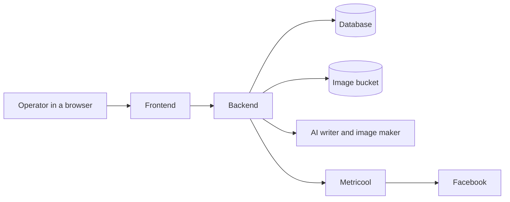
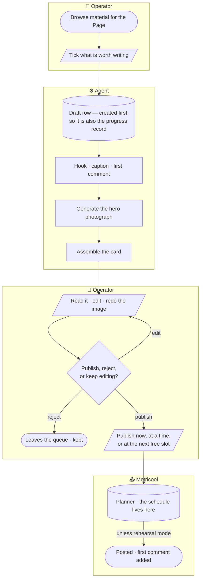
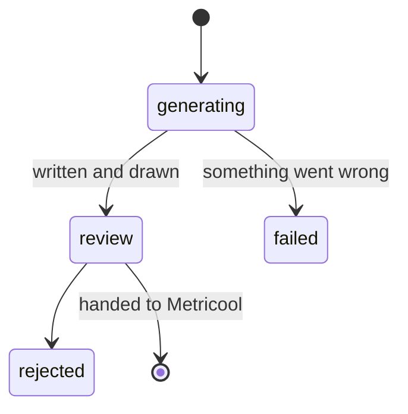
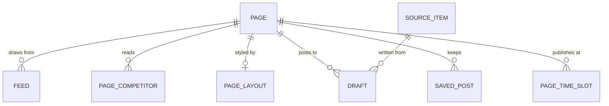

# fb-agent


The agent helps manage several Facebook Pages. It gathers material worth
posting, writes a draft in the Page's voice, and produces the image that goes
with it. A person reviews the draft, edits as needed, and either publishes it or
discards it. Metricool handles the actual posting and adds the first comment.

## Pages

The Pages this agent currently writes for.

| | Page | Facebook |
|---|---|---|
|  | History Retraced | [facebook.com](https://www.facebook.com/569035169625026) |
|  | The Fact Feed | [facebook.com](https://www.facebook.com/603815099479680) |
|  | Bible Focus | [facebook.com](https://www.facebook.com/716243634914791) |
|  | Bodybuilding Tips N Tricks | [facebook.com](https://www.facebook.com/335270636513940) |
|  | Fitness Girls | [facebook.com](https://www.facebook.com/190385971070847) |
|  | Fitness Recipes | [facebook.com](https://www.facebook.com/174689475989202) |
|  | GYM Motivation | [facebook.com](https://www.facebook.com/242430195788437) |
|  | House of Common Sense | [facebook.com](https://www.facebook.com/518809444814591) |

## Language

One meaning each, in the code and on screen.

| Word | What it means | Avoid |
|---|---|---|
| **Page** | An owned Facebook Page. Owns its watermark, feeds, competitor assignments, and any layout overrides. Adding one is an insert | brand, blog, `hr`/`tff` |
| **Source Item** | A piece of outside material chosen as input. Exactly three kinds | inspiration post, article |
| **Competitor** | A Page not ours, synced from Metricool. Metricool owns the list; we store their *posts*. The word is Metricool's own — its endpoint is `/analytics/competitors` | rival |
| **Style Source** | A Source Item whose subject is **not** binding — borrowed for tone only. Competitor posts | |
| **Factual Source** | A Source Item whose subject **is** binding. Tweets and RSS items | |
| **Cart** | Source Items ticked for the next run | selection, basket |
| **Draft** | A generated post awaiting review: hook, caption, first comment, highlighted phrases, image. One Source Item yields one Draft per Page | post, candidate |
| **Approve** | A legacy status nothing new writes — kept only for rows that already carry it. Publishing is its own decision | schedule, publish |
| **Warning** | A style rule the writer still broke after its retries. Residue, not advice — never blocks Approve | |
| **Composed Image** | The finished 896×1120 image: hero photograph, text panel, gold highlights, watermark. Two forms, `card` and `full_overlay` | overlay, composite |
| **Highlight Phrase** | An exact substring of the panel text, copied verbatim, rendered in gold | |

---

## Background

Posts used to be made by hand: scrolling for material, holding a voice in your
head, a second tool for the picture and a third for scheduling.

An earlier system automated parts of it and made one bad mistake, which shapes
everything here: **it kept its own copies of things it did not own** — the
schedule, the competitor list, every writing instruction. The copies drifted,
and a drifted copy produces confident, well-formed output about the wrong thing.
Its schedule table held zero rows while 237 posts sat approved. Not stale.
Empty, and still treated as the truth.

So this system reads that kind of thing live and stores none of it.

---

## Architecture



Two deployables. The **frontend** holds no data and can only ask the backend for
things. The **backend** owns the database, the pictures, the AI calls and every
outside connection.

---

## Workflow



Four boxes, and the operator holds two of them — the agent never reaches
Metricool on its own. The two cylinders are the only places state lives: our
`draft` row and Metricool's planner, and there are two on purpose.

**Material.** Three types, all shown per Page:

| Type | Comes from | The writer treats it as |
|---|---|---|
| Competitor post | Metricool's competitor tracking | **Tone only** — the post is not about their subject |
| RSS item | Feeds chosen for that Page | **Binding** — the post is about that story |
| Tweet | An X link the operator pastes | **Binding** |

Treating a competitor's post as binding writes a post about a rival's topic;
treating a news article as tone-only writes a post about nothing in particular.
It is worked out from the kind every time, never stored, so it cannot drift.

**The run:**

| Stage | What happens | Why it is like this |
|---|---|---|
| Browse | Nothing is written | Material becomes a row only when actually chosen |
| Generate | The Draft row is created *before* any work | It doubles as the progress record — which is why there is no job queue and no events table anywhere |
| Write | Hook, caption, first comment · 20% | The writer checks its own work against the Page's rules and retries |
| Draw | Hero photograph · 60% | Hero and finished card stored separately, so re-assembling after an edit does not pay for a new photograph |
| Assemble | Photograph, black text panel, watermark, optional round inset · 100% | |
| Review | The card exactly as Facebook will show it | Caption, hook, first comment and highlights edit without regenerating; the image alone can be redone |
| Publish | Handed to Metricool with a time | Metricool posts it and adds the first comment. This app never touches Facebook |

Anything still broken after the writer's retries is attached as a **warning, not
a block** — the operator decides whether it matters.

**Publishing, twice over:** refused for a Draft already sent, and a published
Draft **freezes** — no edits, no image rebuild. Metricool stores a *link*, and
Facebook fetches it when the post is due, possibly days later, so the file must
still be there and unchanged. The time is on the Page's clock; left as it comes,
it means as soon as Metricool will take it.

**A queued post is still yours.** Once it is in the planner the drawer can edit
its caption and first comment, **Move** it to another time, or **Remove** it
from the planner entirely — no trip to Metricool. What stays frozen is the
picture, for the reason above: the planner holds a link to a file Facebook has
not fetched yet, and rebuilding the image deletes what that link points at.
Remove first, then redraw. Note that Metricool has no in-place update, so every
edit replaces the post and **its id changes**; the app follows the new id.

**Rehearsal mode** keeps everything as Metricool drafts. The post still reaches
Metricool and appears in the planner; what it stops is Metricool pushing on to
Facebook. On by default — it is how the path gets exercised without an audience.

---

## Draft Lifecycle



| | |
|---|---|
| `failed` is not `review` | A run that produced nothing is not a post awaiting a decision. When they shared a state, empty rows sat in the queue looking ready |
| A restart mid-run fails the stragglers | Otherwise they sit in the queue forever, looking like work about to finish |
| Publishing is not approval | Approve was the old queue movement and nothing writes it now. Publishing is its own decision — three ways out: now, at a time, or at the next free slot |
| Queued is recoverable; published is not | A post still in the planner can be edited, moved or removed from the drawer. Once Facebook has it, this app is done — it never touches Facebook |

---

## Data Model



| Table | Holds |
|---|---|
| **page** | Name, Facebook and Metricool ids, which watermark and avatar files to use |
| **feed** | One RSS feed a Page reads. Added and removed on screen |
| **saved_post** | A published post the operator kept for reference, with its metrics as saved — it survives the rolling reporting window |
| **page_time_slot** | A Page's standing publishing times. Policy, not schedule state, so no contradiction with the "no schedule table" rule — what is actually queued is still read live |
| **page_competitor** | Which competitors each Page reads. **Not a copy of Metricool's list** — a decision on top of it |
| **page_layout** | Per-Page overrides: which of the two forms, panel size, text size, colours, watermark and inset placement. **Only what that Page changed** — everything else keeps tracking the defaults file, so resetting a Page is deleting its row |
| **source_item** | Material actually chosen. One table for all three kinds |
| **draft** | The post: words, pictures, progress, warnings, and Metricool's id once sent |

Three absences, each deliberate:

| Not here | Because |
|---|---|
| **No schedule table** | Metricool's planner is the truth and is read live. The most important thing in this data model, and the old system's empty schedule table is why |
| **No competitor list table** | The list belongs to Metricool |
| **No user accounts** | One operator, no roles, no tenancy — which is also why signing in is a password against an environment variable and a signed cookie, with nothing to look a session up in |

**Competitors are a shared pool.** Metricool allows 100 per *account*, not per
Page, so five Pages watching the same twenty sources cannot each be given them.
A competitor is added once under whichever Page has room, then assigned to every
Page that should read it. A Page with no assignments falls back to whatever set
it owns in Metricool.

### Image Storage

Supabase Storage, not the database. Rows store a **path**, never a web address,
so changing bucket or project is configuration rather than a migration.

| In the bucket | Committed with the code |
|---|---|
| Generated photographs | Page watermarks |
| Finished cards (JPEG) | Page avatars |
| Operator-uploaded inset photos | The font |

---

## Screens

| Screen | For |
|---|---|
| **Sign in** | Email and password. Everything else is behind it |
| **Overview** | How the Page's posts did, read live from Metricool, and the posts worth keeping |
| **Sources** | Browse material and collect what is worth writing |
| **Manual** | Start a post with no source behind it: write it by hand, or from a topic |
| **Review** | The queue of Drafts, and the decision on each |
| **Schedule** | What is actually planned, read live from Metricool |
| **Settings** | This Page: feeds, watermark, publishing times, which competitors it reads |
| **Global** | The account: the competitor pool and its budget, the card layout, the writing instructions |

Every screen after sign-in is scoped to the selected Page, remembered between
visits — except Global, which is the whole account.

---

## Running it

```bash
cp .env.example .env              # backend, then fill it in
cp web/.env.example web/.env.local # frontend, then fill it in

cd api && uv sync
uv run python scripts/seed_page.py     # once; idempotent
uv run fastapi dev app/main.py         # :8000

cd web && npm install
npm run dev                            # :3000
```

Drive **`http://localhost:3000`**, never `127.0.0.1:3000` — Next blocks
`/_next/*` from an origin it does not know, and the page then renders as
skeletons that never resolve, with the warning only on the dev server's stdout.

Checks, all of which should be clean:

```bash
api/  uv run pytest -q
api/  uv run alembic check      # "No new upgrade operations detected"
web/  npx tsc --noEmit
web/  npx eslint src
```

`alembic check` is the one tests cannot cover: the suite builds its schema from
the models, so it verifies the models and never the migrations. Schema changed?

```bash
cd api
uv run alembic revision --autogenerate -m "what changed"   # read the file it writes
uv run alembic upgrade head
```

The app also runs `upgrade head` at startup, so a deploy migrates itself.
Delete-and-reseed stopped being the escape hatch when the database moved off the
laptop: it is shared, and it holds the only copy of the drafts.

**Configuration is a file, not a row:**

| | |
|---|---|
| `api/config/layout.yml` | The Composed Image's defaults. A `page_layout` row overrides individual values |
| `api/config/sources.yml` | Windows and grid caps. **Not the feed list** — those are `feed` rows, edited from Settings, because this API runs from a container image and a write to the file would not survive a deploy |
| `api/prompts/*.txt` | `system`, `overlay`, `image`. Read on every generation, so no restart. `{panel_pct}` and `{highlight_color}` are filled from `layout.yml` — do not paste the numbers in, that is how the old system's prompts came to promise a 25% panel while rendering 20% |

Both YAML files are parsed at import, so a bad value fails the boot rather than
the render. Vendor base URLs, query parameters and the User-Agent stay in code:
changing one means changing the code that parses the response.

`GET /health` reports the bucket, image size, models, and the *names* of any
missing secrets. On Windows, set `PYTHONIOENCODING=utf-8` before redirecting
output — the `fastapi dev` banner contains characters cp1252 cannot encode, and
it dies before the app loads.

---

## Keys and Credit

### Backend

| Key | For |
|---|---|
| `API_KEY` | The shared secret every request must carry. Blank denies everything |
| `DATABASE_URL` | Supabase Postgres, on the session pooler |
| `SUPABASE_URL` · `SUPABASE_SERVICE_KEY` · `SUPABASE_BUCKET` | Where pictures are written and served from |
| `GEMINI_API_KEY` | The writer and the image maker |
| `GEMINI_TEXT_MODEL` · `GEMINI_IMAGE_MODEL` · `GEMINI_IMAGE_FALLBACK_MODELS` | Which models, as configuration not code — pinned ids rot, and a retired one 404s on use while still being listed |
| `METRICOOL_API_TOKEN` · `METRICOOL_USER_ID` | Competitor posts, the planner, publishing |
| `METRICOOL_PUBLISH_AS_DRAFT` | Rehearsal mode. `true` keeps posts off Facebook |
| `X_BEARER_TOKEN` | Reading a pasted tweet |

### Frontend

| Key | For |
|---|---|
| `APP_EMAIL` · `APP_PASSWORD` | The sign-in, compared server-side |
| `AUTH_SECRET` | Signs the session cookie. Blank denies every session |
| `API_KEY` | Must equal the backend's. Attached to proxied requests server-side |
| `API_ORIGIN` | Where the backend is. Left at its local default on a deploy, every call fails against a backend that is plainly running |

None of these are exposed to the browser. A `NEXT_PUBLIC_` prefix would inline
the value into the client bundle at build time and hand it to every visitor.

### What it costs

| | |
|---|---|
| **Gemini** | The only per-run spend: one text call and one image call per Draft, the image being the expensive half. Re-composing a card after an edit is free — the photograph is kept. Regenerating the *hero* is a second image call, so it is a deliberate button |
| **Metricool** | Flat plan, one hard allowance: **100 competitors per account**, the same on Starter and Advanced. That number is what the shared pool exists to spend carefully; the Global screen shows how much is gone |
| **Supabase** | Database and bucket. Storage grows with every photograph and card; superseded cards are deleted as they are replaced, by exact path |
| **X** | One tweet at a time, on paste |
