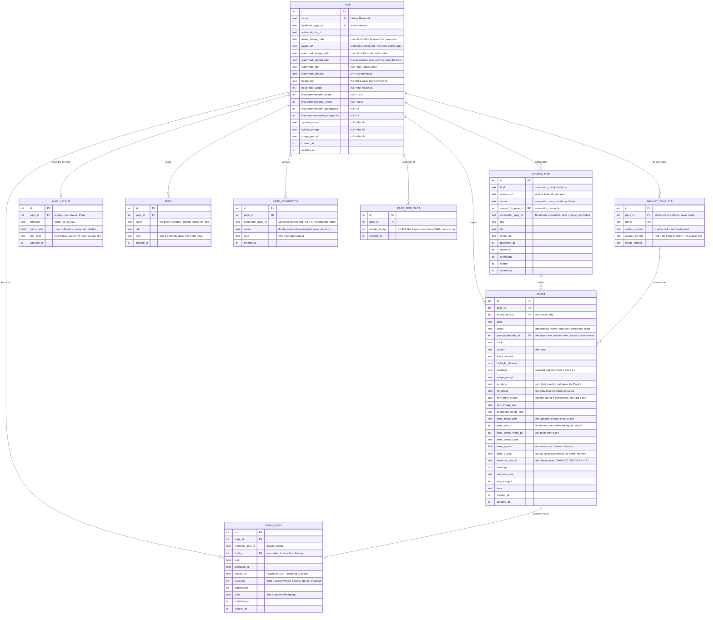

# Data model

Supabase Postgres, via SQLModel. No `user_id` (ADR-0002). No schedule table
(ADR-0001). No `brand_key` (ADR-0003).

Enum columns are stored as `VARCHAR`, never as a native Postgres enum - see
`models._stored_enum`, which carries the reasoning. That predates Alembic and
survived it: `ALTER TYPE` is now a migration we could write, but a new enum
member is a fact about the Python class, and making it a schema change as well
buys nothing. It also keeps the SQLite test fixture building the same schema
Postgres has.

Schema changes are Alembic revisions in `api/alembic/versions/`.

**Eleven tables**, and it started at three. Nothing here is configuration
duplicated across rows, external state mirrored locally, or tenancy ceremony -
the three shapes this model is built to avoid. Each row docstring in `models.py`
argues its own case:

| | Revision | Why it could not stay out of the database |
|---|---|---|
| `PAGE_LAYOUT` | `3a5c60b49f2f` | per-Page overrides to the card. Null means the `layout.yml` value |
| `FEED` | `103581b4d2f1` | the RSS list, editable without a deploy. A container has no writable `sources.yml` |
| `PAGE_COMPETITOR` | `5dd689a49084` | which competitors feed which Pages. Metricool caps an *account* at 100 and has no such concept |
| `PAGE_TIME_SLOT` | `e95cf1ff6545` | the times a Page publishes at. Policy, not schedule state - see ADR-0001 |
| `SAVED_POST` | `85d4da17f9d6` | a published post kept on purpose. Metricool's stats take a date range, so a reference found there stops being readable once it ages out |
| `PROMPT_TEMPLATE` | | a named post style the operator picks at run time. Each field is a *delta* over the Page's prompts, never a copy - see below |
| `CTA_TEMPLATE` | | the Shorts tool's clip library. [youtube-tool.md](youtube-tool.md) |
| `YOUTUBE_JOB` | | one processed Short. The row *is* the job record, exactly as `DRAFT` is for generation. [youtube-tool.md](youtube-tool.md) |

The last two belong to the Shorts tool and touch nothing above them: no foreign
key crosses between a Draft and a Short, and the two halves share only the
process and the Metricool account.

The rule the first five share, and the reason none of them reverses ADR-0001:
**nothing points *into* a row in any of them.** They all carry a `page_id`
outward; none is the target of a foreign key. No `feed_id` on a Source Item, no
slot id on a scheduled post, no competitor table for an assignment to key into.
So deleting a Feed, a slot or an assignment changes tomorrow and nothing that
already happened - which is the property that makes them safe to edit from a
form.

`PROMPT_TEMPLATE` is the one deliberate exception: `DRAFT.prompt_template_id` is
a real foreign key into it, because a regenerate or a hero rebuild has to use the
voice the draft was written in. Re-reading the operator's *current* selection
would let a dropdown change retroactively rewrite half a draft in another voice.
The price is that a style is not freely deletable once something has been
generated under it, and that price is what the other five are avoiding.

## Ten pages

History Retraced, The Fact Feed, Bible Focus, Bodybuilding Tips N Tricks,
Fitness Girls, Fitness Recipes, GYM Motivation, `GYM Motivation | quotes |
videos | tips|`, Hot Tub Timeout, House of Common Sense.

The eighth is why `watermark_text` is a column: `name` is the Metricool brand's
name, and `GYM Motivation | quotes | videos | tips|` is not what anyone wants
stamped on a photograph.

`PAGE` is a table rather than a constant, so each of the nine after the first was
an insert - no schema change, no query rewritten (ADR-0003).

`is_active` is absent. Ten Pages and the flag would still never be false: a Page
that should not publish does not get generated for.

## Prompts are files, with per-Page overrides in the database

Three tiers, resolved in this order by
[`app/writer/prompts.py`](../api/app/writer/prompts.py) on every call:

1. `page.system_prompt` / `overlay_prompt` / `image_prompt` - a `TEXT` column,
   null unless somebody typed into Settings
2. `api/prompts/pages/<slug>/*.txt` - a committed per-Page file. Two exist:
   `bodybuilding-tips-n-tricks/` and `fitness-recipes/`
3. `api/prompts/*.txt` - the house prompts

The house prompts stay files: in git, reviewable, revertable, not editable from
the screen. Only the overrides are rows, and the forcing reason is deployment -
**Railway's filesystem is ephemeral**, so a Settings editor that wrote
`prompts/pages/<slug>/system.txt` would lose every edit on the next redeploy.

**A nullable override cannot drift, because it never holds a copy of what it
inherits.** Null is not "the same text as the file" - it is a live pointer at
the file, and editing the file moves every Page that has not overridden one.
That property is the whole design: a stored *copy* of a prompt goes stale
against the code it was pasted from, silently, and keeps generating.

On top of the three tiers sits a fourth **layer**: a `PROMPT_TEMPLATE` row, the
named post style chosen at run time. It is a delta laid over the resolved text,
never a replacement for it, and it is per-Page.

Two numbers appear in both a prompt and the compositor and are substituted from
`layout.yml` at read time rather than typed twice: `{panel_pct}` and
`{highlight_color}`. Substitution happens after resolution, so a stored override
and a template delta both get it, and no tier can contradict the compositor.

## How long a Page writes

Five nullable columns on `PAGE` - `hook_max_words`, `first_comment_min_chars`,
`first_comment_max_chars`, `first_comment_min_paragraphs`,
`first_comment_max_paragraphs` - read by `writer/validators.Limits`. Null means
the house number: 65 words, 1,500-2,100 characters, 2-3 paragraphs.

They are columns rather than prose in a prompt because **the prompt and the
validator have to move together.** A prompt asking for 30 words while the
validator accepts 65 does not produce 30-word hooks; it produces a rule nothing
enforces. `Limits.disagrees()` also refuses an unsatisfiable band with a 422: a
Page setting a 1,500 ceiling against a 1,500 floor would fail every draft at
whichever end it missed.

Nullable rather than defaulted, for `PAGE_LAYOUT`'s reason: a copied default
cannot be told from a chosen one, so changing the house number would leave every
Page pinned to the old value with nothing recording that anyone meant it.

## ERD



`UNIQUE (kind, external_id)` on `SOURCE_ITEM` - ticking the same RSS item twice
must not create a second row.

## Layout is config, with per-Page overrides

Every layout and image-size setting lives in
[`api/config/layout.yml`](../api/config/layout.yml), taken from **History
Retraced**. The file is loaded once into a frozen Pydantic model at startup, so
a bad value fails the boot rather than the render.

**`PAGE_LAYOUT` holds only what a Page *changed*.** Every column is nullable and
the renderer resolves `{**yaml, **row}`; resetting a Page is deleting its row.
The columns are never seeded with the current values, because a row full of
copied defaults would silently stop tracking a change to the file - the same
argument the writing lengths make above.

Image dimensions and the font stay out of it: one shape, 896×1120, for every
Page. 4:5 is the tallest ratio Facebook renders in feed.

Model ids do **not** live there - they are deployment config and get retired
upstream without warning. `GEMINI_TEXT_MODEL`, `GEMINI_IMAGE_MODEL` and
`GEMINI_IMAGE_FALLBACK_MODELS` go to env.

**The watermark is a committed file, and that is the whole point.**
`watermark_image_path` is relative to `API_DIR` and the file lives in
`api/assets/` beside the font, **not** in the media bucket. A bucket key can be
cleared, and a compositor that treats a failed download as "no logo" then prints
the page name as text instead - no error, no log, no failed post, just every
image shipping without its logo until somebody looks. A committed asset is
present on a fresh clone and cannot 404.

`watermark_image_path` is genuinely per-Page rather than layout, and has since
been joined by `watermark_upload_path`, `watermark_text`, `watermark_enabled`,
`badge_text`, the two avatar columns, the five writing lengths and the three
prompt overrides - all of them answers to "the other nine Pages are not History
Retraced", which is the question `PAGE_LAYOUT` answers for style.

`daily_quota` was cut on 2026-08-06. The cap counted against **Approve**, and
Approve is a queue movement `unapprove` can undo - a cap that only warns, over a
number the operator can move by clicking twice, is decoration rather than policy.

Config in a module is safe here in a way `brand_key` was not: **nothing points at
it**. ADR-0003's failure was rows carrying a foreign key into a code constant that
could not grow with the data. A padding value has no referent, so it cannot rot.

## Why the original three

**`PAGE`** is the unit of identity, and of the per-Page configuration that
survived the layout cut above. Pages are rows, so adding one is an insert - see
ADR-0003 for what the code-constant version cost.

It is deliberately **not** split into `page` + `page_style`. That relationship
would be strictly 1:1, so the split buys a join and nothing else, and it rebuilds
the exact shape ADR-0003 destroyed, where one setting lived in two rows and
drifted.

Adding Pages two through ten moved the schema anyway - additively, one nullable
column at a time: a Page's own watermark, badge word, card proportions, hook
length. Each was a constant while there was one Page.

**`SOURCE_ITEM`** is one table for all three source kinds. They differ only at
ingest; generation reads `text`, `image_url`, and whether the subject is binding.

`reactions`, `comments` and `shares` are null for tweets and RSS items and stay
three typed columns anyway: reactions is the *default* sort on the Competitors
tab, and they are populated in 144-147 of 150 competitor rows. The blob
alternative was tried in production and its `metrics` jsonb was populated in
**0 of 150 rows**.

**`DRAFT`** carries its own progress (`status`, `progress_step`, `progress_pct`,
`error`) because the row is created *before* generation starts. That placeholder
is how the UI shows a run in flight: background task fills the row in, client
polls.

## Every kind binds the subject

| `kind` | Subject | Instruction to the writer |
|---|---|---|
| `competitor_post` | **binding** | same story - and not their wording |
| `tweet`, `rss` | **binding** | write about this *same* story, people, events |

`competitor_post` was "not binding" until 2026-08-18 - borrow the tone, pick your
own story - and the client reported it as the tool not generating from the
competitor posts they had chosen. It had. The prompt told the model to write
about something else, and **a run that does that still reports success**, because
nothing about it failed. That is the failure mode worth remembering here: wrong
subject, well-formed output, no error anywhere.

What survives of the distinction is one extra sentence for competitor posts: the
story is shared, the writing is ours. Their *picture* is a separate rule and did
not move - `hero_from_source` is RSS-only in `generate.build_image`, because
retelling a story is sourcing and reusing a rival's photograph is not.

It is a pure function of `kind`, so it is computed. A stored copy is a second
truth to keep in sync, and when it drifts the model still returns confident,
well-formed output about the wrong story - the failure is invisible until a
human reads the post.

## What was considered and rejected

**A `competitor` table.** Rejected by ADR-0001's own logic: don't mirror state you
don't own. All 161 competitors in production came from Metricool sync - **zero manual
adds** - and `listCachedCompetitors` was already just a cache with a 60-second
cooldown (`competitorMetricoolSyncService.ts:22`). The competitor list is configured
in Metricool and read live from there. `author` and `external_id` denormalized
onto `SOURCE_ITEM` cover everything generation and display need.

**A `page_competitor` join table.** Rejected on the data, and **later built
anyway** - the rejection is kept because it was right about the data and wrong
about the constraint.

The data said: of 92 competitor rows carrying a real `source_page_id`, there
were **92 distinct `external_id`s and zero competitors tracked by more than one
page**. Each page had a disjoint competitor set. (The apparent duplication in
production - 161 rows - is 65 legacy rows with `source_page_id = NULL`,
predating migration `20260702150000` that added the column.)

What that measured was the old tool's *behaviour*, not what it could afford.
A Metricool account may configure **100 competitors in total**, not per page.
Five Pages that should each watch the same twenty sources would spend the whole
allowance on twenty distinct sources. So a competitor is added once, under
whichever Page has room, and `PAGE_COMPETITOR` assigns it to every Page that
should read it. Still no competitor table: `competitor_page_id` is Metricool's
`providerId`, there is no foreign key, and an assignment naming a competitor
since removed there simply matches no posts.

**A `feed` table.** Rejected, and **later built** for one reason the original
argument never considered: where the process runs.

The rejection was sound on coupling - `brand_key` corrupted because rows pointed
at it, and nothing points at a feed. `FEED` keeps that property: `SOURCE_ITEM`
still carries the publisher as `author`, never a `feed_id`, so an item outlives
the feed it arrived through and deleting a feed cannot cascade through published
work.

What changed is that the API runs from a **container image**. `config/sources.yml`
is baked in and read-only in effect: a write lasts until the next deploy and
disagrees with the committed copy in the meantime. The feed list is the one part
of that file an operator has to change without a deploy. The `note` column is
what the move had to buy back - `sources.yml` carried a probe result above every
entry ("31 items, 179-char summaries, every item imaged"), and the seed migration
brings the twelve original notes across verbatim rather than losing them to a
`git rm`.

The windows stayed in the file. `since_days` is a judgement about a beat, made
once, and reading it as a diff is the point.

**A `generation_event` table.** Rejected. Progress needs a step and a
percentage, both columns on `DRAFT`. The old scrolling log was already capped at
40 entries and is cosmetic.

**A cart table.** Rejected. The Cart is a list of Source Items held by the
client - the items themselves, not ids, since most of them are not rows yet.
Nothing about it needs to survive that is not already a row.

## Ingest rule: browsing does not write

Tweets and RSS items are fetched live and become rows **only when they are
generated from**. This keeps the table from filling with hundreds of unread
items.

Competitor posts are the standing exception: they arrive through a Metricool sync
the operator pressed rather than through a tab opening, so they are written on
arrival. The rule exists to stop the table filling with items nobody looked twice
at, and a sync is not that - it is bounded by the seven-day window, and
re-syncing updates the same rows rather than adding more.

Storage is also what makes a competitor post checkable. There is no
`is_curated_url` equivalent for a Facebook post, so `POST /generate` accepts one
by **id only**, resolved against a row the sync owns. Removing the storage was
considered and rejected: it would require confirming the id against Metricool at
the front of a run that is already 60 seconds deep in paid model calls, against
an API that has timed out and returned 502 in normal use, so a cart of competitor
posts would fail for reasons unrelated to the posts or the writer.

**The write happens at generate, not at tick.** Writing at tick leaves unticked
rows referenced by nothing, since removing an item from the Cart issues no
`DELETE`, and it gives one gesture two meanings - a tick on a competitor post is
a local cart add, a tick on an RSS item would be a network write. The Cart
therefore carries the item itself and `POST /generate` writes only what a run
uses.

A Source Item is worth contrasting with a Draft here, because the two are saved
for opposite reasons. A Draft is **load-bearing**: it is the job record, it holds
paid model output and review state, and it cannot be ephemeral. A Source Item is **bookkeeping** - a pointer to something that exists
elsewhere and can be re-fetched, kept only so a Draft can say where it came from.
That is why a Source Item need not exist until a Draft points at it, and why a
Draft must exist from the moment its run starts.

## Flow

```
Metricool sync ──> SOURCE_ITEM(kind=competitor_post, sync'd_page)  [on sync]
Tweet URL      ──> live lookup, unsaved
Curated feeds  ──> live read, unsaved
                              │
                    Cart - client-side, the items themselves
                              │
                    Generate: pick Pages
                              │
              SOURCE_ITEM(kind=tweet | rss)              [written here, if used]
                              │
              DRAFT per (source × page), status=generating
                              │
      Pydantic AI writer ──> text + highlight phrases + image prompt
      google-genai      ──> hero image
      resvg + Pillow    ──> composed image
                              │
                    status=review ──> operator edits, free redraws
                              │
                    Publish ──> Metricool planner
              DRAFT.metricool_post_id set; the row FREEZES
```

## What happens after Publish

The row stops being editable in the ordinary way, and the reason is a link.
Metricool stores the **URL** of `composed_image_path` and Facebook fetches it
when the post is due, days later. A redraw deletes the file that URL points at
(`generate._discard`), so a queued post whose image was rebuilt publishes a
broken picture, or none.

What is still possible, and what is not:

```
queued post ──> PATCH /drafts/{id}          caption + first comment  ── allowed
            ──> POST  /drafts/{id}/reschedule   move the time        ── allowed
            ──> POST  /drafts/{id}/unschedule   out of the planner   ── allowed
            ──> POST  /drafts/{id}/image        redraw               ── 409
```

Unschedule is the way through: it deletes the planner post *first*, clears
`metricool_post_id`, and the row is an ordinary draft again with nothing
pointing at its file.

**`metricool_post_id` is not stable, and that is Metricool's doing.** They have
no in-place update. `PUT /v2/scheduler/posts/{id}` with `id` in the body deletes
the old post and creates a new one; without it, it creates a second post and
leaves the first. Either way the id changes, so every edit writes the returned id
back to the row. The old app does not, which is why its "edit" leaves a duplicate
in the planner and a draft pointing at a post that no longer exists.

The value `"queued"` is a marker rather than a handle: Metricool accepted the
post but did not name it, so nothing can be edited or cancelled through it. Every
route above answers 409 and says to open the planner.

`SAVED_POST` is the only row written after publication, and it is written by a
person deciding a post was worth keeping - never automatically.
