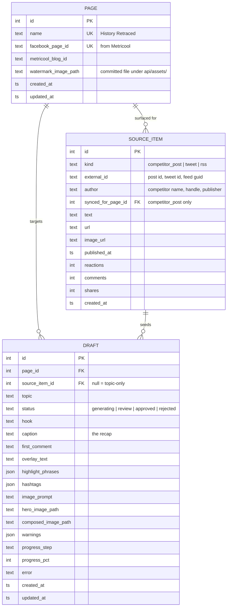

# Data model

SQLite on stock settings, via SQLModel. No `user_id` (ADR-0002). No schedule
table (ADR-0001). No `brand_key` (ADR-0003).

**Three tables.** The old system had eight, plus a 54-column templates table.
Everything removed was one of three things: configuration duplicated across
rows, external state mirrored locally, or tenancy ceremony.

## One page in v1

v1 runs **History Retraced only**. The other nine pages are not modelled, not
seeded, and not migrated; adding one later is an insert plus a set of prompt
files.

`PAGE` stays a table rather than collapsing into a constant because
`draft.page_id` and `source_item.synced_for_page_id` point at it. Making the
second page a schema change *and* a rewrite of every query is exactly the trap
ADR-0003 describes. One row costs nothing.

`is_active` went with the other nine pages: with a single page the flag is never
false, and a flag that is never false is not state.

## Prompts are files, not columns

`system_prompt`, `overlay_prompt` and `image_prompt` are no longer columns. They
live in [`api/prompts/`](../api/prompts) as `.txt`, loaded by
[`app/writer/prompts.py`](../api/app/writer/prompts.py) on every call.

They are the product and they change constantly. As columns they were invisible
to git, unreviewable, and they drifted — the old system's three configured pages
each stored the same 2030-character block, and every copy had gone stale against
the code it was pasted from. History Retraced's stored *overlay* prompt carried
that block a second time, at offset 903, still claiming a 75% hero and a circular
logo. Both copies are dropped; the surviving text is one file.

Two numbers appear in both a prompt and the compositor and are substituted from
`layout.yml` at read time rather than typed twice: `{panel_pct}` and
`{highlight_color}`. Production had already drifted on the first — History
Retraced rendered a 20% panel while its prompt said 25%.

## ERD



`UNIQUE (kind, external_id)` on `SOURCE_ITEM` — ticking the same RSS item twice
must not create a second row.

## Layout is config, not data

Every layout and image-size setting lives in
[`api/config/layout.yml`](../api/config/layout.yml), taken from **History
Retraced**. `PAGE` drops from 29 columns to 12. The file is loaded once into a
frozen Pydantic model at startup, so a bad value fails the boot rather than the
render.

Model ids do **not** live there — they are deployment config and change without
warning (the previous system had to ship `fix(gemini): replace retired image
fallback model`). `GEMINI_TEXT_MODEL` and `GEMINI_IMAGE_MODEL` go to env.

Ten of the settings never varied in production anyway — across all 10 page
rows, the four paddings, `panel_color`, `text_align` and `model_id` each had
exactly **one distinct value**, and `panel_opacity` had one in 9 of 10. `brand_watermark_text`
was byte-identical to `page_name` in **10/10**, so it is derived from `name`, not
stored. `font_min_px == font_size_px == font_max_px` in **10/10** — autofit was
never switched on.

The rest were standardised deliberately, with the cost noted:

| Setting | Was | Now | Cost |
|---|---|---|---|
| Image size | 1080×1080, 1080×1350, 896×1120 | 896×1120 | none — 4:5 is the tallest ratio Facebook renders, so the square pages gain feed height |
| `panel_ratio` | 0.25 (×3), 0.2 | 0.20 | none — it is a *floor*, and the panel grows to fit (`image-composite.ts:291`) |
| `font_size_px` | 35 (×3), 36 | 36 | none — the spread was noise, and nothing autofits |
| `badge_label`, `badge_color`, `badge_font_size_px` | NEWS ×3, `BEST TUB EVER`; two colours; 22–48px | **gone** | the badge renders only under `if (isFullOverlay && label)` (`image-composite.ts:367`), so cutting `full_overlay` cut the badge with it |

Rounded corners went the same way and were already dead before this rebuild: the
compositor hardcodes `const cornerRadius = 0` (`image-composite.ts:313`) and the
preview helper was zeroed to match, with the comment "previews must match the
composited output, which is no longer rounded" (`brand-image-layout.ts:111`).

One thing stayed a column because it is genuinely per-page, not layout:
`watermark_image_path` (each page's own logo file — cannot be one constant).
The prompts were the second until they became files; see above.

`daily_quota` was the third. It was ported (1, 2, 12 across the old pages) and
then cut on 2026-08-06: nothing in v1 publishes, so the cap was counted against
**Approve**, and Approve is a queue movement that `unapprove` can undo. A cap
that only warns, over a number the operator can move by clicking twice, is not
policy — it is decoration. It comes back with publishing or not at all.

**The watermark is a committed file, and that is the whole point.**

The old system stored it in Supabase Storage and read it back by key at composite
time. In the *current* project that key now 404s — all six watermark paths do,
across every bucket — because the bucket was cleared down to 8 recent draft jpgs.
The compositor treats a failed download as "no logo" (`return null`,
`image-composite.ts:136`) and silently prints the page name as text, so the logo
disappeared from output with no error, no log, and no failed post. The newest
draft on record, 2026-08-02, ships the text version.

The real assets survive in the **previous** Supabase project
(`zlrgwutoctezdbunaqxu`, commented out at the top of the old `.env.local`), which
still holds 1491 objects:

| File | Size | Shape |
|---|---|---|
| `brand-assets/hr/watermark-1782917403896-historyretracedwhite.png` | 350×74 RGBA | one line — **in use** |
| `brand-assets/hr/watermark-1782917347424-historyretracedlogo.png` | 350×74 RGBA | one line, near-identical |
| `brand-assets/hr/watermark-1782917203719-profilephoto.jpg` | 400×400 RGB | stacked, on white |

The single-line PNG is what the old `portrait_image_path` actually pointed at,
and it is already white-on-transparent with the red H and R, so it is used as-is.
The stacked variant is kept as `history-retraced-stacked.jpg` for the switch;
using it needs the white background removed first.

`watermark_image_path` is relative to `API_DIR`, and the file lives in
`api/assets/` beside the font — **not** `api/media/`, which is gitignored and
would drop the logo on a fresh clone.

Config in a module is safe here in a way `brand_key` was not: **nothing points at
it**. ADR-0003's failure was rows carrying a foreign key into a code constant that
could not grow with the data. A padding value has no referent, so it cannot rot.

## Why these three

**`PAGE`** is the unit of identity, and of the little configuration that survived
the layout cut above. It replaces the old `facebook_post_templates` (54 columns,
two-level page→brand fallback whose brand rows turned out to be byte-identical
duplicates) and the `brand-config.ts` constant. Pages are rows, so adding the
second page is an insert. See ADR-0003 for what the code-constant version cost.

It is deliberately **not** split into `page` + `page_style`. That relationship
would be strictly 1:1, so the split buys a join and nothing else — and it
rebuilds the exact shape ADR-0003 destroyed, where one setting lived in two rows
and drifted.

**Adding page two** is: insert a row, move the prompt files into
`prompts/<page>/`, and give the loader that directory instead of the module-level
constant it uses today. Nothing in the schema moves. The flat layout is not an
oversight — it is the honest representation of one page.

**`SOURCE_ITEM`** is one table for all three source kinds. They differ only at
ingest; generation reads `text`, `image_url`, and whether the subject is
binding. The old system faked a "competitor" parent row for every Twitter handle
and every RSS feed to fit them into `competitor_posts`.

`reactions`, `comments` and `shares` are null for tweets and RSS items and stay
three typed columns anyway: reactions is the *default* sort on the Competitors tab
(`competitor-panel.tsx:691`), and they are populated in 144–147 of 150 competitor
rows. Production already tried the blob alternative — `competitor_posts.metrics`
(jsonb) is populated in **0 of 150 rows**.

**`DRAFT`** carries its own progress (`status`, `progress_step`, `progress_pct`,
`error`) because the row is created *before* generation starts. That placeholder
is how the UI shows a run in flight: background task fills the row in, client
polls.

## `is_factual` is derived, never stored

| `kind` | Subject | Instruction to the writer |
|---|---|---|
| `competitor_post` | not binding | borrow tone and structure, pick your own story |
| `tweet`, `rss` | **binding** | write about this *same* story, people, events |

The old code branches on this at `facebookGenerateGraph.ts:395`, with a comment
noting that reversing it "tells the model to treat a Smithsonian article as a
writing sample."

It is a pure function of `kind`, so it is computed. A stored copy is a second
truth to keep in sync, and when it drifts the model still returns confident,
well-formed output about the wrong story — the failure is invisible until a
human reads the post.

## What was considered and rejected

**A `competitor` table.** Rejected by ADR-0001's own logic: don't mirror state you
don't own. All 161 competitors in production came from Metricool sync — **zero manual
adds** — and `listCachedCompetitors` was already just a cache with a 60-second
cooldown (`competitorMetricoolSyncService.ts:22`). The competitor list is configured
in Metricool and read live from there. `author` and `external_id` denormalized
onto `SOURCE_ITEM` cover everything generation and display need.

**A `page_competitor` join table.** Rejected on the data: of 92 competitor rows carrying a
real `source_page_id`, there are **92 distinct `external_id`s and zero competitors
tracked by more than one page**. Each page has a disjoint competitor set. (The
apparent duplication in production — 161 rows — is 65 legacy rows with
`source_page_id = NULL`, predating migration `20260702150000` that added the
column.) `SOURCE_ITEM.synced_for_page_id` carries the one link that matters.

**A `feed` table.** Rejected. The argument for it was that configuration in code
corrupts the data referencing it — which is what happened to `brand_key`. But
`brand_key` corrupted because *rows pointed at it*. Nothing would point at a
feed except a `feed_id` FK that exists only because the table exists.

Feeds live in [`api/config/sources.yml`](../api/config/sources.yml), keyed by
`page.name`, and the publisher name lands in `SOURCE_ITEM.author`. That key is
the one pointer in the arrangement, so a Page with no entry **raises** rather
than returning an empty grid — a source that silently stops producing looks
exactly like a quiet week, which is how the watermark went missing for months.

It is a file rather than a `page` column because a feed list is a list, and
because it is edited the way the curation actually happens: every candidate is
probed before it earns a place, which is not a thing to do from a form.

**A `generation_event` table.** Rejected. Progress needs a step and a
percentage, both columns on `DRAFT`. The old scrolling log was already capped at
40 entries and is cosmetic.

**A cart table.** Rejected. The Cart is a list of Source Items held by the
client — the items themselves, not ids, since most of them are not rows yet.
Nothing about it needs to survive that is not already a row.

## Ingest rule: browsing does not write

Tweets and RSS items are fetched live and become rows **only when they are
generated from**. This keeps the table from filling with hundreds of unread
items.

Competitor posts are the standing exception: they arrive by a Metricool sync the
operator pressed, not by a tab opening, so they are written on arrival. The
exception is deliberate and stays. The rule exists to stop the table filling with
items nobody looked twice at, and a competitor sync is not that — it is bounded
by the seven-day window and re-syncing updates the same rows rather than adding
more. Storage is also what makes them checkable: there is no `is_curated_url`
equivalent for a Facebook post, so `POST /generate` accepts a competitor by **id
only**, resolved against a row the sync owns. Phase 3 planned to remove the
storage and re-fetch from Metricool instead, then reversed it —
[why](plan.md#but-competitor-posts-stay-stored--reversed-2026-08-06).

**The write happens at generate, not at tick.** Phase 2 shipped it at tick,
which left a hole: untick removes the id from the Cart but there is no `DELETE`,
so an unticked row survives referenced by nothing. It also gave one gesture two
meanings — a tick on a competitor post is a local cart add, a tick on an RSS
item is a network write. Phase 3 moves the write to `POST /generate`; the
reasoning and its consequences are in [plan.md](plan.md#ticking-stops-writing).

A Source Item is worth contrasting with a Draft here, because the two are saved
for opposite reasons. A Draft is **load-bearing**: it is the job record, it holds
paid model output and review state, and it cannot be ephemeral. A Source Item is **bookkeeping** — a pointer to something that exists
elsewhere and can be re-fetched, kept only so a Draft can say where it came from.
That is why a Source Item need not exist until a Draft points at it, and why a
Draft must exist from the moment its run starts.

## Flow

```
Metricool sync ──> SOURCE_ITEM(kind=competitor_post, sync'd_page)  [on sync]
Tweet URL      ──> live lookup, unsaved
Curated feeds  ──> live read, unsaved
                              │
                    Cart — client-side, the items themselves
                              │
                    Generate: pick Pages
                              │
              SOURCE_ITEM(kind=tweet | rss)              [written here, if used]
                              │
              DRAFT per (source × page), status=generating
                              │
      Pydantic AI writer ──> text + highlight phrases + image prompt
      google-genai      ──> hero image
      resvg + Pillow    ──> composed image
                              │
                    status=review ──> operator ──> approved
```
