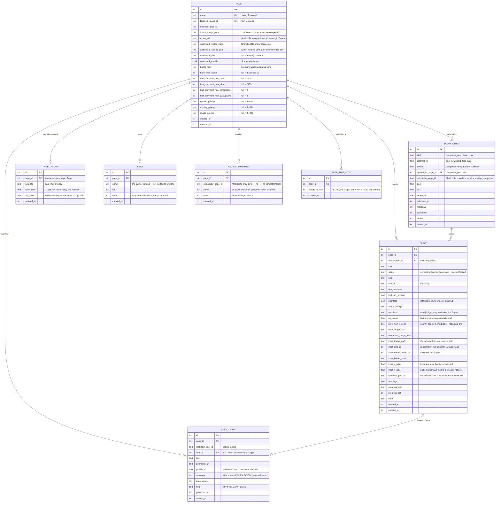

# Data model

Supabase Postgres, via SQLModel. No `user_id` (ADR-0002). No schedule table
(ADR-0001). No `brand_key` (ADR-0003).

Enum columns are stored as `VARCHAR`, never as a native Postgres enum — see
`models._stored_enum`, which carries the reasoning. That predates Alembic and
survived it: `ALTER TYPE` is now a migration we could write, but a new enum
member is a fact about the Python class, and making it a schema change as well
buys nothing. It also keeps the SQLite test fixture building the same schema
Postgres has.

Schema changes are Alembic revisions in `api/alembic/versions/`.

**Eight tables**, and it started at three. The old system had eight plus a
54-column templates table; everything cut from it was one of three things —
configuration duplicated across rows, external state mirrored locally, or
tenancy ceremony. None of the five added since is any of those, and each one's
row docstring in `models.py` argues its own case:

| | Revision | Why it could not stay out of the database |
|---|---|---|
| `PAGE_LAYOUT` | `3a5c60b49f2f` | per-Page overrides to the card. Null means the `layout.yml` value |
| `FEED` | `103581b4d2f1` | the RSS list, editable without a deploy. A container has no writable `sources.yml` |
| `PAGE_COMPETITOR` | `5dd689a49084` | which competitors feed which Pages. Metricool caps an *account* at 100 and has no such concept |
| `PAGE_TIME_SLOT` | `e95cf1ff6545` | the times a Page publishes at. Policy, not schedule state — see ADR-0001 |
| `SAVED_POST` | `85d4da17f9d6` | a published post kept on purpose. Metricool's stats take a date range, so a reference found there stops being readable once it ages out |

The rule they share, and the reason none of them reverses ADR-0001: **nothing
points *into* a row in any of them.** They all carry a `page_id` outward; none
is the target of a foreign key. No `feed_id` on a Source Item, no slot id on a
scheduled post, no competitor table for an assignment to key into. So deleting a
Feed, a slot or an assignment changes tomorrow and nothing that already
happened — which is the property that makes them safe to edit from a form.

## Ten pages

v1 ran **History Retraced only**. It now runs ten: History Retraced, The Fact
Feed, Bible Focus, Bodybuilding Tips N Tricks, Fitness Girls, Fitness Recipes,
GYM Motivation, `GYM Motivation | quotes | videos | tips|`, Hot Tub Timeout,
House of Common Sense. The eighth of those is why `watermark_text` is a column:
`name` is the Metricool brand's name, and `GYM Motivation | quotes | videos |
tips|` is not what anyone wants stamped on a photograph.

`PAGE` stayed a table rather than collapsing into a constant, and adding the
other nine really was an insert each: no schema change, no query rewritten. That
is ADR-0003 paying off rather than being argued.

`is_active` is still absent. Ten Pages and the flag is still never false; a Page
that should not publish does not get generated for.

## Prompts are files, with per-Page overrides in the database

Three tiers, resolved in this order by
[`app/writer/prompts.py`](../api/app/writer/prompts.py) on every call:

1. `page.system_prompt` / `overlay_prompt` / `image_prompt` — a `TEXT` column,
   null unless somebody typed into Settings
2. `api/prompts/pages/<slug>/*.txt` — a committed per-Page file. Two exist:
   `bodybuilding-tips-n-tricks/` and `fitness-recipes/`
3. `api/prompts/*.txt` — the house prompts

The columns came back on 2026-08-17, and it is worth being exact about what did
and did not reverse. The failure that drove prompts out of the database was
**drift between copies**: the old system's three configured pages each stored the
same 2,350-character block, 2,030 characters byte-identical, and every copy had
gone stale against the code it was pasted from. History Retraced's stored
*overlay* prompt carried that block a second time, at offset 903, still claiming
a 75% hero and a circular logo.

A nullable override cannot drift, because it never holds a copy of what it
inherits. Null is not "the same text as the file" — it is a live pointer at the
file, and editing the file moves every Page that has not overridden it.

Files alone could not answer the client's F5 ("I did write new prompts already in
Setting tab"), because **Railway's filesystem is ephemeral** (`db.py`). An editor
that wrote `prompts/pages/<slug>/system.txt` would lose every edit on the next
redeploy. So the globals stay files — in git, reviewable, revertable, and not
editable from the screen — and only the overrides are rows.

Two numbers appear in both a prompt and the compositor and are substituted from
`layout.yml` at read time rather than typed twice: `{panel_pct}` and
`{highlight_color}`. Production had already drifted on the first — History
Retraced rendered a 20% panel while its prompt said 25%. Substitution happens
after resolution, so a stored override gets it too.

## How long a Page writes

Five nullable columns on `PAGE` — `hook_max_words`, `first_comment_min_chars`,
`first_comment_max_chars`, `first_comment_min_paragraphs`,
`first_comment_max_paragraphs` — read by `writer/validators.Limits`. Null means
the house number: 65 words, 1,500–2,100 characters, 2–3 paragraphs.

They are columns rather than prose in a prompt because that is the whole
difference between C6/C7 as dropped and C6/C7 as shipped. **The prompt and the
validator have to move together.** A prompt asking for 30 words while the
validator accepts 65 does not produce 30-word hooks; it produces a rule nothing
enforces. `Limits.disagrees()` also refuses an unsatisfiable band with a 422 —
a Page that sets only the ceiling to 1,500 against a 1,500 floor would fail every
draft at whichever end it missed, which is exactly why C7 was first dropped as
unbuildable.

Nullable rather than defaulted, for `PAGE_LAYOUT`'s reason: a copied default
cannot be told from a chosen one, so changing the house number would leave every
Page pinned to the old value with nothing recording that anyone meant it.

**As of 2026-08-17 no Page has set any of the eight.** The mechanism is
deployed-ready and unused — see `HANDOFF.md`.

## ERD



`UNIQUE (kind, external_id)` on `SOURCE_ITEM` — ticking the same RSS item twice
must not create a second row.

## Layout is config, with per-Page overrides

Every layout and image-size setting lives in
[`api/config/layout.yml`](../api/config/layout.yml), taken from **History
Retraced**. The file is loaded once into a frozen Pydantic model at startup, so
a bad value fails the boot rather than the render.

**`PAGE_LAYOUT` reverses the second half of this, on purpose.** This section
used to say the file "has no per-page section and should not grow one", and
`CONTEXT.md` said a Page "does not own styling — every Page renders in the same
form and size". Both were written when there was one Page. Ten Pages with
unrelated beats, and an operator who wants a news card to look unlike a history
card, is new evidence rather than a lapse.

What a row holds is only what a Page *changed*: every column is nullable and the
renderer resolves `{**yaml, **row}`. Resetting a Page is deleting its row. The
columns are not seeded with the current values, because a row full of copied
defaults would silently stop tracking a change to the file — the same argument
the writing lengths make above, and the same one that kept prompts out of the
database for a month.

Image dimensions and the font stay out of it, and that part of the old decision
holds: 4:5 is the tallest ratio Facebook renders in feed.

Model ids do **not** live there — they are deployment config and change without
warning (the previous system had to ship `fix(gemini): replace retired image
fallback model`). `GEMINI_TEXT_MODEL`, `GEMINI_IMAGE_MODEL` and
`GEMINI_IMAGE_FALLBACK_MODELS` go to env.

Ten of the settings never varied in production anyway — across all 10 page
rows, the four paddings, `panel_color`, `text_align` and `model_id` each had
exactly **one distinct value**, and `panel_opacity` had one in 9 of 10. `brand_watermark_text`
was byte-identical to `page_name` in **10/10**, so it is derived from `name`, not
stored. `font_min_px == font_size_px == font_max_px` in **10/10** — autofit was
never switched on.

The rest were standardised deliberately, with the cost noted:

| Setting | Was | Now | Cost |
|---|---|---|---|
| Image size | 1080×1080, 1080×1350, 896×1120 | 896×1120 | none — 4:5 is the tallest ratio Facebook renders, so the square pages gain feed height |
| `panel_ratio` | 0.25 (×3), 0.2 | 0.20 | none — it is a *floor*, and the panel grows to fit (`image-composite.ts:291`) |
| `font_size_px` | 35 (×3), 36 | 36 | none — the spread was noise, and nothing autofits |
| `badge_label`, `badge_color`, `badge_font_size_px` | NEWS ×3, `BEST TUB EVER`; two colours; 22–48px | **gone** | the badge renders only under `if (isFullOverlay && label)` (`image-composite.ts:367`), so cutting `full_overlay` cut the badge with it |

Rounded corners went the same way and were already dead before this rebuild: the
compositor hardcodes `const cornerRadius = 0` (`image-composite.ts:313`) and the
preview helper was zeroed to match, with the comment "previews must match the
composited output, which is no longer rounded" (`brand-image-layout.ts:111`).

One thing stayed a column throughout because it is genuinely per-page, not
layout: `watermark_image_path` (each page's own logo file — cannot be one
constant). It has since been joined by `watermark_upload_path`,
`watermark_text`, `watermark_enabled`, `badge_text`, the two avatar columns, the
five writing lengths and the three prompt overrides — all of them answers to
"the other nine Pages are not History Retraced", which is the same question
`PAGE_LAYOUT` answers for style.

`daily_quota` was the third. It was ported (1, 2, 12 across the old pages) and
then cut on 2026-08-06: nothing in v1 publishes, so the cap was counted against
**Approve**, and Approve is a queue movement that `unapprove` can undo. A cap
that only warns, over a number the operator can move by clicking twice, is not
policy — it is decoration. It comes back with publishing or not at all.

**The watermark is a committed file, and that is the whole point.**

The old system stored it in Supabase Storage and read it back by key at composite
time. In the *current* project that key now 404s — all six watermark paths do,
across every bucket — because the bucket was cleared down to 8 recent draft jpgs.
The compositor treats a failed download as "no logo" (`return null`,
`image-composite.ts:136`) and silently prints the page name as text, so the logo
disappeared from output with no error, no log, and no failed post. The newest
draft on record, 2026-08-02, ships the text version.

The real assets survive in the **previous** Supabase project
(`zlrgwutoctezdbunaqxu`, commented out at the top of the old `.env.local`), which
still holds 1491 objects:

| File | Size | Shape |
|---|---|---|
| `brand-assets/hr/watermark-1782917403896-historyretracedwhite.png` | 350×74 RGBA | one line — **in use** |
| `brand-assets/hr/watermark-1782917347424-historyretracedlogo.png` | 350×74 RGBA | one line, near-identical |
| `brand-assets/hr/watermark-1782917203719-profilephoto.jpg` | 400×400 RGB | stacked, on white |

The single-line PNG is what the old `portrait_image_path` actually pointed at,
and it is already white-on-transparent with the red H and R, so it is used as-is.
The stacked variant is kept as `history-retraced-stacked.jpg` for the switch;
using it needs the white background removed first.

`watermark_image_path` is relative to `API_DIR`, and the file lives in
`api/assets/` beside the font — **not** in the media bucket, which is where the
old system kept it and where clearing the bucket turned every logo into a
`NoSuchKey`. A committed asset is present on a fresh clone and cannot 404.

Config in a module is safe here in a way `brand_key` was not: **nothing points at
it**. ADR-0003's failure was rows carrying a foreign key into a code constant that
could not grow with the data. A padding value has no referent, so it cannot rot.

## Why the original three

**`PAGE`** is the unit of identity, and of the little configuration that survived
the layout cut above. It replaces the old `facebook_post_templates` (54 columns,
two-level page→brand fallback whose brand rows turned out to be byte-identical
duplicates) and the `brand-config.ts` constant. Pages are rows, so adding the
second page is an insert. See ADR-0003 for what the code-constant version cost.

It is deliberately **not** split into `page` + `page_style`. That relationship
would be strictly 1:1, so the split buys a join and nothing else — and it
rebuilds the exact shape ADR-0003 destroyed, where one setting lived in two rows
and drifted.

**Adding page two** was predicted here as: insert a row, move the prompt files
into `prompts/<page>/`, and nothing in the schema moves. That is what happened,
almost. Nine inserts, `prompts/pages/<slug>/` for the two Pages that needed
their own text, and no query rewritten.

What the prediction missed is everything a *second* Page turned out to want that
the first never had to say out loud: its own watermark, its own badge word, its
own card proportions, its own hook length. Those are the columns and the
`PAGE_LAYOUT` row above. The schema did move — additively, one nullable column
at a time, each one a thing that was a constant while there was one Page.

**`SOURCE_ITEM`** is one table for all three source kinds. They differ only at
ingest; generation reads `text`, `image_url`, and whether the subject is
binding. The old system faked a "competitor" parent row for every Twitter handle
and every RSS feed to fit them into `competitor_posts`.

`reactions`, `comments` and `shares` are null for tweets and RSS items and stay
three typed columns anyway: reactions is the *default* sort on the Competitors tab
(`competitor-panel.tsx:691`), and they are populated in 144–147 of 150 competitor
rows. Production already tried the blob alternative — `competitor_posts.metrics`
(jsonb) is populated in **0 of 150 rows**.

**`DRAFT`** carries its own progress (`status`, `progress_step`, `progress_pct`,
`error`) because the row is created *before* generation starts. That placeholder
is how the UI shows a run in flight: background task fills the row in, client
polls.

## `is_factual` is derived, never stored

| `kind` | Subject | Instruction to the writer |
|---|---|---|
| `competitor_post` | not binding | borrow tone and structure, pick your own story |
| `tweet`, `rss` | **binding** | write about this *same* story, people, events |

The old code branches on this at `facebookGenerateGraph.ts:395`, with a comment
noting that reversing it "tells the model to treat a Smithsonian article as a
writing sample."

It is a pure function of `kind`, so it is computed. A stored copy is a second
truth to keep in sync, and when it drifts the model still returns confident,
well-formed output about the wrong story — the failure is invisible until a
human reads the post.

## What was considered and rejected

**A `competitor` table.** Rejected by ADR-0001's own logic: don't mirror state you
don't own. All 161 competitors in production came from Metricool sync — **zero manual
adds** — and `listCachedCompetitors` was already just a cache with a 60-second
cooldown (`competitorMetricoolSyncService.ts:22`). The competitor list is configured
in Metricool and read live from there. `author` and `external_id` denormalized
onto `SOURCE_ITEM` cover everything generation and display need.

**A `page_competitor` join table.** Rejected on the data, and **later built
anyway** — the rejection is kept because it was right about the data and wrong
about the constraint.

The data said: of 92 competitor rows carrying a real `source_page_id`, there
were **92 distinct `external_id`s and zero competitors tracked by more than one
page**. Each page had a disjoint competitor set. (The apparent duplication in
production — 161 rows — is 65 legacy rows with `source_page_id = NULL`,
predating migration `20260702150000` that added the column.)

What that measured was the old tool's *behaviour*, not what it could afford.
A Metricool account may configure **100 competitors in total**, not per page.
Five Pages that should each watch the same twenty sources would spend the whole
allowance on twenty distinct sources. So a competitor is added once, under
whichever Page has room, and `PAGE_COMPETITOR` assigns it to every Page that
should read it. Still no competitor table: `competitor_page_id` is Metricool's
`providerId`, there is no foreign key, and an assignment naming a competitor
since removed there simply matches no posts.

**A `feed` table.** Rejected, and **later built** for one reason the original
argument never considered: where the process runs.

The rejection was sound on coupling — `brand_key` corrupted because rows pointed
at it, and nothing points at a feed. `FEED` keeps that property: `SOURCE_ITEM`
still carries the publisher as `author`, never a `feed_id`, so an item outlives
the feed it arrived through and deleting a feed cannot cascade through published
work.

What changed is that the API runs from a **container image**. `config/sources.yml`
is baked in and read-only in effect: a write lasts until the next deploy and
disagrees with the committed copy in the meantime. The feed list is the one part
of that file an operator has to change without a deploy. The `note` column is
what the move had to buy back — `sources.yml` carried a probe result above every
entry ("31 items, 179-char summaries, every item imaged"), and the seed migration
brings the twelve original notes across verbatim rather than losing them to a
`git rm`.

The windows stayed in the file. `since_days` is a judgement about a beat, made
once, and reading it as a diff is the point.

**A `generation_event` table.** Rejected. Progress needs a step and a
percentage, both columns on `DRAFT`. The old scrolling log was already capped at
40 entries and is cosmetic.

**A cart table.** Rejected. The Cart is a list of Source Items held by the
client — the items themselves, not ids, since most of them are not rows yet.
Nothing about it needs to survive that is not already a row.

## Ingest rule: browsing does not write

Tweets and RSS items are fetched live and become rows **only when they are
generated from**. This keeps the table from filling with hundreds of unread
items.

Competitor posts are the standing exception: they arrive by a Metricool sync the
operator pressed, not by a tab opening, so they are written on arrival. The
exception is deliberate and stays. The rule exists to stop the table filling with
items nobody looked twice at, and a competitor sync is not that — it is bounded
by the seven-day window and re-syncing updates the same rows rather than adding
more. Storage is also what makes them checkable: there is no `is_curated_url`
equivalent for a Facebook post, so `POST /generate` accepts a competitor by **id
only**, resolved against a row the sync owns. Phase 3 planned to remove the
storage and re-fetch from Metricool instead, then reversed it —
[why](plan.md#but-competitor-posts-stay-stored--reversed-2026-08-06).

**The write happens at generate, not at tick.** Phase 2 shipped it at tick,
which left a hole: untick removes the id from the Cart but there is no `DELETE`,
so an unticked row survives referenced by nothing. It also gave one gesture two
meanings — a tick on a competitor post is a local cart add, a tick on an RSS
item is a network write. Phase 3 moves the write to `POST /generate`; the
reasoning and its consequences are in [plan.md](plan.md#ticking-stops-writing).

A Source Item is worth contrasting with a Draft here, because the two are saved
for opposite reasons. A Draft is **load-bearing**: it is the job record, it holds
paid model output and review state, and it cannot be ephemeral. A Source Item is **bookkeeping** — a pointer to something that exists
elsewhere and can be re-fetched, kept only so a Draft can say where it came from.
That is why a Source Item need not exist until a Draft points at it, and why a
Draft must exist from the moment its run starts.

## Flow

```
Metricool sync ──> SOURCE_ITEM(kind=competitor_post, sync'd_page)  [on sync]
Tweet URL      ──> live lookup, unsaved
Curated feeds  ──> live read, unsaved
                              │
                    Cart — client-side, the items themselves
                              │
                    Generate: pick Pages
                              │
              SOURCE_ITEM(kind=tweet | rss)              [written here, if used]
                              │
              DRAFT per (source × page), status=generating
                              │
      Pydantic AI writer ──> text + highlight phrases + image prompt
      google-genai      ──> hero image
      resvg + Pillow    ──> composed image
                              │
                    status=review ──> operator edits, free redraws
                              │
                    Publish ──> Metricool planner
              DRAFT.metricool_post_id set; the row FREEZES
```

## What happens after Publish

The row stops being editable in the ordinary way, and the reason is a link.
Metricool stores the **URL** of `composed_image_path` and Facebook fetches it
when the post is due, days later. A redraw deletes the file that URL points at
(`generate._discard`), so a queued post whose image was rebuilt publishes a
broken picture, or none.

What is still possible, and what is not:

```
queued post ──> PATCH /drafts/{id}          caption + first comment  ── allowed
            ──> POST  /drafts/{id}/reschedule   move the time        ── allowed
            ──> POST  /drafts/{id}/unschedule   out of the planner   ── allowed
            ──> POST  /drafts/{id}/image        redraw               ── 409
```

Unschedule is the way through: it deletes the planner post *first*, clears
`metricool_post_id`, and the row is an ordinary draft again with nothing
pointing at its file.

**`metricool_post_id` is not stable, and that is Metricool's doing.** They have
no in-place update. `PUT /v2/scheduler/posts/{id}` with `id` in the body deletes
the old post and creates a new one; without it, it creates a second post and
leaves the first. Either way the id changes, so every edit writes the returned id
back to the row. The old app does not, which is why its "edit" leaves a duplicate
in the planner and a draft pointing at a post that no longer exists.

The value `"queued"` is a marker rather than a handle: Metricool accepted the
post but did not name it, so nothing can be edited or cancelled through it. Every
route above answers 409 and says to open the planner.

`SAVED_POST` is the only row written after publication, and it is written by a
person deciding a post was worth keeping — never automatically.
