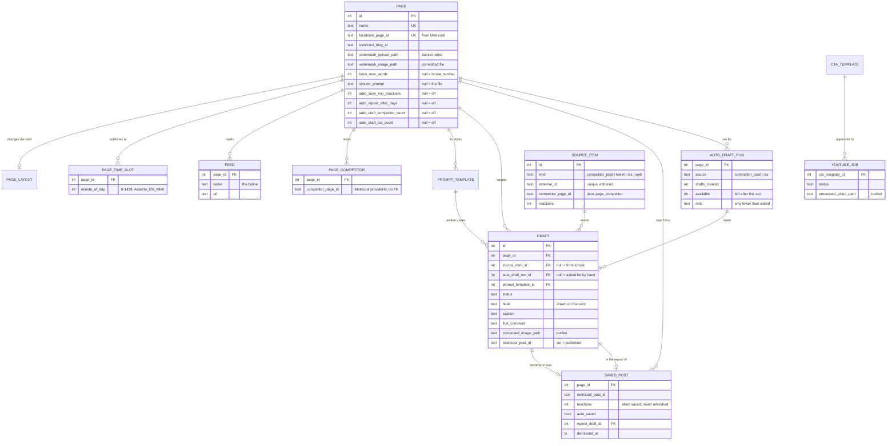

# Data model

What fb-agent stores, why it stores it, and how data moves through the app.
The reasoning for each column is in its docstring in
[`api/app/models.py`](../api/app/models.py). This page is the map.

## Where data lives

fb-agent owns only part of its data. Before adding a table, check which of
these four places the data belongs in.

| Place | Holds | Why there |
|---|---|---|
| **Postgres** | Settings, drafts, the posts we read from, records of decisions | The only copy. Nothing else can rebuild it |
| **Supabase bucket** (`fb-agent-media`, public) | Pictures: heroes, composites, insets, uploaded watermarks, Shorts | Facebook fetches the picture by URL when the post goes out, days later. Rows store a bucket-relative path, never a URL |
| **Metricool** | The schedule, published posts, stats, the competitor list | Theirs. We ask, we never mirror it |
| **Git** | Default prompts (`api/prompts/`), card layout (`api/config/layout.yml`), feed windows (`api/config/sources.yml`), the two committed watermarks | Reviewed and versioned. The database stores only a Page's overrides on top |

Three rules follow from this:

- **No schedule table.** When a post goes out is Metricool's answer.
  `draft.metricool_post_id` is the only link we keep.
- **No competitor table.** The list is configured in Metricool. We store only
  which Page reads which competitor.
- **No stats table.** Reactions and impressions are read live. A saved post
  keeps the numbers it had when it was saved, and nothing else does.

## What we store

Twelve tables, in three groups. The group decides what happens to a row when
the database moves, and whether anything ever deletes it.

### Settings: the operator's decisions

Permanent. Only an edit on the Settings screen changes them. Moving to a new
database MUST copy all of these.

| Table | One row is | Why we store it |
|---|---|---|
| `page` | One Facebook page we publish to | Identity (`facebook_page_id`, `metricool_blog_id`), the watermark, how long it writes, its prompt overrides, and its automation switches |
| `page_layout` | One Page's changes to the card | Only the values the Page changed. Null means `layout.yml`. Deleting the row resets the Page |
| `page_time_slot` | One time of day a Page publishes at | Publishing policy ("08:00 and 19:00"). Metricool has nowhere to keep it |
| `feed` | One RSS feed a Page reads | The feed list has to change without a deploy, and the container's files are read-only |
| `page_competitor` | One competitor assigned to one Page | Metricool allows 100 competitors per account, so one competitor is added once and assigned to every Page that should read it |
| `prompt_template` | One named post style for one Page | A style picked at generate time. Each field replaces the Page's prompt; blank keeps the Page's |
| `cta_template` | One end clip for Shorts | The Shorts tool's clip library |

**Null means inherit.** Most settings columns are nullable. Null is not "the
same value as the default", it is a pointer to the default, so changing a
default moves every Page that never overrode it. A copied default would freeze
the Page at today's value with nothing recording that anyone chose it. This
applies to the prompt overrides, the writing lengths, `page_layout` and
`prompt_template`.

**Prompts resolve in three tiers**, on every call, in
[`app/writer/prompts.py`](../api/app/writer/prompts.py):

1. The Page's column (`page.system_prompt` and its siblings), if someone typed one.
2. A committed per-Page file, `api/prompts/pages/<slug>/*.txt`.
3. The house file, `api/prompts/*.txt`.

A post style, when one is picked, is applied on top of whichever tier won.

**The watermark** resolves the same way: an uploaded file
(`watermark_upload_path`, in the bucket) wins over a committed one
(`watermark_image_path`, under `api/assets/`). With neither, the card prints
`watermark_text`, or the Page's name. `watermark_enabled = false` draws nothing
at all. A configured file that will not load fails the draft rather than
quietly printing the name.

### Records: what happened, kept on purpose

Small, and not rebuildable. Moving to a new database SHOULD copy these.

| Table | One row is | Why we store it |
|---|---|---|
| `saved_post` | A published post someone, or auto-repost, decided to keep | Metricool's stats cover a date range, so a post drops out of every read as it ages. The row also carries auto-repost's memory: `repost_draft_id` (already reposted), `dismissed_at` (unsaved by hand, never save again) and `repost_error` (will never repost) |
| `auto_draft_run` | One Page's share of one auto-draft run | A run that made nothing leaves no draft behind. This row is how the screen tells "the cron did not fire" from "there was nothing left to write about" |

Without `saved_post`, the next auto-repost run would save the top posts again
and schedule reposts the operator already has or already refused.

### Work: drafts and their inputs

Disposable once published. A new database MAY start without these; the cost is
in "Moving the database" below.

| Table | One row is | Why we store it |
|---|---|---|
| `draft` | One generated post for one Page | It holds paid model output and the review state, and it is the job record: the row exists before generation starts, and progress is written to it |
| `source_item` | One competitor post, tweet, RSS item or web page used as input | Competitor posts are stored on sync so the grid and the generator can read them by id. Tweets, RSS and web pages are fetched live and stored only when a draft is written from them |
| `youtube_job` | One processed Short | The row is the job: queued, processing, completed or failed, with progress |

**Draft status:**

```
generating ──> review ──> rejected
     │           │  ▲          │
     ▼           │  └──────────┘  (unapprove)
   failed        ▼
           published = metricool_post_id is set (status stays review)
```

`approved` is still a valid value for old rows. Nothing sets it any more.

A published draft is **frozen**. Metricool holds a link to its composite, and
a redraw would delete that file before Facebook fetches it. Caption, first
comment and time can still change; the picture cannot. To change the picture,
unschedule first.

`metricool_post_id` changes on every edit, because Metricool has no in-place
update: an edit deletes the post and creates a new one. Every edit writes the
new id back. The value `queued` means Metricool accepted the post without
naming it, so it can only be changed in Metricool's planner.

## ERD

Key columns only. `models.py` has the full list.


```mermaid
erDiagram
    PAGE ||--o| PAGE_LAYOUT : "changes the card"
    PAGE ||--o{ PAGE_TIME_SLOT : "publishes at"
    PAGE ||--o{ FEED : "reads"
    PAGE ||--o{ PAGE_COMPETITOR : "reads"
    PAGE ||--o{ PROMPT_TEMPLATE : "its styles"
    PAGE ||--o{ DRAFT : "targets"
    PAGE ||--o{ SAVED_POST : "kept from"
    PAGE ||--o{ AUTO_DRAFT_RUN : "ran for"
    SOURCE_ITEM ||--o{ DRAFT : "seeds"
    PROMPT_TEMPLATE ||--o{ DRAFT : "written under"
    AUTO_DRAFT_RUN ||--o{ DRAFT : "made"
    DRAFT ||--o| SAVED_POST : "became, if ours"
    DRAFT ||--o| SAVED_POST : "is the repost of"
    CTA_TEMPLATE ||--o{ YOUTUBE_JOB : "appended to"

    PAGE {
        int id PK
        text name UK
        text facebook_page_id UK "from Metricool"
        text metricool_blog_id
        text watermark_upload_path "bucket; wins"
        text watermark_image_path "committed file"
        int hook_max_words "null = house number"
        text system_prompt "null = the file"
        int auto_save_min_reactions "null = off"
        int auto_repost_after_days "null = off"
        int auto_draft_competitor_count "null = off"
        int auto_draft_rss_count "null = off"
    }
    PAGE_COMPETITOR {
        int page_id FK
        text competitor_page_id "Metricool providerId, no FK"
    }
    PAGE_TIME_SLOT {
        int page_id FK
        int minute_of_day "0-1439, Asia/Ho_Chi_Minh"
    }
    FEED {
        int page_id FK
        text name "the byline"
        text url
    }
    SOURCE_ITEM {
        int id PK
        text kind "competitor_post | tweet | rss | web"
        text external_id "unique with kind"
        text competitor_page_id "joins page_competitor"
        int reactions
    }
    DRAFT {
        int id PK
        int page_id FK
        int source_item_id FK "null = from a topic"
        int auto_draft_run_id FK "null = asked for by hand"
        int prompt_template_id FK
        text status
        text hook "drawn on the card"
        text caption
        text first_comment
        text composed_image_path "bucket"
        text metricool_post_id "set = published"
    }
    SAVED_POST {
        int page_id FK
        text metricool_post_id
        int reactions "when saved, never refreshed"
        bool auto_saved
        int repost_draft_id FK
        ts dismissed_at
    }
    AUTO_DRAFT_RUN {
        int page_id FK
        text source "competitor_post | rss"
        int drafts_created
        int available "left after this run"
        text note "why fewer than asked"
    }
    YOUTUBE_JOB {
        int cta_template_id FK
        text status
        text processed_video_path "bucket"
    }
```

**Nothing points into the settings tables**, apart from `prompt_template`.
`source_item` carries the publisher's name, not a `feed_id`; a scheduled post
carries its own time, not a slot id. So deleting a feed, a slot or an
assignment changes tomorrow and nothing that already happened.
`draft.prompt_template_id` is the exception, on purpose: a regenerate has to
use the style the draft was written in, not whatever is selected now.

## Flows

Each flow says what starts it, what it reads and what it writes.

### 1. Set up a Page

- **Trigger:** `scripts/seed_page.py` (two hand-checked Pages with
  watermarks) or `scripts/import_metricool_pages.py` (every Metricool brand with
  a Facebook page).
- **Writes:** `page`.
- Then, on Settings: feeds, competitor assignments, time slots, layout, prompts,
  post styles and automation switches. Each is one settings table above.

### 2. Competitor sync

- **Trigger:** opening the Competitors grid, when the stored posts are older
  than `stale_after_hours` (6), or the Sync button.
- **Reads:** Metricool's competitor posts for the last `lookback_days` (7), for
  every brand.
- **Writes:** `source_item` rows of kind `competitor_post`. Updates the
  reactions on posts it already has. Deletes posts more than twice the window
  older than the newest post, unless a draft came from one.

### 3. Generate by hand

```
Grid (competitor posts, RSS, tweets, web)
  └─> Cart                          in the browser, not stored
        └─> Generate: pick Pages, style, picture choice
              ├─> source_item       tweets, RSS and web written now, if used
              └─> draft             one per source x Page, status generating
                    └─> writer      text, highlights, image prompt
                    └─> picture     source photo, Google, image model, or none
                    └─> compositor  composed card into the bucket
                    └─> status review (or failed, with error)
```

`POST /drafts/manual` skips the writer: the operator types the text and may
upload the hero.

### 4. Auto-drafts (daily)

- **Trigger:** GitHub Actions, `auto-drafts.yml`, 06:00 Ho Chi Minh City.
  It POSTs `/generate/auto`.
- **Reads:** each Page with a source switched on. Competitor posts: the
  highest-reaction posts from assigned competitors, above
  `auto_draft_competitor_min_reactions`, that no draft has come from yet. RSS:
  the Page's feeds, fetched live, filtered by `auto_draft_rss_instructions`.
- **Writes:** one `auto_draft_run` per Page and source, then drafts as in
  flow 3, landing in Review.
- A post is never drafted twice, because a draft already points at it. That
  check reads `draft`, so it only holds while the drafts exist.

### 5. Review and edit

- **Trigger:** the operator, on Review.
- **Writes:** `draft` only. Text edits, regenerate, a new hero, crop, inset,
  template. A redraw replaces the composite in the bucket and deletes the old
  file. Reject and unapprove move the status.

### 6. Publish

```
draft (review) ──> POST /drafts/{id}/publish
                     ├─ Metricool: caption, first comment, picture URL, time
                     └─ draft.metricool_post_id = Metricool's id   (frozen)

then:  PATCH       caption, first comment   allowed, id changes
       reschedule  move the time            allowed, id changes
       unschedule  delete in Metricool      draft is editable again
       redraw                               refused (409)
```

The time comes from the Page's free slots: `page_time_slot` minus what
Metricool already has queued. When Facebook publishes, it fetches the picture
from the bucket.

### 7. Overview: save, reuse, repost

- **Reads:** Metricool stats, live, last 30 days.
- **Save:** writes `saved_post` with the post's text and scores at that moment.
- **Write again (reuse):** a new draft from a saved post, through flow 3.
- **Repost:** a new draft copying the post as it went out, picture included,
  into Review. Published through flow 6 like any other.
- **Unsave:** deletes a hand-saved row. An auto-saved row is kept with
  `dismissed_at` set, so auto-repost never saves it again.

### 8. Auto-repost (weekly)

- **Trigger:** GitHub Actions, `auto-repost.yml`, Monday 06:00 Ho Chi Minh
  City. It POSTs `/pages/auto-repost`.
- **Reads:** for each Page with `auto_save_min_reactions` set, the last 30 days
  of Metricool stats, and that Page's `saved_post` rows.
- **Writes:** `saved_post` for each post over the threshold that is not saved,
  dismissed, or a caption already saved. Then, if `auto_repost_after_days` is
  set, up to three reposts per Page: a draft each, scheduled at the first free
  slot after publish date plus N days, with `repost_draft_id` set on the saved
  post first so no run builds a second.
- This skips Review. The repost is visible and cancellable on Schedule.

### 9. Clean-up (daily)

- **Trigger:** a thread in the API process, at startup and every 24 hours.
- **Deletes:**
  - bucket files older than the retention window, except Page files;
  - `rejected` and `failed` drafts whose pictures are gone, unless a saved post
    links to them;
  - tweet, RSS and web `source_item` rows no draft points at any more;
  - a published draft's hero and inset files after 14 days. Only the
    composite is needed once Facebook has it.
- Published drafts are never deleted. They are the record of what went out.

### 10. Shorts

```
POST /youtube/jobs ──> youtube_job (queued)
  worker thread, every 5s ──> download, trim to N seconds, append the CTA clip
                          ──> mp4 into the bucket, job completed (or failed)
```

Separate from everything above: no key crosses between a draft and a Short.
Publishing Shorts was cut; the operator downloads the file.

## Moving the database

What a fresh database costs, by group:

- **Settings missing:** every Page loses its feeds, competitors, times, layout,
  prompts, styles and automation. The seed scripts bring back Pages only.
- **Records missing:** auto-repost reposts again, and hand-saved notes are gone.
- **Work missing:** the queue starts empty. Auto-drafts may draft competitor
  posts that were already used, once, because the drafts that marked them used
  are gone. Posts already scheduled in Metricool still go out, but show as
  posts not made in this app.

Whatever moves, the bucket MUST stay. Posts already queued in Metricool point
at files in it.

Copy with ids kept, then move each table's sequence past the highest id
(`setval`), or the first new row collides. `scripts/seed_local.py` does exactly
this for a local copy.

## Conventions

- **Enums are `VARCHAR`**, never native Postgres enums. A new member is a change
  to the Python class only. See `models._stored_enum`.
- **Paths, not URLs**, for anything in the bucket. The URL is built at read
  time (`media.public_url`), so a new bucket or project is a config change.
- **Every time is `Asia/Ho_Chi_Minh`.** Metricool takes naive local time with
  the zone as a separate field.
- **Schema changes are Alembic revisions** in `api/alembic/versions/`. The
  test suite builds its schema from the models, so only `alembic check` against
  the live database proves a revision exists.
- **No `user_id`.** One operator, one shared API key.
