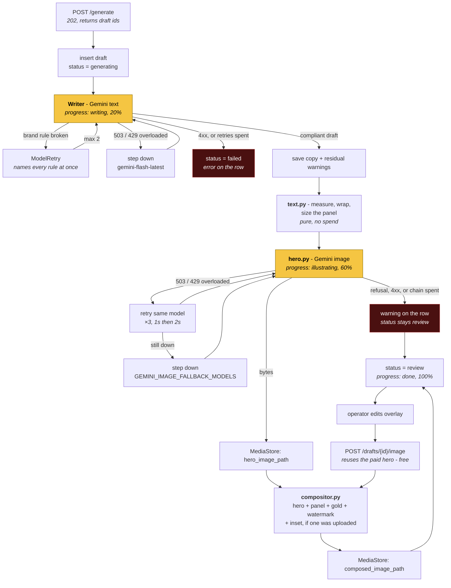

# Design

This document describes the architecture of the application: its components,
their interfaces, and the reasoning behind the boundaries between them.

Related documents:

| Document | Covers |
|---|---|
| [data-model.md](data-model.md) | The database schema and the ERD |
| [adr/](adr/) | The decisions that constrain future changes |
| [youtube-tool.md](youtube-tool.md) | The Shorts tool, which is a separate application sharing this process |
| [CLAUDE.md](../CLAUDE.md) | Development conventions, the check commands, and known integration traps |

The design principle applied throughout is that **a module should present a
small interface over a large amount of behaviour**. Where a module is described
below, it is described by its interface first and its implementation second.

## Shape

```
        ┌───────────────────────────────┐
        │  web/   Next.js               │   11 screens, no DB access
        │  Overview · Sources · Manual  │   talks only to /api over fetch
        │  Review · Schedule · Settings │
        │  · Global                     │
        │  Shorts: Produce · Overview   │   the second tool, same rail
        │  · History · Shorts Settings  │
        └───────────────┬───────────────┘
                        │ HTTP + JSON, X-API-Key on every path but /health
        ┌───────────────▼───────────────┐
        │  api/   FastAPI               │
        │                               │
        │   routes  ──► generate  ──►   │──► Gemini (text, image)
        │              sources    ──►   │──► Metricool · x.com · RSS
        │              compositor       │
        │              media store  ──► │──► Supabase Storage, public bucket
        │              youtube    ──►   │──► yt-dlp · ffmpeg · youtube-media
        │              db               │
        └───────────────┬───────────────┘
                        │
                 Supabase Postgres   session pooler, :5432
```

Authentication is one shared secret in `X-API-Key`, checked in **middleware**
rather than as a `Depends` per router - a dependency is something the next route
can be written without, and the failure is a new endpoint that is silently
unprotected. It also covers the `/assets` StaticFiles mount, which a `Depends`
could not. A blank `API_KEY` denies rather than allows: `compare_digest("", "")`
is `True`, so the explicit emptiness check in `main.py` is what stops a deploy
coming up wide open and looking exactly like a working one.

The browser never holds that key. `web/src/proxy.ts` attaches it from the web
server's own environment as it forwards `/api/*`, and what the browser carries
is an httpOnly session cookie issued by `/auth/login` against `APP_EMAIL` /
`APP_PASSWORD`. Two secrets, neither of them client-side: the cookie says who is
using the screens, the key says the API may be called at all.

Two processes, one machine. No queue, no worker, no Redis, no cron.

## Layout

```
fb-agent/
├── api/
│   ├── config/layout.yml        the default Composed Image form
│   ├── config/sources.yml       the windows. The feed list is rows now
│   ├── prompts/                 system · overlay · image
│   │   └── pages/<slug>/        a Page's own, when it has one
│   ├── alembic/versions/        21 revisions; head is 4c88d1d59926
│   ├── app/
│   │   ├── main.py              FastAPI app, lifespan, API-key middleware,
│   │   │                        /assets mount
│   │   ├── settings.py          env + both yml files → frozen models
│   │   ├── db.py                engine, alembic upgrade, session dependency
│   │   ├── models.py            SQLModel, eleven tables
│   │   ├── routes/              pages · prompts · sources · competitors ·
│   │   │                        feeds · drafts · schedule · overview · config
│   │   ├── sources/             metricool.py · x.py · rss.py
│   │   ├── publish/             metricool.py - the planner write path
│   │   │                        repost.py - republishing one of our own
│   │   ├── writer/              agent.py · prompts.py · validators.py
│   │   ├── image/               hero.py · compositor.py · text.py
│   │   ├── youtube/             the Shorts tool: routes · process (the worker)
│   │   │                        · sources (yt-dlp) · storage · overview
│   │   ├── media.py             MediaStore
│   │   ├── http.py              the shared httpx clients
│   │   ├── log.py               loguru setup
│   │   ├── transient.py         "should I ask again" - one answer, both models
│   │   ├── layout_for.py        layout.yml under a Page's PAGE_LAYOUT row
│   │   └── generate.py          the run
│   ├── assets/                  fonts/Arial-Bold.ttf · watermarks/
│   └── tests/
├── web/                         Next.js, fresh
└── docs/
```

`app/youtube/` is a second tool sharing this process rather than a layer of the
first: its own table, its own bucket, its own worker thread, and no code path
between a Draft and a Short. It is documented separately in
[youtube-tool.md](youtube-tool.md); everything below this line is the Facebook
side unless it says otherwise.

## The modules

Seven, each stated as its interface. Everything else is implementation.

| Module | Interface | What it hides |
|---|---|---|
| `Source` | `fetch(...) -> list[SourceItem]` | three unrelated protocols |
| `Writer` | `write(page, source) -> DraftContent` | prompt assembly, structured output, brand-rule retries |
| `HeroImage` | `generate(prompt, w, h) -> Hero` | `google-genai`, the model chain, retries, safety refusals |
| `Compositor` | `compose(hero, text, highlights, watermark) -> bytes` | measurement, wrapping, panel geometry, SVG, rasterisation |
| `MediaStore` | `save(bytes, name) -> url` | where files live and how they become URLs |
| `Metricool` | `pages()`, `competitors(page)`, `competitor_posts(page)` | auth, blog-id resolution, lookback windows |
| `Publisher` | `schedule()`, `update()`, `delete()`, `get_post()` | the planner's payload shape, its naive-local clock, and that an edit is a replace |
| `GenerateRun` | `run(source_ids, page_ids) -> list[draft_id]` | the whole pipeline |

`Publisher` is `app/publish/metricool.py` and is a separate module from
`sources/metricool.py` on purpose: the read side answers "what is out there",
the write side "put this in the planner", and they share an account rather than
a problem. The write side is where every integration trap in `CLAUDE.md` lives -
naive local `dateTime` with `timezone` beside it, XML error bodies on a JSON
API, images that are linked and never re-hosted, and `update()` returning a
**new** post id because there is no in-place edit.

Persistence is **SQLModel** - the table classes in `models.py` are both the
schema and the API-facing types, so there is no second set of DTOs to keep in
sync.

Schema changes go through **Alembic**, and `db.init_db()` is `alembic upgrade
head` run in-process at startup rather than as a release command: there is
exactly one replica, so nothing races for the migration lock and no deploy can
forget its own migration. `create_all` cannot do this job - it creates missing
tables and never alters existing ones, so a column added to `models.py` breaks
every query on that table until someone remembers the `ALTER TABLE` by hand.

`app/db.py` **refuses** a non-Postgres URL rather than building an engine for
it. One backend keeps every behavioural question answerable once: the enum
column that round-tripped as `str` on one backend and as the enum on the other
was invisible precisely because two disagreed. The connection is the session
pooler on `:5432` - the transaction pooler on `:6543` breaks psycopg's prepared
statements, and the direct host is IPv6-only.

The test suite still runs on a throwaway SQLite file per test, but it builds that
engine itself in `tests/conftest.py` and assigns `db._engine` directly, so SQLite
is a property of the suite and has no representation in the app's configuration.
The two schemas agree only because the enum columns are pinned to `VARCHAR`.

### `Source` - the one real seam

Three adapters behind one interface, which is what makes the seam genuine rather
than hypothetical:

- **`MetricoolCompetitors`** - `fetchMetricoolCompetitors` + `fetchMetricoolCompetitorPosts`,
  windowed by a lookback in days. Writes rows on arrival.
- **`XTweet`** - `https://api.x.com/2`, one tweet resolved from a pasted URL.
- **`RssFeeds`** - the Page's curated feeds, read from
  [`config/sources.yml`](../api/config/sources.yml). Per-page, because the beats
  do not overlap: History Retraced draws seven (Smithsonian, Live Science,
  Science Daily, Atlas Obscura, The History Blog, HistoryExtra, All That's
  Interesting) over a 7-day window, capped at 50 items. A Page with no entry
  raises rather than showing an empty grid.

They converge on one `SourceItem`, and generation never learns which adapter
produced one. It passes `kind` to `source_instruction`, and every kind binds the
subject (see [data-model.md](data-model.md#every-kind-binds-the-subject)).

The ingest rule - **browsing does not write** - lives here. Tweets and RSS items
are fetched live and become rows only when ticked into the Cart, so the table
does not fill with hundreds of unread items.

### `Writer` - validation moves inside the interface

One Pydantic AI agent over `GoogleModel`, returning a typed `DraftContent`
(hook, caption, first comment, overlay text, highlight phrases, hashtags, image
prompt).

The brand rules are `@agent.output_validator` functions raising `ModelRetry`
with the specific failure: hook ≤65 words, no question mark in the hook, ≤5
recap lines each opening with an emoji, first comment 2-3 paragraphs, body
1500-2100 chars, no meta-phrases. Capped at two retries, so the happy path costs
one call. Whatever still fails after two lands in `draft.warnings`.

The lengths in that list are the house numbers. A Page may set its own through
the five nullable columns in
[data-model.md](data-model.md#how-long-a-page-writes), and `Limits.disagrees()`
refuses an unsatisfiable band with a 422 rather than letting every draft fail at
one end of it.

**A validator may block only if the prompt states it and the model can verify it
in its own output.** Everything else is a Warning, and that line is what
separates `check` from `advise`. It was learned the expensive way: a paragraph
count was enforced and never stated, so the model was rejected on the first
attempt of *every* run, and a birth/death-years rule could not be satisfied at
all by a story naming no people. Moving a rule from warning to blocker raises the
bar on its precision - a loose warning is noise, a loose blocker is a dead run.

This is the depth that matters most: callers ask for a draft and get a
brand-compliant draft, or an explanation. They never see a retry.

**Post styles are a fourth layer, not a fourth tier.** A `PROMPT_TEMPLATE` row
is a named style the operator picks at run time - Meme, Workout Infographic -
and each of its three fields is a **delta** laid over the resolved prompt, never
a copy of it. A style that restated the house prompt would drift from it; a Meme
style is a dozen lines of "ignore the essay structure above".

Styles are per-Page rather than global, and the chosen one is recorded on the
Draft as `prompt_template_id`, so a redraw or a rewrite applies the same one.

### `Compositor` - the largest implementation, four arguments

Everything about how the image looks is [`layout.yml`](../api/config/layout.yml)
plus the hero and the text. `resvg` rasterises, `fontTools` measures, both
reading the same `Arial-Bold.ttf`.

Internally it splits into `text.py` (measure → wrap → plan panel height) and
`compositor.py` (SVG → raster → paste). That split is an **internal seam**: its
own tests use it, callers never see it. Text measurement is a pure function and
is tested as one; the composite is tested against golden images.

Two traps here, both easy to get wrong and both silent:

- **Kerning is not optional.** Without it `AVATAR` measures 10.69px too wide at
  36px - Arial's AV/VA/AT/TA pairs at −152 units over a 2048 em. A token
  measured too wide wraps early, which changes the line count, which changes the
  panel height.
- **resvg substitutes silently.** It does not error on an unmatched
  `font-family`; it renders a system face and returns a valid PNG of the wrong
  font, which then disagrees with every width the measurer computed. The family
  must be the TTF's own name-table entry - `font-family="Arial"` with
  `font-weight="bold"`, *not* `"Arial Bold"`. The compositor asserts rendered
  ink width against measured advance so a regression here fails loudly.

### `MediaStore` - one adapter, on purpose

`save(bytes, name) -> url`. The implementation is `SupabaseMediaStore`, writing
to a **public** bucket.

Public is load-bearing, not lazy. Metricool stores the image *link* and never
re-hosts the file, whatever their help centre says about the normalize endpoint,
and Facebook fetches that link when the post is due - days later. A signed URL
expires before then, and the evidence is not hypothetical: the previous system
signed for 24h and 0 of its 105 published posts still have a working image.
Public means "public to whoever holds the link" - buckets do not list, and every
filename ends in six random hex characters.

A row holds the path *relative to the bucket*, never a URL, so moving the
project or the bucket is an env change rather than an `UPDATE` across every
draft; `public_url` turns a stored path into the link at read time. There is no
`/media` mount on the API any more - the browser fetches from the bucket
directly, and a mount would be a second, staler way to reach the same file.

The Protocol survives the one-implementation rule because `tests/conftest.py`
substitutes a filesystem-backed fake for it, which is what keeps the suite
offline instead of mocking HTTP in order to write a file.

### `GenerateRun` - one function, not a graph

`run(source_ids, page_ids) -> list[draft_id]`. Resolving the prompt is a `Page`
row read, resolving the sources is a `SourceItem` row read, validation lives
inside `Writer`, and the save is one transaction.

`generate.py` is ~600 lines, and almost none of it is orchestration: it is the
image path, the style layer, the source resolution and the failure handling,
all of it behind that one call.

A run generates its drafts **in parallel** - a `ThreadPoolExecutor` with a
session per draft, because SQLAlchemy Sessions are not thread-safe and `_run_one`
commits several times. Concurrency defaults to **3**, and the cap is about Gemini
rather than threads: the writer's fallback chain steps models on a transient
error without ever backing off, so a 429 burns the chain and fails the draft
instead of waiting. Going wider means adding backoff first.

## Background work and progress

No queue. The sequence, for each (source × page) pair:

1. `POST /generate` inserts a `draft` row with `status='generating'` and returns
   its id immediately.
2. A FastAPI `BackgroundTask` runs `Writer` → `HeroImage` → `Compositor` →
   `MediaStore`, updating `progress_step` and `progress_pct` on the row as it
   goes.
3. The client polls `GET /drafts/{id}` until `status` leaves `generating`.
4. Failure writes `error` and stops. The row stays, so nothing is lost silently.

### The run, end to end

Two model calls, and they fail differently. **Only the two orange steps cost
money**; everything downstream of the hero is arithmetic and rasterising, and
can be re-run for free. The circular inset is not on this diagram because
nothing here produces it: it is uploaded afterwards, from the drawer, and
re-composites for free like any other edit.



The one picture nothing on that diagram produces is the **circular inset** - the
disc that sits, by default, on the seam between the hero and the panel. It is
uploaded from the drawer, so it costs nothing, cannot fail a run, and does not
exist until somebody puts it there. `POST /drafts/{id}/inset` stores the file and
re-composites. It is uploaded only - there is no generate-an-inset path.

Size and position live on the row - `inset_size_px`, `inset_x_ratio`,
`inset_y_ratio` - because they depend on what is in the picture rather than on
the brand, and changing either is a free redraw like any text edit. Position is
a *ratio* of the card, and **null is not
zero**: it means the default, which cannot be written down as a number because
the panel grows with the copy and the seam is therefore at a different height on
every draft. `compositor.inset_centre` resolves it per axis at draw time, and
the preview mirrors that split - a defaulted disc is rendered inside the hero,
where the seam is a flexbox edge, and a placed one against the card.

The asymmetry between the two failure paths is the design decision worth
keeping. A writer failure is fatal to the draft - there is no post without copy.
An image failure is **not**: the row stays at `review` with its caption intact
and the reason in `warnings`, because throwing away a good caption over one
refused prompt is the more expensive mistake.

A second asymmetry sits inside the hero step, and it is about billing rather than
severity. **A refusal and an outage are not the same failure.** A refusal is a
completed call - the model answered, the answer was a well-formed empty response,
and Google charged for it - so retrying buys the same rejection twice and a
second model refuses the same prompt for the same reason. A 503 never reached a
model at all: nothing was generated, nothing was billed, and asking again is
free. The hero step originally retried neither, on the reasoning that "a second
attempt is a second charge" - true of the refusal, false of the 503, and that
one conflated rule is how a transient outage came to kill whole runs.

So the image side has the same ladder as the writer now, minus the alias at the
bottom - see [Configuration](#configuration) for why it cannot have one. Both
sides share one
`is_transient` in `app/transient.py`, because "should I ask again" is one
question and two copies of the answer would drift.

Unlike the text chain, a fallback here is **reported**: `generate()` returns the
model that drew the picture, and `build_image` turns a swap into a Draft warning.
A backup text model reads the same; a backup image model draws in a different
style, and a silent swap is brand drift nobody sees.

`hero_image_path` and `composed_image_path` are separate columns for the same
reason. Editing the overlay text re-enters the graph at `compositor.py` and
costs nothing; only `?new_hero=true` buys another picture.

The row *is* the job record. That is why `draft` carries progress columns and
why there is no `generation_event` table.

Consequence to accept: a process restart mid-run leaves rows stuck in
`generating`. A startup sweep marks any such row as `error`, since with one
process there is no other writer that could still own it.

## HTTP surface

Every path but `/health` requires `X-API-Key`; `/assets` included, because the
check is middleware and not a per-route dependency.

```
GET    /health                      boot state. The only unauthenticated path -
                                    Railway probes it before routing traffic.
                                    Names missing secrets, never their values

GET    /pages                       ten rows
GET    /pages/{id}
PATCH  /pages/{id}                  watermark, badge, writing lengths (422 on an
                                    unsatisfiable band)
POST   /pages/{id}/watermark        upload a mark;  DELETE removes it
GET    /pages/{id}/slots            the times this Page publishes at
POST   /pages/{id}/slots            DELETE /pages/{id}/slots/{slot_id}

GET    /prompts                     resolved per Page, with `source` and `editable`
PUT    /prompts/{page_id}/{file}    this Page's own text. Blank body = inherit again
GET    /prompts/templates           the Page's named post styles
POST   /prompts/templates           PUT /{id} ;  DELETE /{id}

GET    /layout                      layout.yml with the Page's overrides laid over
PATCH  /layout                      write an override;  DELETE /layout resets
POST   /layout/sample               render a sample card without a draft

GET    /feeds                       POST /feeds ;  DELETE /feeds/{id}
GET    /competitors/assignments     PUT to replace a Page's set
POST   /competitors                 add one to Metricool;  DELETE /competitors/{id}
GET    /competitors/allowance       how much of the account's 100 is spent

GET    /sources/competitors?page_id=&refresh=&sort=  stored rows; reactions by default
GET    /sources/competitors/reach   GET /sources/competitors/pages
GET    /sources/rss?page_id=        the Page's feeds, live, unsaved
GET    /sources/tweet?url=          single lookup, live, unsaved
GET    /sources/items/{id}          what a draft was written from
GET    /sources/config              the windows

POST   /generate                    {sources, page_ids} → draft ids
POST   /drafts/manual               a typed draft. No model call at all
GET    /drafts?status=&page_id=
GET    /drafts/{id}                 poll target
PATCH  /drafts/{id}                 operator edits. Allowed on a queued post for
                                    text only; pushes the edit to Metricool
POST   /drafts/{id}/regenerate      one field, by the model
POST   /drafts/{id}/image           redraw; ?new_hero=true buys a new picture
POST   /drafts/{id}/hero            upload a hero instead of paying for one
POST   /drafts/{id}/inset           upload the disc;  DELETE removes it
POST   /drafts/{id}/reject          /unapprove puts it back in the queue
DELETE /drafts/{id}

GET    /publish/mode                rehearsal or live - the flag the screens cannot see
POST   /drafts/{id}/publish         → the planner
POST   /drafts/{id}/reschedule      move it, without opening Metricool
POST   /drafts/{id}/unschedule      out of the planner, back to an editable draft

GET    /schedule                    read live from Metricool. No local mirror (ADR-0001)
GET    /schedule/next-slot          the next free PAGE_TIME_SLOT

GET    /overview/performance        live from Metricool's stats
GET    /overview/saved              POST to keep one;  /reuse ;  DELETE
POST   /overview/saved/{id}/repost  the original back in the queue, as published -
                                    /reuse sends the story through the writer again

GET    /assets/{path}               committed watermarks and fonts
```

The Shorts tool hangs off the same app under `/youtube`, and shares nothing with
the block above but the process and the Metricool account:

```
POST   /youtube/jobs                enqueue; GET lists, GET /{id} polls
GET    /youtube/jobs/{id}/download  DELETE /youtube/jobs/{id}
GET    /youtube/channel-shorts      the picker, ranked by views
GET    /youtube/brands              GET /youtube/overview?brand_id&days
GET    /youtube/config              presence, never values
GET    /youtube/cta-templates       /upload-url mints a signed PUT;
                                    /complete makes the row;  DELETE /{id}
```

`cta-templates/upload-url` is the shape worth noticing from here: the bytes never
cross this app. See [youtube-tool.md](youtube-tool.md) for why, and for the two
production ceilings that made it necessary.

`hero_image_path` and `composed_image_path` are stored separately so
regenerating the overlay after an edit does not re-pay for image generation -
which is why the two operations are **two routes**. Collapsing them into one
hides the price difference from the only screen that could show it, and the
cheap one is the common case: every overlay edit needs it.

`?new_hero=true` also clears `error`, because a refused hero is the one failure
that leaves a Draft complete except for its image, and the prompt it was refused
for is `image_prompt` - an operator-editable field on `PATCH`, or the row is a
dead end.

`POST /drafts/{id}/approve` is gone, and so is Approve in the UI: publishing
never required it, so it was a queue movement with no consequence. `unapprove`
survives as the undo behind the Rejected toast, and still puts back a row that
already carries `APPROVED`; **nothing writes that status any more.** That is
also why the Quota was cut - it capped a number Approve could raise and
`unapprove` could lower, so it never bound anything.

**The three routes at the bottom of the publish block are the exception to the
freeze**, and the shape is worth stating once. A Draft in the planner is frozen
against anything that would change its *picture*, because Metricool holds a link
and Facebook has not followed it yet. Its text is not frozen: `PATCH` pushes the
edit through to the planner, `reschedule` moves it, and `unschedule` takes it out
and unfreezes the row completely. Each of those calls Metricool's `PUT`, which
**replaces** the post - so `metricool_post_id` is rewritten from the response
every time. See `data-model.md#what-happens-after-publish`.

## Configuration

Four tiers. Two of them carry a per-Page layer, and in both cases that layer
holds **only what a Page changed** - never a copy of what it inherits, which is
the property that stops either from drifting:

- **[`layout.yml`](../api/config/layout.yml)** - how the image looks. Loaded once
  into a frozen Pydantic model at startup, so a bad value fails the boot, not the
  render. `PAGE_LAYOUT` rows override it per Page and the file is the default
  they resolve against
  ([why](data-model.md#layout-is-config-with-per-page-overrides)).
- **[`prompts/*.txt`](../api/prompts)** - what the model is told. Read on every
  call, so an edit needs no restart. Files because they are the most-edited thing
  here and must be reviewable and revertable. Resolved in three tiers: the
  Page's stored column, then `prompts/pages/<slug>/`, then the house file
  ([why](data-model.md#prompts-are-files-with-per-page-overrides-in-the-database)).
  The stored tier exists because Railway's filesystem is ephemeral, so an editor
  that wrote a file would lose every edit on redeploy. `{panel_pct}` and
  `{highlight_color}` are substituted from `layout.yml` after resolution, so no
  tier can contradict the compositor.
- **env** - secrets and model ids. Model ids belong here because they get retired
  upstream without notice. **Every link in both
  chains is a pinned version and will eventually rot.** There is no `-latest`
  alias for any image model - only pinned ids (`gemini-3.1-flash-image`,
  `gemini-3-pro-image`, `gemini-2.5-flash-image`) - and the text chain does not
  use the alias it could: `gemini-flash-latest` pings fine and then answers 503
  on a real call, being an alias onto a busy model, which is the one failure a
  fallback exists for (`b971556`, measured). A rotted link answers 404, which is
  not transient and so surfaces instead of being spent as three attempts and a
  silent step sideways.
- **`page` rows** - identity and per-Page policy: name, the two external ids, the
  watermark and badge, the five writing lengths, the three prompt overrides.

### The three prompt files

Two models are prompted - the text writer and the hero image model. One file per
prompt, one loader each.

| File | Model | What it does |
|---|---|---|
| `system.txt` | text | The post: hook ≤65 words no questions, recap of ≤5 emoji-led points, first comment of 2-3 paragraphs and no meta-phrases. The lengths are the house numbers, and a Page that sets its own gets them appended as an overriding block |
| `overlay.txt` | text | The panel copy, then 5-8 short substrings quoted verbatim out of it |
| `image.txt` | image | How the photo should look, which layer to draw, and what must not appear in it |

**`overlay.txt` is a contract with the compositor, not a style note.** The
writer produces the panel text *and then quotes pieces of its own text back* -
it is not searching text it was given, and it must not paraphrase. Highlighting
is a substring match, so a phrase off by one character silently renders no gold.
The prompt therefore demands verbatim copies, and demands them short (1-4 words:
years, names, places) because a whole clause in gold emphasises nothing. The
colour it names is `{highlight_color}`, substituted so it cannot disagree with
what is painted.

**`image.txt` also carries a contract with the card**, and that is why it is one
file rather than two. It tells the model the panel takes `{panel_pct}`% from the
bottom, that the watermark lands top-right, and that layers 2-3 are drawn in
code - so it must leave room and draw neither.

Style and card contract are one file rather than two, deliberately. The split
looked principled - hero *style* is the page's taste, the *card contract* is
universal - but no line can be drawn there correctly: most of what read as
universal was one Page's taste (reenactment, period dress, mid-shot filling
40-60% of frame), and three rules ended up stated twice, once on either side of
the boundary. This is the same call as `page` + `page_style` in
[data-model.md](data-model.md#why-the-original-three): a strictly 1:1 split buys
nothing and rebuilds the shape where one setting lives in two places and drifts.

`prompts/pages/bodybuilding-tips-n-tricks/` and `prompts/pages/fitness-recipes/`
each hold all three files; the other eight Pages inherit the house ones.

A Page overriding a file overrides **all** of it, deliberately: no merge, no
block-level inheritance, no way to take half a prompt. Same reasoning as the
ERD's null columns - a partial copy is the thing that drifts.

The two per-Page sets are **drafts of ours and have never been approved by the
client**.

## Frontend

Eleven screens in a fresh Next.js app, in two groups on one rail:

- **Facebook** - Overview, Sources, Manual, Review, Schedule, Settings, Global
- **Shorts** - Produce, Overview, History, Shorts Settings

They are two tools rather than one with a tab: no screen crosses the line, and
nothing in the Shorts group reads a Draft. The rail groups them for that reason
rather than to sort a long list.

It holds no database credentials and no Supabase client; every read is `fetch`
to `/api`, which `proxy.ts` forwards to FastAPI with the API key attached
server-side. The Cart is client state, holding the items themselves, and is not
persisted.

Which Page a screen is showing is a **cookie**, `fb_page_id` (`lib/page-cookie.ts`),
not a route segment or a query parameter. Global is the one screen with no
switcher in its title row: the competitor pool at the top is account-wide, and a
Page name up there read as the scope of the whole screen. The two cards below it
that *are* per-Page carry their own switcher, beside the sentence saying so.

**There is no Generate screen.** It existed, staging a run that had one possible
answer, so the Cart panel runs the generation itself and the count sits on its
button (`Generate 3 drafts`) - a label on the click that spends the money. The
topic field lives in the Cart's empty state, which is when a topic run is the
only kind available anyway.

Server state is polled, not streamed: enough for a run measured in tens of
seconds.

## Testing

Each module is tested through its interface, because that is the same surface
callers use.

- `Source` - three adapters, one contract test, recorded fixtures per protocol.
- `Writer` - a fake model returning canned structured output. The validators are
  pure functions and are tested directly; the retry behaviour is tested by a
  fake that fails once then succeeds.
- `Compositor` - golden images at 896×1120, plus pure-function tests on
  measurement and wrapping.
- `GenerateRun` - fakes for `Writer`, `HeroImage`, `Compositor` and
  `MediaStore`; asserts the rows, the progress transitions, and that a failure
  leaves an `error` rather than a stuck row.
- Routes - FastAPI `TestClient` against a temp SQLite file built by the fixture,
  never by `app.db`, which is Postgres-only.

No mocking library reaches past an interface. If a test wants to, the module is
the wrong shape.
