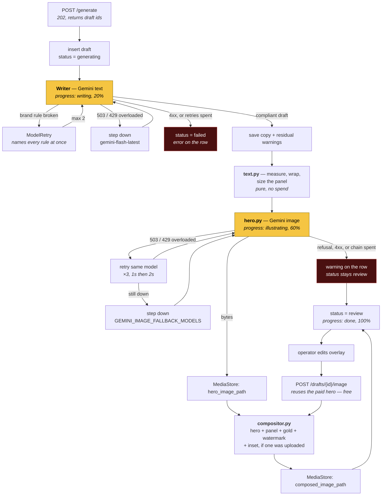

# Design

How the app is put together. The vocabulary is
[CONTEXT.md](../CONTEXT.md); the tables are
[data-model.md](data-model.md); why the old system was cut this way is
[decisions.md](decisions.md) and the three [ADRs](adr/).

The rule this document is written against: **a module is deep when a lot of
behaviour sits behind a small interface**. The previous system failed not
because it had too much code but because its interfaces were as wide as their
implementations — `facebookGenerateGraph.ts` was 819 lines of orchestration
whose every intermediate state was public to the next node.

## Shape

```
        ┌───────────────────────────────┐
        │  web/   Next.js               │   7 screens, no DB access
        │  Overview · Sources · Manual  │   talks only to /api over fetch
        │  Review · Schedule · Settings │   plus Global, the cross-Page one
        └───────────────┬───────────────┘
                        │ HTTP + JSON
        ┌───────────────▼───────────────┐
        │  api/   FastAPI               │
        │                               │
        │   routes  ──► generate  ──►   │──► Gemini (text, image)
        │              sources    ──►   │──► Metricool · x.com · RSS
        │              compositor       │
        │              media store  ──► │──► Supabase Storage, public bucket
        │              db               │
        └───────────────┬───────────────┘
                        │
                 Supabase Postgres   session pooler, :5432
```

Two processes, one machine. No queue, no worker, no Redis, no cron — see
[decisions.md](decisions.md#cut-with-the-evidence) for why each is absent.

## Layout

```
fb-agent/
├── api/
│   ├── config/layout.yml        the default Composed Image form
│   ├── config/sources.yml       the windows. The feed list is rows now
│   ├── prompts/                 system · overlay · image
│   │   └── pages/<slug>/        a Page's own, when it has one
│   ├── alembic/versions/        17 revisions; head is e232c1fcb279
│   ├── app/
│   │   ├── main.py              FastAPI app, lifespan, /assets mount
│   │   ├── settings.py          env + both yml files → frozen models
│   │   ├── db.py                engine, alembic upgrade, session dependency
│   │   ├── models.py            SQLModel, eight tables
│   │   ├── routes/              pages · prompts · sources · competitors ·
│   │   │                        feeds · drafts · schedule · overview · config
│   │   ├── sources/             metricool.py · x.py · rss.py
│   │   ├── publish/             metricool.py — the planner write path
│   │   ├── writer/              agent.py · prompts.py · validators.py
│   │   ├── image/               hero.py · compositor.py · text.py
│   │   ├── media.py             MediaStore
│   │   └── generate.py          the run
│   ├── assets/                  fonts/Arial-Bold.ttf · watermarks/
│   └── tests/
├── web/                         Next.js, fresh
└── docs/
```

## The modules

Seven, each stated as its interface. Everything else is implementation.

| Module | Interface | What it hides |
|---|---|---|
| `Source` | `fetch(...) -> list[SourceItem]` | three unrelated protocols |
| `Writer` | `write(page, source) -> DraftContent` | prompt assembly, structured output, brand-rule retries |
| `HeroImage` | `generate(prompt, w, h) -> Hero` | `google-genai`, the model chain, retries, safety refusals |
| `Compositor` | `compose(hero, text, highlights, watermark) -> bytes` | measurement, wrapping, panel geometry, SVG, rasterisation |
| `MediaStore` | `save(bytes, name) -> url` | where files live and how they become URLs |
| `Metricool` | `pages()`, `competitors(page)`, `competitor_posts(page)` | auth, blog-id resolution, lookback windows |
| `Publisher` | `schedule()`, `update()`, `delete()`, `get_post()` | the planner's payload shape, its naive-local clock, and that an edit is a replace |
| `GenerateRun` | `run(source_ids, page_ids) -> list[draft_id]` | the whole pipeline |

`Publisher` is `app/publish/metricool.py` and is a separate module from
`sources/metricool.py` on purpose: the read side answers "what is out there",
the write side "put this in the planner", and they share an account rather than
a problem. The write side is where every integration trap in `CLAUDE.md` lives —
naive local `dateTime` with `timezone` beside it, XML error bodies on a JSON
API, images that are linked and never re-hosted, and `update()` returning a
**new** post id because there is no in-place edit.

Persistence is **SQLModel** — the table classes in `models.py` are both the
schema and the API-facing types, so there is no second set of DTOs to keep in
sync. Schema changes go through **Alembic**, adopted the day after the move to
Supabase. `create_all` had been the whole story: it creates missing tables and
never alters existing ones, so every added column was a hand-written `ALTER
TABLE` that nothing recorded — the inset columns were done exactly that way.

That was survivable while the database was a disposable file on one laptop and
"delete it and let it rebuild" was the escape hatch. It stopped being survivable
when the database became shared and held the only copy of the drafts: a deploy
ships new code but does not change the schema with it, so a column added to
`models.py` breaks every query on that table until someone remembers the DDL.

`db.init_db()` is `alembic upgrade head`, run in-process at startup rather than
as a separate release command — there is exactly one replica, so nothing races
for the migration lock and no deploy can forget its own migration.

The baseline revision was autogenerated against a throwaway SQLite file and the
live database was `alembic stamp`ed at it, because autogenerate diffs the models
against whatever it is pointed at and Supabase already matched.

The store moved to **Supabase Postgres** on 2026-08-10 (2 pages, 954 source
items, 6 drafts, ids preserved). SQLite was right for a laptop-only v1 and wrong
the moment anything deployed: Railway's filesystem is ephemeral, so a redeploy
dropped the drafts while their pictures stayed in the bucket as orphans.

`app/db.py` **refuses** a non-Postgres URL rather than building an engine for
it. One backend keeps every behavioural question answerable once — the enum
column that round-tripped as `str` on one backend and as the enum on the other
was invisible precisely because two disagreed. The connection is the session
pooler on `:5432`; the transaction pooler on `:6543` breaks psycopg's prepared
statements, and the direct host is IPv6-only.

The test suite still runs on a throwaway SQLite file per test, but it builds
that engine itself in `tests/conftest.py` and assigns `db._engine` directly —
so SQLite is a property of the suite (offline, ~60s) with no representation in
the app's configuration. The two schemas agree only because the enum columns are
pinned to `VARCHAR`.

### `Source` — the one real seam

Three adapters behind one interface, which is what makes the seam genuine rather
than hypothetical:

- **`MetricoolCompetitors`** — `fetchMetricoolCompetitors` + `fetchMetricoolCompetitorPosts`,
  windowed by a lookback in days. Writes rows on arrival.
- **`XTweet`** — `https://api.x.com/2`, one tweet resolved from a pasted URL.
- **`RssFeeds`** — the Page's curated feeds, read from
  [`config/sources.yml`](../api/config/sources.yml). Per-page, because the beats
  do not overlap: History Retraced draws seven (Smithsonian, Live Science,
  Science Daily, Atlas Obscura, The History Blog, HistoryExtra, All That's
  Interesting) over a 7-day window, capped at 50 items. A Page with no entry
  raises rather than showing an empty grid.

They converge on one `SourceItem`, and generation never learns which adapter
produced one. It asks `is_factual`, which is a pure function of `kind`
(see [data-model.md](data-model.md#is_factual-is-derived-never-stored)).

The ingest rule — **browsing does not write** — lives here. Tweets and RSS items
are fetched live and become rows only when ticked into the Cart, so the table
does not fill with hundreds of unread items.

### `Writer` — validation moves inside the interface

One Pydantic AI agent over `GoogleModel`, returning a typed `DraftContent`
(hook, caption, first comment, overlay text, highlight phrases, hashtags, image
prompt).

The brand rules that `validation.ts:44` computed and then discarded as warnings
become `@agent.output_validator` functions raising `ModelRetry` with the
specific failure: hook ≤65 words, no question mark in the hook, ≤5 recap lines
each opening with an emoji, first comment 2–3 paragraphs, body 1500–2100 chars,
birth/death years present, no meta-phrases. Capped at two retries; the happy
path costs the same one call as today. Whatever still fails after two lands in
`draft.warnings` for the operator.

This is the depth that matters most: callers ask for a draft and get a
brand-compliant draft, or an explanation. They never see a retry.

### `Compositor` — the largest implementation, four arguments

Everything about how the image looks is [`layout.yml`](../api/config/layout.yml)
plus the hero and the text. Ported from the old renderer, which already used
resvg rather than sharp for text (`composite-font.ts:24`) and measured with
`opentype.js` advance widths (`overlay-text-measure.server.ts:19`) — both have
exact Python equivalents reading the same `Arial-Bold.ttf`, so this is a port,
not a rewrite.

Internally it splits into `text.py` (measure → wrap → plan panel height) and
`compositor.py` (SVG → raster → paste). That split is an **internal seam**: its
own tests use it, callers never see it. Text measurement is a pure function and
is tested as one; the composite is tested against golden images.

Two facts the Phase 0 spike established, both easy to get wrong:

- **Kerning is not optional.** `opentype.js` applies it inside
  `getAdvanceWidth`. Without it `AVATAR` measures 10.69px too wide at 36px —
  Arial's AV/VA/AT/TA pairs at −152 units over a 2048 em. A token measured too
  wide wraps early, which changes the line count, which changes the panel
  height. With kerning, `fontTools` matches `opentype.js` to four decimal
  places on every token tried.
- **resvg substitutes silently.** It does not error on an unmatched
  `font-family`; it renders a system face and returns a valid PNG of the wrong
  font, which then disagrees with every width the measurer computed. The family
  must be the TTF's own name-table entry — `font-family="Arial"` with
  `font-weight="bold"`, *not* `"Arial Bold"`. The compositor asserts rendered
  ink width against measured advance so a regression here fails loudly.

**Pixel parity with the old system is not a goal.** One good form, re-curated.

### `MediaStore` — one adapter, on purpose

`save(bytes, name) -> url`, with `LocalMediaStore` writing `./media` and serving
it from FastAPI's static mount.

Normally one adapter means the seam is hypothetical and should not exist. It is
kept here because the second adapter is scheduled rather than imagined:
Metricool's servers fetch the image URL themselves
(`metricoolService.ts:182`), so the v2 push cannot work against local disk and
*will* need Supabase Storage or R2. The seam costs one Protocol and one class.

### `GenerateRun` — what replaced the graph

The old LangGraph had six nodes, linear, zero conditional edges
(`facebookGenerateGraph.ts:742`). Each becomes something smaller or nothing:

| Old node | Becomes |
|---|---|
| `resolvePrompt` | a `Page` row read |
| `loadPosts` | a `SourceItem` row read |
| `summarize` | **deleted** — it already mapped each post to itself without calling a model (`:352`) |
| `writeThreeDrafts` | `Writer.write()` per (source × page) |
| `validateAll` | **absorbed** into `Writer`'s output validators |
| `saveBatch` | one transaction |

An `async def`, roughly forty lines.

## Background work and progress

No queue. The sequence, for each (source × page) pair:

1. `POST /generate` inserts a `draft` row with `status='generating'` and returns
   its id immediately.
2. A FastAPI `BackgroundTask` runs `Writer` → `HeroImage` → `Compositor` →
   `MediaStore`, updating `progress_step` and `progress_pct` on the row as it
   goes.
3. The client polls `GET /drafts/{id}` until `status` leaves `generating`.
4. Failure writes `error` and stops. The row stays, so nothing is lost silently.

### The run, end to end

Two model calls, and they fail differently. **Only the two orange steps cost
money**; everything downstream of the hero is arithmetic and rasterising, and
can be re-run for free. The circular inset is not on this diagram because
nothing here produces it: it is uploaded afterwards, from the drawer, and
re-composites for free like any other edit.



The one picture nothing on that diagram produces is the **circular inset** — the
disc that sits, by default, on the seam between the hero and the panel. It is
uploaded from the drawer, so it costs nothing, cannot fail a run, and does not
exist until somebody puts it there. `POST /drafts/{id}/inset` stores the file and
re-composites. The old app offered Upload beside a Generate tab and defaulted to
Upload; only Upload is ported.

Size and position live on the row — `inset_size_px`, `inset_x_ratio`,
`inset_y_ratio` — because they depend on what is in the picture rather than on
the brand, and changing either is a free redraw like any text edit. Position is
a *ratio* of the card, as `centerXRatio`/`centerYRatio` were, and **null is not
zero**: it means the default, which cannot be written down as a number because
the panel grows with the copy and the seam is therefore at a different height on
every draft. `compositor.inset_centre` resolves it per axis at draw time, and
the preview mirrors that split — a defaulted disc is rendered inside the hero,
where the seam is a flexbox edge, and a placed one against the card.

The asymmetry between the two failure paths is the design decision worth
keeping. A writer failure is fatal to the draft — there is no post without copy.
An image failure is **not**: the row stays at `review` with its caption intact
and the reason in `warnings`, because throwing away a good caption over one
refused prompt is the more expensive mistake.

A second asymmetry sits inside the hero step, and it is about billing rather than
severity. **A refusal and an outage are not the same failure.** A refusal is a
completed call — the model answered, the answer was a well-formed empty response,
and Google charged for it — so retrying buys the same rejection twice and a
second model refuses the same prompt for the same reason. A 503 never reached a
model at all: nothing was generated, nothing was billed, and asking again is
free. The hero step originally retried neither, reasoning that "a second attempt
is a second charge"; that is true of the first case and simply false of the
second, which is how a transient outage came to kill whole runs. The writer
carries the same scar (`FALLBACK_MODELS` in `writer/agent.py`).

So the image side has the same ladder now, minus the alias at the bottom — see
[Configuration](#configuration) for why it cannot have one. Both sides share one
`is_transient` in `app/transient.py`, because "should I ask again" is one
question and two copies of the answer would drift.

Unlike the text chain, a fallback here is **reported**: `generate()` returns the
model that drew the picture, and `build_image` turns a swap into a Draft warning.
A backup text model reads the same; a backup image model draws in a different
style, and a silent swap is brand drift nobody sees.

`hero_image_path` and `composed_image_path` are separate columns for the same
reason. Editing the overlay text re-enters the graph at `compositor.py` and
costs nothing; only `?new_hero=true` buys another picture.

The row *is* the job record. That is why `draft` carries progress columns and
why there is no `generation_event` table.

Consequence to accept: a process restart mid-run leaves rows stuck in
`generating`. A startup sweep marks any such row as `error`, since with one
process there is no other writer that could still own it.

## HTTP surface

```
GET    /pages                       ten rows
GET    /pages/{id}
PATCH  /pages/{id}                  watermark, badge, writing lengths (422 on an
                                    unsatisfiable band)
POST   /pages/{id}/watermark        upload a mark;  DELETE removes it
GET    /pages/{id}/slots            the times this Page publishes at
POST   /pages/{id}/slots            DELETE /pages/{id}/slots/{slot_id}

GET    /prompts                     resolved per Page, with `source` and `editable`
PUT    /prompts/{page_id}/{file}    this Page's own text. Blank body = inherit again

GET    /layout                      layout.yml with the Page's overrides laid over
PATCH  /layout                      write an override;  DELETE /layout resets
POST   /layout/sample               render a sample card without a draft

GET    /feeds                       POST /feeds ;  DELETE /feeds/{id}
GET    /competitors/assignments     PUT to replace a Page's set
POST   /competitors                 add one to Metricool;  DELETE /competitors/{id}
GET    /competitors/allowance       how much of the account's 100 is spent

GET    /sources/competitors?page_id=&refresh=&sort=  stored rows; reactions by default
GET    /sources/competitors/reach   GET /sources/competitors/pages
GET    /sources/rss?page_id=        the Page's feeds, live, unsaved
GET    /sources/tweet?url=          single lookup, live, unsaved
GET    /sources/items/{id}          what a draft was written from
GET    /sources/config              the windows

POST   /generate                    {sources, page_ids} → draft ids
POST   /drafts/manual               a typed draft. No model call at all
GET    /drafts?status=&page_id=
GET    /drafts/{id}                 poll target
PATCH  /drafts/{id}                 operator edits. Allowed on a queued post for
                                    text only; pushes the edit to Metricool
POST   /drafts/{id}/regenerate      one field, by the model
POST   /drafts/{id}/image           redraw; ?new_hero=true buys a new picture
POST   /drafts/{id}/inset           upload the disc;  DELETE removes it
POST   /drafts/{id}/approve         /unapprove  /reject
DELETE /drafts/{id}

GET    /publish/mode                rehearsal or live — the flag the screens cannot see
POST   /drafts/{id}/publish         → the planner
POST   /drafts/{id}/reschedule      move it, without opening Metricool
POST   /drafts/{id}/unschedule      out of the planner, back to an editable draft

GET    /schedule                    read live from Metricool. No local mirror (ADR-0001)
GET    /schedule/next-slot          the next free PAGE_TIME_SLOT

GET    /overview/performance        live from Metricool's stats
GET    /overview/saved              POST to keep one;  /reuse ;  DELETE

GET    /assets/{path}               committed watermarks and fonts
```

`hero_image_path` and `composed_image_path` are stored separately so
regenerating the overlay after an edit does not re-pay for image generation —
which is why the two operations are **two routes**. Collapsing them into one
hides the price difference from the only screen that could show it, and the
cheap one is the common case: every overlay edit needs it.

`?new_hero=true` also clears `error`, because a refused hero is the one failure
that leaves a Draft complete except for its image, and the prompt it was refused
for is `image_prompt` — an operator-editable field on `PATCH`, or the row is a
dead end.

`unapprove` survives for rows that already carry `APPROVED`; **nothing writes it
any more** and Approve is gone from the UI. Publishing never required it. That is
also why the Quota was cut — it capped a number Approve could raise and
`unapprove` could lower, so it never bound anything.

**The three routes at the bottom of the publish block are the exception to the
freeze**, and the shape is worth stating once. A Draft in the planner is frozen
against anything that would change its *picture*, because Metricool holds a link
and Facebook has not followed it yet. Its text is not frozen: `PATCH` pushes the
edit through to the planner, `reschedule` moves it, and `unschedule` takes it out
and unfreezes the row completely. Each of those calls Metricool's `PUT`, which
**replaces** the post — so `metricool_post_id` is rewritten from the response
every time. See `data-model.md#what-happens-after-publish`.

## Configuration

Four tiers, and the split is deliberate. Two of them have grown a per-Page layer
since this was written, and in both cases the layer holds **only what a Page
changed** — never a copy of what it inherits, which is the property that stops
either from drifting:

- **[`layout.yml`](../api/config/layout.yml)** — how the image looks. Loaded once
  into a frozen Pydantic model at startup, so a bad value fails the boot, not the
  render. It said "no per-page section, ever"; `PAGE_LAYOUT` rows now override it
  per Page and the file is the default they resolve against
  ([why](data-model.md#layout-is-config-with-per-page-overrides)).
- **[`prompts/*.txt`](../api/prompts)** — what the model is told. Read on every
  call, so an edit needs no restart. Files because they are the most-edited thing
  here and must be reviewable and revertable. Resolved in three tiers: the
  Page's stored column, then `prompts/pages/<slug>/`, then the house file
  ([why](data-model.md#prompts-are-files-with-per-page-overrides-in-the-database)).
  The stored tier exists because Railway's filesystem is ephemeral, so an editor
  that wrote a file would lose every edit on redeploy. `{panel_pct}` and
  `{highlight_color}` are substituted from `layout.yml` after resolution, so no
  tier can contradict the compositor.
- **env** — secrets and model ids. Model ids belong here because they get retired
  upstream without notice; the old repo shipped
  `fix(gemini): replace retired image fallback model`. That applies twice over to
  `GEMINI_IMAGE_FALLBACK_MODELS`: the text chain can end on `gemini-flash-latest`,
  an alias Google repoints, but **there is no `-latest` alias for any image
  model** — only pinned versions (`gemini-3.1-flash-image`, `gemini-3-pro-image`,
  `gemini-2.5-flash-image`). Every image link therefore expires on someone else's
  schedule, and a rotted one answers 404, which is not transient and so surfaces
  instead of being spent as three attempts and a silent step sideways.
- **`page` rows** — identity and per-Page policy: name, the two external ids, the
  watermark and badge, the five writing lengths, the three prompt overrides.

### The three prompt files

Two models are prompted — the text writer and the hero image model. One file per
prompt, one loader each.

| File | Model | What it does |
|---|---|---|
| `system.txt` | text | The post: hook ≤65 words no questions, recap of ≤5 emoji-led points, first comment with birth/death years and no meta-phrases. The lengths are the house numbers, and a Page that sets its own gets them appended as an overriding block |
| `overlay.txt` | text | The panel copy, then 5–8 short substrings quoted verbatim out of it |
| `image.txt` | image | How the photo should look, which layer to draw, and what must not appear in it |

**`overlay.txt` is a contract with the compositor, not a style note.** The
writer produces the panel text *and then quotes pieces of its own text back* —
it is not searching text it was given, and it must not paraphrase. Highlighting
is a substring match, so a phrase off by one character silently renders no gold.
The prompt therefore demands verbatim copies, and demands them short (1–4 words:
years, names, places) because a whole clause in gold emphasises nothing. The
colour it names is `{highlight_color}`, substituted so it cannot disagree with
what is painted.

**`image.txt` also carries a contract with the card**, and that is why it is one
file rather than two. It tells the model the panel takes `{panel_pct}`% from the
bottom, that the watermark lands top-right, and that layers 2–3 are drawn in
code — so it must leave room and draw neither.

It was two files, on the theory that hero *style* is the page's taste while the
*card contract* is universal, so page two would fork the first and share the
second. Measured against the actual text, the theory did not hold: **7 of the 19
lines in the shared half were History Retraced's taste** — historical
reenactment, period-accurate dress, no surreal metaphors, mid-shot filling
40–60% of frame. The old system is the proof, because it sent exactly that block
to Hot Tub Timeout, and to a Bible Focus page whose own style block asked for
reverent fine-art photography that the shared rules then forbade.

A boundary nobody can place a line on correctly is not a boundary, and this one
had already cost something: photorealistic-not-illustration, mid-shot, and
documentary/reenactment were each stated twice, once on either side of it. The
merge changed no bytes — the concatenation `image_prompt()` used to perform is
now simply the file — so it deletes a seam without touching a prompt. Whether
the surviving repetition helps the image model is a Phase 4 question, to be
answered by rendering rather than by reasoning.

This is the same call as `page` + `page_style` in
[decisions.md](decisions.md): a strictly 1:1 split buys nothing and rebuilds the
shape where one setting lives in two places and drifts.

**The fork it predicted has happened**, and the merge is what made it cheap.
`prompts/pages/bodybuilding-tips-n-tricks/` and `prompts/pages/fitness-recipes/`
each hold all three files; the other eight Pages inherit the house ones. Had the
split survived, page two would have inherited the old "universal" file and with
it History Retraced's reenactment rules — exactly as Hot Tub Timeout did in the
old system.

A Page overriding a file overrides **all** of it, deliberately: there is no
merge, no block-level inheritance, and no way for a Page to take half a prompt.
That is the same reasoning as the ERD's null columns — a partial copy is the
thing that drifts.

The two files that exist are **drafts of ours and have never been approved by
the client**. There was nothing in the old tool to port for either Page, so
somebody wrote a plausible prompt and it has been generating with it since.

The old system glued the pair together and stored the result per page: three
pages, ~2350 characters each, of which **2030 were byte-identical**. Every copy
had drifted from the code it was pasted from — all three still specified a 75%
hero and a circular logo long after the panel had learned to grow and the logo
had moved to natural aspect ratio. Files fix that; the number of files was never
what fixed it.

## Frontend

Seven screens — Overview, Sources, Manual, Review, Schedule, Settings, and
Global — in a fresh Next.js app. It holds no database credentials and no Supabase
client; every read is `fetch` to `/api`. The Cart is client state, holding the
items themselves, and is not persisted.

Which Page a screen is showing is a **cookie**, `fb_page_id` (`lib/page-cookie.ts`),
not a route segment or a query parameter. Global is the one screen with no
switcher in its title row: the competitor pool at the top is account-wide, and a
Page name up there read as the scope of the whole screen. The two cards below it
that *are* per-Page carry their own switcher, beside the sentence saying so.

There was a fourth, `Generate`, and removing it is the one frontend decision
worth recording. It staged a run: the Cart again, the target Page, and
`N sources × 1 page = N drafts`. The reasoning was that *how many* against
*which Page* should be visible rather than buried in a page-picker dialog —
sound for the old app's ten brands, and empty at one, where the Page cannot be
chosen and the arithmetic multiplies by one. That left a confirmation screen for
a decision with a single possible answer.

So the Cart panel runs the generation itself and the count moved onto its button
(`Generate 3 drafts`), which is both the thing the screen existed to show and a
label on the click that now spends the money. The topic field was the only
control unique to that screen; it lives in the Cart's empty state, which is when
a topic run is the only kind available anyway.

Server state is polled, not streamed. Polling is what the old system did and it
is enough for a run measured in tens of seconds.

## Testing

Each module is tested through its interface, because that is the same surface
callers use.

- `Source` — three adapters, one contract test, recorded fixtures per protocol.
- `Writer` — a fake model returning canned structured output. The validators are
  pure functions and are tested directly; the retry behaviour is tested by a
  fake that fails once then succeeds.
- `Compositor` — golden images at 896×1120, plus pure-function tests on
  measurement and wrapping.
- `GenerateRun` — fakes for `Writer`, `HeroImage`, `Compositor` and
  `MediaStore`; asserts the rows, the progress transitions, and that a failure
  leaves an `error` rather than a stuck row.
- Routes — FastAPI `TestClient` against a temp SQLite file built by the fixture,
  never by `app.db`, which is Postgres-only.

No mocking library reaches past an interface. If a test wants to, the module is
the wrong shape.

## Deliberately absent

BullMQ · Redis · a worker process · cron · LangGraph · Supabase auth · RLS ·
`user_id` · Postiz · Facebook Graph OAuth · `sharp` · rounded corners ·
a schedule table · a competitors table.

Each was checked against running code or production data before removal;
[decisions.md](decisions.md#cut-with-the-evidence) records the evidence.

**Two came back**, and the list says so rather than quietly dropping them. The
`full_overlay` layout and the headline badge were cut because one Page never
used them; they are `PAGE_LAYOUT.template` (and `Draft.template` for one post)
and `Page.badge_text` now, because a news Page wants a card a history Page does
not. Both are still absent from `layout.yml` as *global* settings, which is what
the original cut was actually about.

The schedule table and the competitors table have **not** come back.
`PAGE_TIME_SLOT` is policy — the times we publish at, which Metricool has
nowhere to keep — and `PAGE_COMPETITOR` is an assignment on top of a list that
is still configured in Metricool and still never mirrored here. ADR-0001 holds:
what is queued is read live, every time.

## Shipped since, having been deferred

Publishing to Metricool, the Schedule screen that depends on it, and the
`MediaStore` swap to Supabase Storage. The accepted risk was that "the riskiest
integration ships unproven"; it is proven now, at the cost of most of the
integration traps in `CLAUDE.md` — and one that outlived the deferral, that a
queued post could not be edited or cancelled from this app at all until D6.
