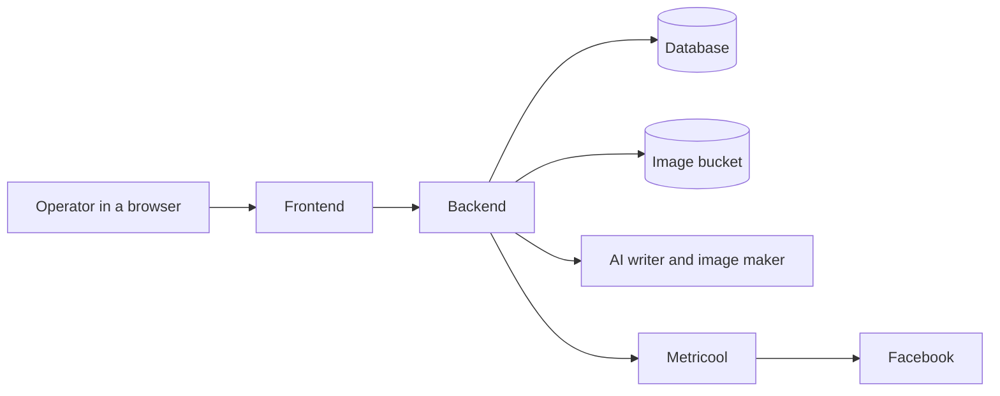
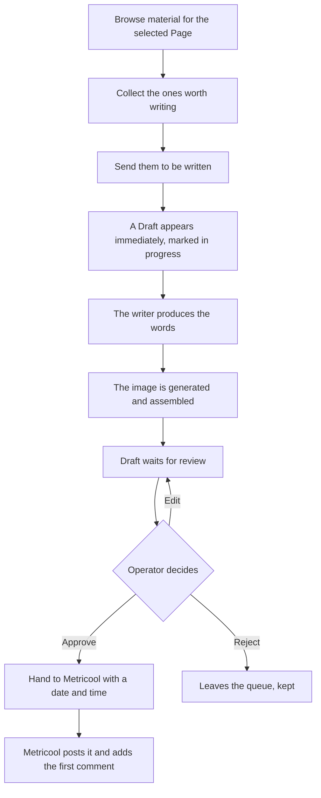
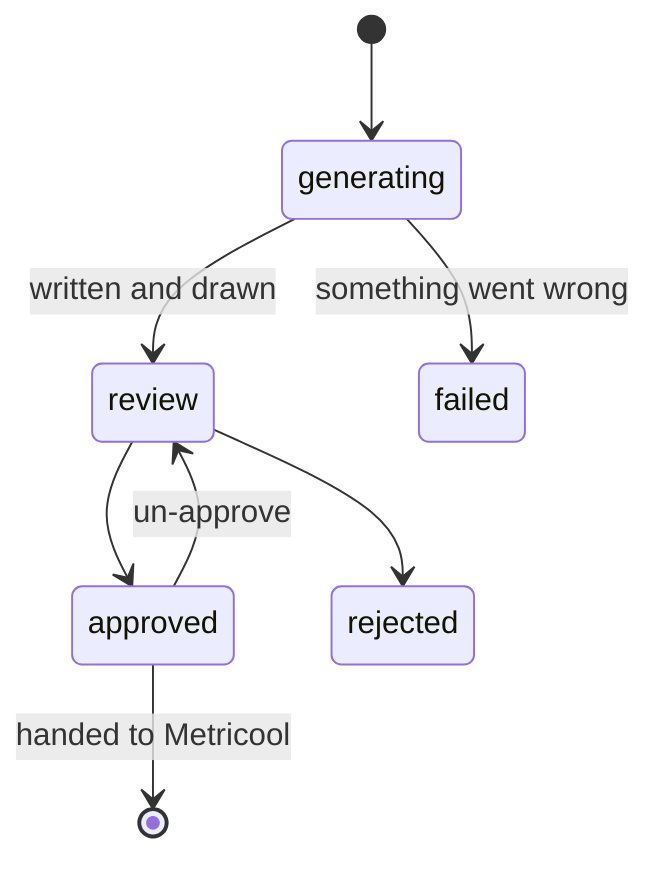
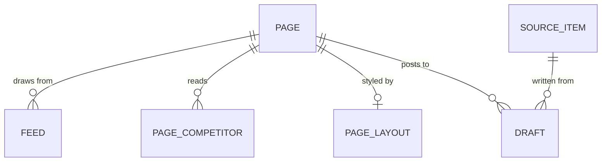

# Facebook Agent

Written from the system as built. The words in it are defined in
[CONTEXT.md](../CONTEXT.md); the decisions that bind are the
[ADRs](adr/). Where this document and the code disagree, **the code is right and
this document is a bug.**

---

## Overview

The agent helps one person run several Facebook Pages. It gathers material worth
posting about, writes a post in the Page's voice, makes the picture that goes
with it, and then stops. A person reads it, edits anything they like, and
approves or throws it away. Approved posts are handed to Metricool, which does
the actual posting and adds the first comment. Nothing reaches Facebook without
someone clicking approve.

Two Pages run on it today: History Retraced and The Fact Feed.

---

## Background

Every post used to be made by hand. Finding something to post about meant
scrolling other people's Pages and news feeds and remembering what had already
been covered. Writing meant holding a Page's voice in your head. The picture was
a second tool, the scheduling a third.

An earlier system automated parts of this and made one bad mistake, worth
stating because avoiding it shapes everything here: **it kept its own copies of
things it did not own.** Its own copy of the posting schedule, of the competitor
list, of every writing instruction. The copies drifted from the real thing, and
once they drifted the app kept producing confident, well-formed output about the
wrong thing. Its schedule table held zero rows while 237 posts sat approved — not
merely stale, empty, and still treated as the truth.

So this system reads that kind of thing live and stores none of it.

---

## Design Principles

**A person is the gate.** No post goes out without an explicit approval. There is
no setting that turns this off, and adding one would be a redesign rather than a
feature.

**Nothing external is copied.** Metricool owns the posting schedule and the
competitor list. The app asks for them when it needs them and keeps neither
([ADR-0001](adr/)).

**A Page is a row, not code.** Adding a third Page is a database insert, not a
release ([ADR-0003](adr/)).

---

## Architecture

Two things get deployed. The **frontend** is what the operator looks at; it holds
no data of its own and can only ask the backend for things. The **backend** owns
everything else: the database, the pictures, the AI calls, and every outside
connection.

The browser never talks to the database, and never holds the backend's password.
The frontend server attaches that on the way through, so it stays server-side and
never reaches anyone's developer tools.

---

## Workflow

**Finding material.** Three kinds, all shown per Page:

| Kind | Where it comes from | How the writer treats it |
|---|---|---|
| Competitor post | Metricool's competitor tracking | Borrowed for **tone only** — the post is not about their subject |
| RSS item | News feeds chosen for that Page | The subject is **binding** — the post is about that story |
| Tweet | An X link the operator pastes | The subject is **binding** |

That distinction matters more than it looks. Treating a competitor's post as
binding writes a post about a rival's topic; treating a news article as
tone-only writes a post about nothing in particular. It is worked out from the
kind every time it is needed, never stored, so it cannot drift.

**Browsing writes nothing.** Looking around has no consequences. Material only
becomes a stored row when it is actually chosen for writing.

**Writing and drawing.** The Draft row is created *before* any work begins, so it
doubles as the progress record — which is why there is no job queue and no
separate events table anywhere in this system. It moves through: queued → writing
the post (20%) → drawing the image (60%) → done (100%).

The finished picture is assembled in layers: a generated photograph on top, a
black panel underneath carrying the text, the Page's logo stamped in the corner,
and optionally a round inset photo the operator uploads and positions themselves.
The photograph and the finished card are stored separately, so re-assembling
after an edit does not pay for a new photograph.

**Review.** The operator sees the card exactly as Facebook will show it. Caption,
hook, first comment and highlighted phrases are all editable without
regenerating. The image alone can be redone.

The writer checks its own work against the Page's style rules and retries when it
breaks one. Anything still broken after those retries is attached to the Draft as
a **warning rather than a block** — the operator decides whether it matters.

**Publishing.** An approved Draft is handed to Metricool with a time. Metricool
posts it and adds the first comment. The app never touches Facebook directly.

There is a rehearsal mode that keeps everything as Metricool drafts, so the whole
path can be exercised without anything reaching an audience.

---

## Draft Lifecycle

`failed` is deliberately not the same as `review`. A run that produced nothing is
not a post awaiting a decision, and when the two shared a state the empty rows
sat in the queue looking ready.

If the backend restarts mid-run, anything still marked in progress is marked
failed on the next start — otherwise it would sit in the queue forever looking
like work about to finish.

---

## Data Model

### Database

| Table | What it holds |
|---|---|
| **page** | One Facebook Page: its name, its Facebook and Metricool ids, and which logo and avatar files to use |
| **feed** | One RSS feed a Page reads. Added and removed on screen, no deploy needed |
| **page_competitor** | Which competitors each Page reads. **Not a copy of Metricool's list** — an extra decision on top of it |
| **page_layout** | Per-Page overrides for how the card is drawn: panel size, text size, colours, logo and inset placement |
| **source_item** | A piece of material that was actually chosen. One table for all three kinds |
| **draft** | The generated post: its words, its pictures, its progress, its warnings, and Metricool's id for it once sent |

Three absences are deliberate and each has a reason:

- **No schedule table.** Metricool's planner is the truth and is read live. This
  is the single most important thing in the data model, and the old system's
  empty schedule table is why.
- **No competitor list table.** The list belongs to Metricool. `page_competitor`
  records only which of them a given Page should read.
- **No user accounts.** One operator, no roles, no tenancy ([ADR-0002](adr/)).

**Competitors are a shared pool.** Metricool allows 100 competitors per *account*,
not per Page. So five Pages that should each watch the same twenty sources
cannot each be given them — it would spend the entire allowance on twenty
sources. A competitor is added once under whichever Page has room, and then
assigned to every Page that should read it. A Page with no assignments falls back
to whatever set it owns in Metricool.

### Image Storage

Pictures live in Supabase Storage, not in the database. Rows store a **path**,
never a web address — so moving to a different bucket or project is a
configuration change rather than a database migration.

| In the bucket | Committed with the code |
|---|---|
| Generated photographs | Page logos / watermarks |
| Finished cards | Page avatars |
| Operator-uploaded inset photos | The font |

Logos are committed rather than hosted because hosting them is exactly what
failed before: the old system read them from storage by key, the bucket was
cleared, and the compositor quietly printed the Page name as plain text instead.
The logo disappeared from output with no error anywhere.

Files are named `<draft id>-<kind>-<timestamp>-<random>.png`, filed under a
year-month folder. Draft id first so a listing sorts usefully; timestamped rather
than overwritten so redoing an image cannot pull the picture out from under a
post already scheduled.

**The bucket is public and unsigned, and this is load-bearing.** Metricool does
not take its own copy of an image — tested against Metricool directly, it hands the
same address straight back. So the picture must still be fetchable when Facebook
comes for it at posting time. The old system used addresses that expired two
hours after posting: **0 of its 105 published posts still have a working image.**

Development and production use different buckets, because they have separate
databases that both hand out draft id 1 — one bucket would let them overwrite
each other's files.

---

## Screens

| Screen | For |
|---|---|
| **Sources** | Browse material and collect what is worth writing |
| **Review** | The queue of Drafts, and the decision on each |
| **Schedule** | What is actually planned, read live from Metricool |
| **Settings** | This Page: its feeds, its logo, which competitors it reads |
| **Global** | The account: the competitor pool and its budget, the card layout, the writing instructions |

Every screen is scoped to whichever Page is selected, and that choice is
remembered between visits.

---

## Operational Constraints

**One copy of the backend runs, deliberately.** The startup sweep that marks
stranded Drafts as failed cannot tell "crashed" from "still running somewhere
else", so a second copy would kill live runs. This is a correctness constraint,
not a capacity decision.

**The backend is locked; the frontend is not.** Every request to the backend
needs a shared secret, checked centrally rather than route by route so a new
route cannot silently skip it. Only the health check is open, so the hosting
platform can probe it. A missing secret **denies everything** rather than
allowing it — the opposite would produce a wide-open deploy that looks healthy.
The frontend itself runs locally today; putting it on a public address needs its
own decision.

**The database schema updates itself on start**, so code and schema cannot ship
out of step. The test suite builds its schema from the code rather than by
running the migrations, so it can never catch a missing migration — a check
against the live database is the only thing that can, and it is a required step
before deploying.

**There is no separate testing environment.** One database, one bucket. Local
runs write real rows. Rehearsal mode is what keeps that off a real Page.

---

## Out of Scope

- **Automatic publishing.** No setting removes the approval step.
- **A local copy of the schedule.** No cron, no due-post checker, no status list
  duplicating Metricool's ([ADR-0001](adr/)).
- **Storing the competitor list.** The app stores their *posts*, never the list.
- **Networks other than Facebook.**
- **User accounts and roles** ([ADR-0002](adr/)).
- **Running more than one copy** — the stranded-Draft sweep would have to be
  rethought first.
- **Analytics.** Metricool already does this.

---

## Known Limitations

- The collected-items list does not clear when the Page is switched.
- One style rule warns on nearly every news-beat Draft — a tuning problem, not a
  correctness one.
- The old system is still the one publishing today, and remains the reference for
  prior art and for what not to repeat. It is read-only.

---

## Related Documentation

This document is the overview. The details it deliberately leaves out are
recorded where they are enforced:

| Looking for | Read |
|---|---|
| What the words mean | [CONTEXT.md](../CONTEXT.md) |
| Decisions that bind | [adr/](adr/) |
| Why the tables are shaped this way | [data-model.md](data-model.md) |
| What was cut and why | [decisions.md](decisions.md) |
| Traps found the hard way | [CLAUDE.md](../CLAUDE.md), and the tests that pin them |
| Why any specific line exists | its commit message |
