# YouTube tool — Python rebuild plan

> Rebuild of the old YouTube automation tool (`social-agent`) in `fb-agent`,
> same workflow, Python. Download → trim → CTA-concat → store, then a
> Metricool planner post per target channel, then status reconciliation.
> Verified against the old code (see `youtube-tool.md` for the study; three
> corrections from the verification pass are baked in below).

```mermaid
flowchart LR
  A["Operator pastes URL"] --> B["FastAPI · enqueue job"]
  B --> C[("Postgres · youtube_jobs table-queue")]
  C --> D["asyncio worker · in-process"]
  D --> E["yt-dlp · Python lib"]
  E --> F["ffmpeg subprocess · trim + CTA concat"]
  F --> G[("Supabase Storage · processed video")]
  G --> H["Metricool planner · ytTitle + autoPublish"]
  H --> I[("Supabase · youtube_schedules row")]
  I --> J["Metricool status → reconcile · COMPLETED/FAILED"]
```



## What stays the same (the workflow, verbatim)

1. **Ingest**: a single `/shorts/ID`, `watch?v=`, `youtu.be`, `/embed/`, or a
   channel Shorts tab. Channel = top-N by view count, or a hand-picked subset
   from the picker. URL classification ports directly
   (`youtubeUrl.ts` → Python regexes; the 11-char id, `@handle/shorts`
   normalization, `shortsIndex` rank semantics).
2. **Shorts discovery**: `@handle → channelId` via `channels.list forHandle`,
   `search` ordered by `viewCount` (max **50**), `videos.list` details, filter
   `durationSec ≤ 180`, rank by views, snapshot views/likes into the job row.
   If `YOUTUBE_API_KEY` absent: yt-dlp flat-playlist listing, same fallback
   chain as the old tool (ranked by `view_count`, 5-min cache).
3. **Process** (the worker):
   - download via **yt-dlp Python library** (cookies work-copy + optional
     proxy, player-client rotation on bot-check signatures, sleep
     intervals — all ported as `YoutubeDL` options)
   - ffmpeg subprocess: trim to first `trimDuration` s (default 3, clamp
     1–60, `MAX_TRIM_DURATION_SECONDS=60`), then concat CTA clip at the end,
     scale+pad CTA to source dims, `fps=30`, libx264/aac, `+faststart`
   - upload `{jobId}_processed.mp4` to the `processed-videos` bucket (flat,
     bucket root — old convention, keep), `COMPLETED`
   - CTA clip fetched **at job time** from `cta_templates.cta_video_url`;
     public URL must resolve when the job runs
4. **Distribute**: per selected Metricool brand (blog) whose
   `connectedNetworks` includes youtube: normalize the public processed URL,
   then `POST v2/scheduler/posts` body with `text`, `autoPublish: true`,
   `draft: false`, `providers:[{network:"youtube"}]`, root `ytTitle` +
   `youtubeData` (type short|video, privacy, madeForKids false), and
   `publicationDate.dateTime` **naive local** + separate `timezone`. One
   `youtube_schedules` row per brand. Title: given → first description line →
   fallback ("YouTube Short" / "Untitled video"), sliced 100. Title/desc
   defaults for bulk come from the raw yt-dlp title. "Publish now" = planner
   post at now+2min (same code path).
5. **Reconcile** on every schedules read: ask Metricool about past-due
   `PENDING`/`PROCESSING` rows with a real `metricool_post_id`. Fold:
   post-gone + past-due → `COMPLETED`; post-gone early → `FAILED`; provider
   failure message or fail/error/rejected → `FAILED`; published status →
   `COMPLETED`; waiting + past-due + no media attachment >5min → `COMPLETED`;
   waiting + past-due >30min → `FAILED`. Realign `scheduled_at` if Metricool
   shifted >1 min. **Ported with their comments — they are observed behavior,
   not spec.**
6. **Schedule actions**: `pause` (cancel planner post, clear id), `resume`
   (re-create), `reschedule` (**delete + re-create, never PUT** — Metricool
   has no in-place update and PUT duplicates; the old tool kept a stale id),
   `retry` (failed → re-create), `publish_now` (cancel + create at now+2min),
   `delete` (cancel + drop row). `isShort` re-derived per schedule: tags
   `#Shorts`, description marker, or original source URL shape.

## The stack (why)

| Piece | Old | New | Why |
|---|---|---|---|
| Download | CLI exec + shell escapes | `yt_dlp` library | yt-dlp is Python-first; options dict replaces every CLI flag; progress hooks + logger built in. `devscripts/cli_to_api.py` maps flags → params |
| ffmpeg | fluent-ffmpeg wrapper | `subprocess` + filtergraph | flu/av-python etc. are subprocess wrappers anyway; one filtergraph ports the old one verbatim; PyAV is wrong tool for re-encode concat |
| Cobalt | Docker, usually failing | **dropped** | No public hosted API (self-host only, AGPL docker); production logs show it always fell back to yt-dlp (`error.api.youtube.login`). v1: yt-dlp only |
| Queue | BullMQ + Upstash Redis + VPS worker | **Postgres table-queue** + in-process asyncio worker | Repo already runs this shape (`drafts`/`generate` + startup sweep), one writer replica. `SKIP LOCKED` claim if concurrency ever appears. pgmq is the sanctioned upgrade path, still Postgres, adopt only for multi-worker |
| Storage | Supabase Storage | same, existing `SupabaseMediaStore` / bucket convention | Already built and byte-verified in this repo |
| Metricool | bespoke client | existing `api/app/sources/metricool.py` + publish path | Same `v2/scheduler/posts`, live-verified, publishes for real. Add `ytTitle`/`youtubeData` payload fields only |
| Status fold | heuristics | port as-is | See §5 |

## Data model (sketch)

```sql
-- mirrors `videos` + shorts snapshots; queue semantics added
create table youtube_jobs (
  id uuid primary key default gen_random_uuid(),
  user_id uuid not null,
  youtube_url text,              -- null when ingest_type = 'upload'
  ingest_type text not null default 'youtube',  -- youtube | upload
  source_storage_path text,      -- upload path in raw-uploads
  source_type text,              -- direct | channel_short | upload
  youtube_short_id text,
  resolved_short_url text,
  channel_shorts_url text,
  shorts_rank int,
  view_count_snapshot bigint,
  like_count_snapshot bigint,
  raw_title text,
  trim_duration int not null default 3,          -- clamp 1..60
  cta_template_id uuid not null,
  status text not null default 'QUEUED',         -- QUEUED|PROCESSING|COMPLETED|FAILED
  progress int not null default 0,
  processed_video_path text,                     -- {id}_processed.mp4 in processed-videos
  processed_video_url text,
  error_message text,
  created_at timestamptz not null default now(),
  updated_at timestamptz not null default now(),
  started_at timestamptz,
  finished_at timestamptz
);

-- `youtube_schedules` ports as-is (title, description, tags, scheduled_at,
-- video_path, status + PAUSED, metricool_post_id, metricool_blog_id,
-- publish_via default 'metricool', error_message).
-- `cta_templates` ports as-is (title, cta_video_url).

-- worker claim (only if multi-worker ever lands)
-- select * from youtube_jobs where status = 'QUEUED'
-- order by created_at limit 1 for update skip locked;
```

## The worker

- One asyncio task loop in the FastAPI process (repo pattern: `generate`
  writer + `sweep_stranded` at startup). Startup sweep marks stranded
  `PROCESSING` rows `FAILED` — safe because exactly one worker process.
- Progress updates (`20/35/50/90/100`) land on the row; the web polls
  (`GET /api/youtube/jobs/{id}`) — the old realtime push is a nice-to-have,
  the new repo polls drafts already. Notes in the doc; don't add realtime to
  v1.
- yt-dlp options ported: `cookiefile` (work copy; master browser export
  untouched), `proxy`, `retries`/`fragment_retries` (3), nested
  `extractor_args` (`player_client` variants `tv_embedded,mweb` →
  `android,web` → `ios,mweb`; `youtubetab:skip=authcheck` for channel tabs),
  `sleep_interval` 2 / `max_sleep_interval` 8, format
  `best[ext=mp4]/bestvideo[ext=mp4]+bestaudio[ext=m4a]/bestvideo+bestaudio/best`.
- Cookie-error signature → retry once with `no_cookies: True`; bot/429
  signature → next player client. Errors fold through one `YtdlpError`
  equivalent with operator-facing messages (cookie refresh hint, proxy hint).
- CTA clip download at job time; temp files cleaned by exact path.

## Env

`YOUTUBE_API_KEY` (optional; switches shorts listing to official API),
`METRICOOL_API_TOKEN`, `METRICOOL_USER_ID`, `METRICOOL_BRAND_ID` (fallback
target), `METRICOOL_TIMEZONE` (default Asia/Ho_Chi_Minh),
`SUPABASE_*` (existing), `YTDLP_COOKIES_FILE`, `YTDLP_COOKIES_WORK_FILE`,
`YTDLP_PROXY_URL` (datacenter egress).

## Carries / drops

| Carries | Drops |
|---|---|
| workflow steps 1–6, verbatim | Cobalt (self-host only, always lost to yt-dlp) |
| yt-dlp rotation + cookie discipline | BullMQ / Upstash / VPS worker split |
| reconcile heuristics with comments | era-1 OAuth Connect + Data API upload |
| naive+zone datetime, 100-char title rule, clamp bounds | realtime progress (v1 polls) |
| bulk slot helper (`buildBulkScheduleSlots`) — host-TZ-safe | `youtube_connections` (metricool needs no Google token) |
| flat `{id}_processed.mp4` storage path | — |

## Open questions before build

1. **Where downloads run** — One Railway replica? Then cookies live there too
   (wizard: one browser export). Or does the operator's machine run the
   worker? This fixes storage contract + how long jobs may run.
2. **Datacenter egress bot-checks** — keep `YTDLP_PROXY_URL` knob (old tool
   needed it on VPS)? If yes, calendar on which provider.
3. **Upload path kept?** Old tool had client-side upload → raw-uploads →
   process. Cheap to keep, used by operators with local files. Confirm.
4. **API key or yt-dlp for the picker** — the official API gives
   titles/thumbnails; yt-dlp needs no key. Old tool did both. Keep the
   switch?

## Traps (from the verification pass, each cost real time in the old repo)

- Metricool **does not re-host media** — normalize echoes the URL; the public
  bucket URL must resolve at publish time (fb-agent already lives this rule
  for images).
- GETs to Metricool must **omit** `Accept: application/json` (500 otherwise).
- `publicationDate.dateTime` naive + separate `timezone`; offset suffix
  rejected.
- Metricool **no in-place update** — PUT duplicates; delete + re-create.
- Reconcile constants (5/30 min, gone-⇒-published) are measured behavior.
- fbcdn-style expiry applies to CTA/processed URLs only if storage policy
  changes; bucket stays public (old repo's signed URL experiment failed —
  0/105 images alive).