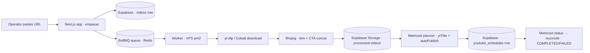
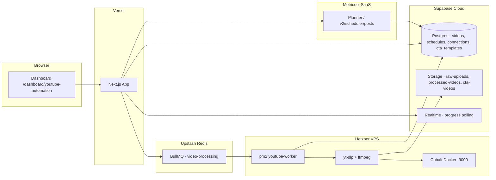

# The old YouTube tool — what it does

Study of the YouTube automation tool in `D:\Laboratory\social-agent`, read for
the rebuild. Source of truth: the code and the commit history, not this file —
this file is the map, and the file paths cited are the territory.

The tool has two eras, and they matter more than any single feature:

- **Era 1 (2026-05): publish with the YouTube Data API.** OAuth-connected
  channel, refresh token in `youtube_connections`, upload + schedule via
  `googleapis`, Vercel cron publishing. Almost everything in this era is dead
  code now.
- **Era 2 (2026-07, current): publish through Metricool.** The scheduler is
  Metricool's planner. `autoPublish` posts are created there by the app, and
  the app's only other job is reconciling its own status rows against what
  Metricool actually did. The cron is disabled ("legacy rows only"), and the
  Data API upload service survives only as an unused module.

So "the tool" today is: **download + trim + CTA-concat + store, then a
Metricool planner post per target channel, then status reconciliation.** The
YouTube channel Connect flow is vestigial UI around the era-1 path.



---

## Purpose

Turn a pasted YouTube URL (or an uploaded video) into a publish-ready Short,
and queue it onto one or more YouTube channels via Metricool:

1. **Ingest** — a single `/shorts/ID`, `watch?v=`, `youtu.be`, or a channel's
   Shorts tab (`@channel/shorts`, top-N by views, or a hand-picked subset).
2. **Process** — download, trim to N seconds, append a CTA clip, upload the
   result to public storage. Runs on a BullMQ job consumed by a separate worker
   process with `yt-dlp`/`ffmpeg`/Cobalt on disk.
3. **Distribute** — create an `autoPublish` post in Metricool's planner for
   every selected brand (blog) whose `connectedNetworks` includes YouTube, with
   `ytTitle`/`youtubeData`, tags, Short/Long video flag and privacy.
4. **Reconcile** — on every schedules-list read, ask Metricool what happened to
   past-due posts and fold that into local status (`PENDING → COMPLETED |
   FAILED`).

The operator loop lives at `/dashboard/youtube-automation`, four tabs:
Process video · CTA Templates · History · Scheduled.

## Architecture



| Piece | Where it runs | Job |
|---|---|---|
| Dashboard + API routes | Vercel (Next.js) | enqueue, schedule, history, CTA, OAuth |
| Queue | Upstash Redis, `video-processing` | decouples enqueue from processing |
| Worker | Hetzner VPS under pm2 (`npm run worker`) | download, trim, concat, upload |
| `yt-dlp` + `ffmpeg` | VPS (and dev Mac) | download; trim + CTA concat |
| Cobalt (Docker, :9000) | VPS | primary downloader, falls back to yt-dlp |
| Supabase | cloud | `videos`, `youtube_schedules`, `youtube_connections`, `cta_templates`; buckets `raw-uploads`, `processed-videos`, `cta-videos`; realtime for progress |
| Metricool | SaaS | the scheduler and publisher — no YouTube API credentials needed |

No local schedule state is authoritative — same rule the new app already lives
by (ADR-0001). Metricool holds the planner; this app holds mirror rows and
guesswork about what Metricool did with them.

## The flows

### 1. Ingest — URL parsing (`src/lib/youtubeUrl.ts`)

Accepted shapes, nothing else: `/shorts/{11char}`, `watch?v=`, `youtu.be/`,
`/embed/`, and `@channel(/shorts)`. `parseYoutubeSource` classifies into
`video` (single) or `channel_shorts` (with `shortsIndex`). Channel URLs are
normalized to end in `/shorts`. A channel source means "Short ranked #N by
view count" — the download is *resolved by rank*, not by URL directly.

### 2. Channel Shorts discovery — two backends, one picker

`POST /api/video` and `GET /api/youtube/channel-shorts` both need "what are the
top shorts of this channel, with view counts".

- If `YOUTUBE_API_KEY` is set (`youtubeChannelShortsApiService`): official
  API — resolve `@handle → channelId` (`channels.list forHandle`), `search`
  ordered by `viewCount` (max 50), then `videos.list` details, filter
  `durationSec ≤ 180`, rank by views. Thumbnails and real titles come from
  here.
- Otherwise (`ytdlpService.listChannelShortsByViews`): `yt-dlp --flat-playlist
  -j` on the channel tab, JSON per line, sort by `view_count`, 5-minute
  in-memory cache. No thumbnails, no durations.

`listChannelShortsForPicker` picks the API when the key exists, else yt-dlp.
The picker UI shows one row per short; the operator can pick a subset, and the
enqueue route then enriches the selection with rank/view snapshots from the
same listing. `view_count`/`like_count` are snapshot into the `videos` row at
enqueue time (like would need a second API call — era-2 never makes it).

### 3. Enqueue (`src/app/api/video/route.ts`)

Validates URL shape + CTA template (UUID, must exist). Expands the source into
a list: one row for a single video; top-N *or the selected ids* for a channel.
For each, inserts a `videos` row (`status=PROCESSING`, `progress=10`,
`source_type=direct|channel_short`, shorts snapshots, resolved URL) and adds a
BullMQ job `process-video` carrying `{videoId, youtubeUrl, sourceType,
shortsIndex, trimDuration, ctaTemplateId}`. Returns the row id(s) with 202.

Channel shorts + selected ids: only the picked shorts get jobs; the resolved
short URL (not the channel URL) is what the worker downloads.

### 4. The worker (`src/queue/processVideoJob.ts`, `videoWorker.ts`)

`videoWorker` is a separate process consuming `video-processing`. Steps, each
pushing a DB progress update:

```
20  download source (upload path: fetch from raw-uploads; else downloadYoutubeMedia)
35  download CTA clip (url from cta_templates.cta_video_url)
50  ffmpeg: trim to trimDuration s → concat CTA (scale+pad to source dims, fps=30)
90  upload result to processed-videos as {videoId}_processed.mp4
100 status=COMPLETED, processed_video_url = public bucket URL
```

Any failure: `status=FAILED`, `error_message` from `toYtdlpError` (a user-
facing message table). Temp files are deleted by exact path. The browser polls
via Supabase realtime subscription on the `videos` row (`useVideoSubscription`)
— progress moves without refresh.

**Download orchestration (`youtubeDownloadService`)**: try Cobalt first (POST
to `{COBALT_API_URL}/`, h264 1080, handles tunnel/redirect/picker responses),
fall back to yt-dlp. Cobalt answers `error.api.youtube.login` on datacenter
IPs — expected in production, that IS the fallback trigger.

**yt-dlp invocation (`ytdlpService`)**: CLI via exec; `best[ext=mp4]/...`
format; global args `--js-runtimes node --remote-components ejs:github`,
`--sleep-interval 2..8`, retries 3, cookies from a *work copy* (the master
browser export is never handed to yt-dlp, which would overwrite it). Player
client variants rotate (`tv_embedded,mweb` → `android,web` → `ios,mweb`) when
the error smells like a bot check or 429, sleeping between attempts; channel
tabs add `youtubetab:skip=authcheck`. On a cookie-error signature, the command
is retried once with `--no-cookies` (`withCookieErrorFallback`). Optional
`YTDLP_PROXY_URL` (residential proxy) for VPS datacenter IPs.

**CTA concat (`ffmpegService`)**: `trimVideo` (libx264/aac/faststart, first
`trimDuration` s) then `concatWithCta` — scale+pad the CTA to the source
dimensions, concat video+audio, re-encode. `trimDuration` default 3s,
clamped.

### 5. Upload path (`/api/video/upload`, `/upload/complete`)

For files the operator has on disk and doesn't want to re-download: create the
`videos` row + a `raw-uploads` path, client uploads the bytes (200 MB cap),
the complete route enqueues the job with `ingestType=upload`. Worker downloads
from storage instead of the network. No cookies, no yt-dlp.

### 6. CTA templates

`cta_templates` rows: title + `cta_video_url` (uploaded to the `cta-videos`
bucket). The worker fetches the CTA clip *at job time* — the URL must still
resolve when the job runs, which is the same public-URL-must-stay-live rule
pinned in `fb-agent/CLAUDE.md` for images. API: list/create/delete, plus an
upload-url endpoint.

### 7. Scheduling — Metricool (`youtubeMetricoolScheduleService`)

`POST /api/video/schedule` (single-brand list, actually multi) and
`POST /api/video/schedule/bulk`:

- Resolve target brands: `metricoolBlogIds` (array, deduped) or the legacy
  single `metricoolBlogId` or env `METRICOOL_BRAND_ID`. Brand must be one of
  the Metricool profiles with `connectedNetworks` containing `youtube`
  (`youtube-brands.ts`).
- Title resolution (`youtube-data.ts`): given title → first non-empty
  description line → fallback ("YouTube Short" if short, else "Untitled
  video"); sliced to 100 chars.
- Body: `text` = description + `#tag` list, `autoPublish: true`,
  `draft: false`, `providers: [{network: "youtube"}]`, root-level
  `ytTitle` + `youtubeData` (type short|video, privacy public|unlisted|private,
  madeForKids false), `publicationDate: {dateTime: naive local,
  timezone}` — the naive-plus-zone shape, an offset suffix is rejected.
- Media: normalize the public processed-video URL via Metricool's normalize
  endpoint first. **Metricool does not re-host it**; it echoes the URL back, so
  the bucket URL must resolve at publish time. Normalize returns either a URL
  or a `mediaId`; the body uses whatever shape it gives.
- One `youtube_schedules` row per brand (`status=PENDING`, `metricool_post_id`,
  `metricool_blog_id`, `publish_via=metricool`).
- Timezone: publish settings → `METRICOOL_TIMEZONE` → `Asia/Ho_Chi_Minh`.
  Scheduling requires a future ISO date.

`POST /api/video/publish` is the same code path with `publicationDate =
now + 2 minutes` — "publish now" is a planner post two minutes out, not an
immediate call.

**Bulk** (`/schedule/bulk`): a pattern `{time, startDate, intervalDays,
timezone}` spreads one slot per video (`buildBulkScheduleSlots`); per-video
metadata defaults come from `buildShortsScheduleDefaults` — title = raw yt-dlp
title (100 cap), description = `#Shorts\n\n{rawTitle}` (+ CTA line), tags
empty, `isShort` from the source URL shape. Every scheduled time must be
future.

### 8. Reconciliation (`youtubeMetricoolSyncService`)

`GET /api/video/schedules` runs `syncOverdueYoutubeMetricoolSchedules` first,
then lists: rows with `publish_via=metricool`, a real post id, `scheduled_at`
in the past, still `PENDING`/`PROCESSING`. Per row, asks Metricool for the
post and folds the answer:

- **Post gone, and past-due** → `COMPLETED`. Metricool removes scheduler posts
  shortly after publishing; real failures keep an error status. This heuristic
  is the whole trick.
- Post gone, *not* past-due → `FAILED` ("post not found").
- Provider failure message, or status containing fail/error/rejected →
  `FAILED` with Metricool's message.
- Published status → `COMPLETED`.
- Still waiting, past due, **no media attachment**, >5 min — Metricool lingers
  in "scheduled" with empty media after YouTube already published →
  `COMPLETED`.
- Still waiting past due >30 min → `FAILED` ("open the planner, then
  reschedule").
- Also realigns local `scheduled_at` to Metricool's if it shifted >1 min.

The heuristics are tuned to observed Metricool behavior and each one is
commented with why. This is the most fragile code in the tool and the most
worth porting *carefully*.

### 9. Schedule actions (`PATCH|DELETE /api/video/schedules/[id]`)

`pause` (cancels the Metricool post, clears `metricool_post_id`), `resume`
(re-creates the planner post), `reschedule` (PUT to the planner), `retry`
(failed → re-create post), `publish_now` (cancel + re-create at now+2min),
`DELETE` (cancel + drop row). `isShort` for a schedule is re-derived: tags
`#Shorts`, description marker, or the original `videos.youtube_url` shape.
`pause`/`publish_now`/`delete` cancel the live planner post via
`deleteMetricoolScheduledPost` — the app **does** clean up its own planner
posts, unlike the Facebook side (compare HANDOFF's D6 note).

### 10. Channel Connect (era 1, vestigial)

`Connect YouTube` starts a Google OAuth via Supabase (`linkIdentity` or
`signInWithOAuth`, scopes `youtube.upload` + `youtube`, `access_type=offline`,
`prompt=consent`). The `auth/callback` page posts to `/api/youtube/oauth-complete`,
which exchanges the code for a session and stores `youtube_connections`
(user_id, google_email, refresh_token, channel id/title/thumbnail resolved via
`channels.list mine=true`). Disconnect deletes the row and unlinks the Google
identity (with an admin-API fallback when unlink fails; grows a warning when
it can't). Nothing in the era-2 flow reads these tokens — the Metricool path
needs only `METRICOOL_API_TOKEN` + `METRICOOL_USER_ID`. The Connect button
still works and the status panel still shows the channel, but the refresh
token's only consumer is the unused `youtubeUploadService`.

### 11. Legacy publish path (dead)

`youtubeUploadService` (Data API `videos.insert`, public/private+scheduled via
`publishAt`, `updateYouTubeVideoStatus`, `unschedule`) and the Vercel cron
`/api/cron/publish-video`. The cron now returns "schedules publish via
Metricool; cron is disabled." `youtube_schedules.youtube_video_id` exists for
era-1 rows only.

## Data model (Supabase)

| Table | Columns worth knowing |
|---|---|
| `videos` | youtube_url, source_type (direct\|channel_short\|upload), youtube_short_id, resolved_short_url, channel_shorts_url, shorts_rank, view/like snapshots, status (PENDING/PROCESSING/COMPLETED/FAILED), progress 0-100, trim_duration, cta_template_id, raw_title, processed_video_url, source_storage_path |
| `cta_templates` | title, cta_video_url |
| `youtube_connections` | user_id (PK), google_email, refresh_token, access_token, channel_id/title/thumbnail_url |
| `youtube_schedules` | title, description, tags[], scheduled_at, video_path, status (+PAUSED), youtube_video_id, metricool_post_id, metricool_blog_id, publish_via (default metricool), error_message |
| buckets | `raw-uploads`, `processed-videos`, `cta-videos` (all public — the URLs are handed to Metricool/YouTube) |

`videos` and `cta_templates` are on `supabase_realtime` (progress polling).
RLS is per-user on the new tables; `videos` read policy was "anyone" in era 1.

## API surface

| Route | Meaning |
|---|---|
| `POST /api/video` | enqueue URL (single / channel top-N / selected shorts) |
| `GET /api/youtube/channel-shorts?url=` | picker listing |
| `POST /api/video/upload`, `/upload/complete` | client-side upload |
| `GET /api/videos`, `DELETE /api/videos/[id]` | history |
| `POST /api/video/schedule`, `/schedule/bulk` | schedule to N brands |
| `POST /api/video/publish` | publish now (+2min planner post) |
| `GET /api/video/schedules` | list + reconciliation sync |
| `PATCH|DELETE /api/video/schedules/[id]` | pause/resume/reschedule/retry/publish_now / remove |
| `GET|DELETE /api/youtube/connection`, `POST /api/youtube/oauth-complete` | era-1 Connect |
| `GET /api/cron/publish-video` | disabled |
| `GET|POST /api/cta-templates`, `/upload-url`, `[id]` | CTA library |

## Environment

`GOOGLE_CLIENT_ID/SECRET`, `YOUTUBE_API_KEY` (optional; switches shorts
listing to the official API), `METRICOOL_API_TOKEN`, `METRICOOL_USER_ID`,
`METRICOOL_BRAND_ID` (fallback target), `METRICOOL_TIMEZONE` (default
Asia/Ho_Chi_Minh), `METRICOOL_CONFIG`-era leftovers, `SUPABASE_*`, `REDIS_HOST/
PORT/PASSWORD` (TLS when host contains upstash.io, and a guard refusing an
Upstash URL unless `ALLOW_PROD_REDIS=1` so a dev machine can't eat prod jobs),
`YTDLP_COOKIES_FILE`, `YTDLP_COOKIES_WORK_FILE`, `YTDLP_PROXY_URL`,
`COBALT_API_URL`, `COBALT_COOKIES_JSON`, `CRON_SECRET`.

## Traps the rebuild must carry (each cost real time)

1. **Metricool does not host media.** Normalize echoes the URL back. The
   public bucket URL must still resolve when YouTube fetches it — forever,
   not just at schedule time. fb-agent already lives this rule for images.
2. **GETs to Metricool must omit `Accept: application/json`** — that header on
   the normalize GET answers 500 "No acceptable representation".
3. **`publicationDate.dateTime` is naive local + separate `timezone` field.**
   An offset suffix is rejected.
4. **Metricool has no in-place update.** `PUT /v2/scheduler/posts/{id}`
   without `id` in the body duplicates the post; either way the post id
   changes. The facebook drawer hit this (HANDOFF D6); the youtube reschedule
   keeps the stale `metricool_post_id`, so the reconciliation layer later has
   to guess. Prefer delete + create.
5. **Reconciliation is heuristic, deliberately.** "Post gone + past-due =
   COMPLETED" and the 5/30-minute windows are observations of Metricool
   behavior, not spec. Port them with their comments or re-derive from
   production before deleting them.
6. **yt-dlp bot-checks beat everything except rotation.** Player-client
   variants, work-copy cookies, `skip=authcheck`, sleep intervals, residential
   proxy for datacenter IPs. Any of these removed = downloads start failing
   quietly on a VPS.
7. **Cobalt fails with `error.api.youtube.login` on datacenter IPs.** That is
   expected and is exactly why yt-dlp is the fallback, not the other way.
8. **raw_title comes from the network** (yt-dlp) and becomes the default
   schedule title/description — there is no curation in the loop; users edit
   at schedule time.
9. **The official API shorts listing** filters ≤180s and caps at 50 — an
   "all shorts" read must be pageable, and quota is real.
10. **videos RLS was "anyone can read"** for realtime; the rebuild should not
    copy that by reflex.

## What survives into the rebuild vs what doesn't

The new app already has: FastAPI + Next.js skeleton, Supabase Postgres +
storage (public buckets, the live-URL rule), Metricool token plumbing, publish
settings + timezone conventions, auth. The YouTube tool needs:

- **Keep**: the ingest→download→trim→concat→store pipeline (minus Cobalt
  unless it still earns its place), Metricool planner scheduling + the
  reconciliation heuristics, multi-brand target selection, the "publish now =
  now+2min planner post" shape, schedule actions (delete+recreate, not PUT),
  the naive+zone datetime shape, numbers as evidence (title caps, trim,
  durations, snapshot columns).
- **Drop or defer**: the BullMQ/Upstash/VPS-worker topology (what runs the
  ffmpeg in the new world?), era-1 OAuth Connect and `youtube_connections`
  unless the Data API is genuinely coming back, realtime progress (the new app
  polls drafts already), yt-dlp cookie machinery (works only on a machine with
  a browser export — a server-side rebuild must decide how downloads happen at
  all).
- **The open question**: the old tool is two applications glued by a queue —
  Vercel can enqueue, only the VPS can process. The rebuild decides where
  ffmpeg/yt-dlp live before anything else, because that decision fixes the
  deploy shape, the storage contract, and how long a job may run.