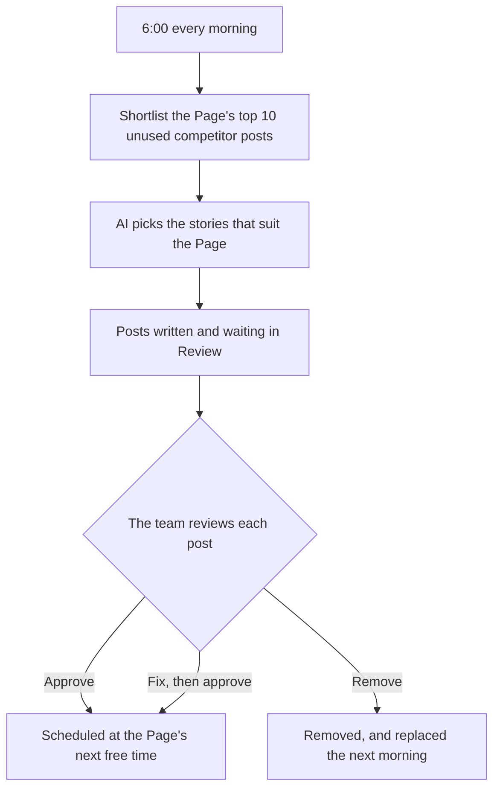

## 1. Executive summary

- **Product**: Morning auto-drafts
- **Status**: Draft
- **Last updated**: 15 September 2026

Every morning at 06:00 (Vietnam time), the app writes draft posts for each Page
that has this switched on, so the content team starts the day reviewing posts
instead of sourcing and generating them. Nothing is published until a person
approves it.

## 2. Problem & opportunity

- **Problem**: Every draft is created by hand, one Page at a time. The operator
  opens Sources, reviews competitor posts, selects stories, starts generation and
  waits several minutes before anything is ready. Across ten Pages this is
  estimated to take most of the morning. It is also the least
  judgement-intensive step: the Sources screen already ranks candidate stories,
  and the operator mostly selects from the top of that ranking.
- **Opportunity**: Return that time to the step that needs judgement: reviewing,
  editing and scheduling posts. Automation was first requested in August 2026
  and deferred until the app had a way to run work on a schedule and an agreed
  review policy. This document provides both.
- **Solution**: At 06:00 (Vietnam time) the app shortlists each enabled Page's
  best unused competitor posts, has the AI select the stories that fit the Page,
  and writes drafts into Review. Nothing is published until a person approves
  it.

## 3. User requirements

- **Primary users**:
  - **Content operator**: reviews, edits, approves and schedules posts for each
    Page.
  - **Account owner**: decides which Pages are automated and how many drafts each
    should have waiting.
- **Key use cases**:
  1. Start the day with drafts already waiting for every enabled Page.
  2. Approve a draft and have it scheduled at the Page's next free time.
  3. Fix or remove a draft that does not suit the Page.
  4. Recover a missed morning by starting the run by hand.
- **Success criteria**: The operator can fill each Page's schedule without
  opening Sources or pressing Generate.

### User flow

### Queue behaviour

The run fills each Page's queue to its setting rather than adding a fixed number
of drafts. Unreviewed drafts from earlier days count towards the setting, so an
unattended weekend does not accumulate drafts or AI costs. Rejected and deleted
drafts free a place for the following morning.

| Setting | Drafts already waiting | New drafts generated |
|---|---|---|
| 5 | 0 | 5 |
| 5 | 2 | 3 |
| 5 | 5 | 0 |
| Off | Any | 0 |

## 4. Product requirements

### Must have features

- **Daily run**: Drafts are generated every day at 06:00 (Vietnam time) for each
  Page with automation enabled.
  - *Acceptance criteria*: Given a Page set to 4 with an empty queue, when the
    06:00 run completes, then 4 new drafts for that Page are waiting in Review.
- **Per-Page setting**: Each Page can be set to Off, or to 3, 4 or 5 drafts
  waiting.
  - *Acceptance criteria*: Given a Page set to Off, when the next run completes,
    then no drafts are generated for it. Any value other than Off, 3, 4 or 5 is
    refused.
- **Queue top-up**: The run tops each queue up to its setting and never beyond
  it.
  - *Acceptance criteria*: Given a Page set to 5 with 2 drafts waiting, when the
    run completes, then 3 new drafts are generated. Given the run is started
    twice in a row, then the second run generates nothing.
- **Story shortlist**: The Page's 10 highest-ranked unused competitor posts are
  shortlisted, with each competitor given one place before any receives a
  second.
  - *Acceptance criteria*: Given a story this Page already has a draft from, then
    it is never shortlisted for this Page again. A story used only by another
    Page remains eligible.
- **AI selection**: The AI selects the shortlisted stories that fit the Page's
  own instructions from Settings, and may select fewer than requested.
  - *Acceptance criteria*: Given a shortlist that does not suit the Page, then
    fewer drafts than the setting may be generated. Given the AI is unavailable,
    then the top of the shortlist is used instead.
- **Human approval**: Automated drafts are never published automatically, and
  appear in Review exactly like manual drafts.
  - *Acceptance criteria*: Given an automated draft, then it reaches Metricool
    only after an operator approves it. On approval, the Page's next free
    publishing time is shown before the operator confirms.

### Should have features

- **Visible failures**: A draft that could not be written appears in Review with
  the reason. A draft whose picture fails keeps its text. Priority: high.
- **Manual run**: The run can be started by hand to recover a missed morning.
  Priority: high.
- **Source shown**: Each automated draft shows which competitor post it was
  written from, so the operator can judge the selection. Priority: medium.

## 5. Technical specifications

- **Architecture**: Runs inside the existing app. A scheduled job on the hosting
  platform starts the run each morning. Drafts are generated through the same
  process as manual generation, so they use each Page's own instructions,
  lengths and layout.
- **Dependencies**:
  - Google Gemini, the app's existing AI provider, for selection and writing.
  - The Page's competitor posts, refreshed before shortlisting when out of date.
  - Metricool's planner, for the next free publishing time on approval.
- **Performance**: About two minutes per draft, three at a time. The maximum of
  50 drafts (10 Pages x 5) takes a little over 30 minutes, which completes
  before the working day.

## 6. Success metrics

- **Primary**: Share of working days on which every enabled Page has drafts
  waiting before the day begins.
- **Secondary**:
  - Approval rate of automated drafts, with or without edits.
  - Drafts generated by hand per day.
  - AI cost per day.
- **Timeline**: Baseline measured before launch; first review 30 days after
  launch, then monthly.

## 7. Risks & mitigation

| Risk | Impact | Mitigation |
|---|---|---|
| The AI selects stories that do not suit the Page | Drafts rejected, review time wasted | Selection uses the Page's own instructions and may pick fewer; every draft is reviewed |
| The AI is unavailable | No drafts that morning | Falls back to the top of the shortlist |
| A Page has no unused competitor posts | Empty queue | The empty queue prompts a review of the Page's competitors in Settings |
| AI costs higher than expected | Budget overrun | Top-up caps generation at 50 drafts a day, and normally far fewer |
| The run is started twice | Duplicate drafts | Drafts already being generated count towards the setting |
| A morning run is missed | Empty queue | The run can be started by hand |
| Two drafts for one Page approved at the same moment | Both offered the same publishing time | Accepted for a single operator |

## 8. Open questions

| Question | Status |
|---|---|
| How long do manual sourcing and generation take today? Needed as a baseline. | Open |
| Which Pages should be enabled at launch, and at what setting? | Open |
| Is 06:00 Vietnam time the right start time? | Open |

## 9. Out of scope

- Publishing without approval.
- Approving several drafts at once.
- Identifying time-sensitive stories.
- More than one run a day, or a different run time per Page.
- News feed stories or tweets as sources.
