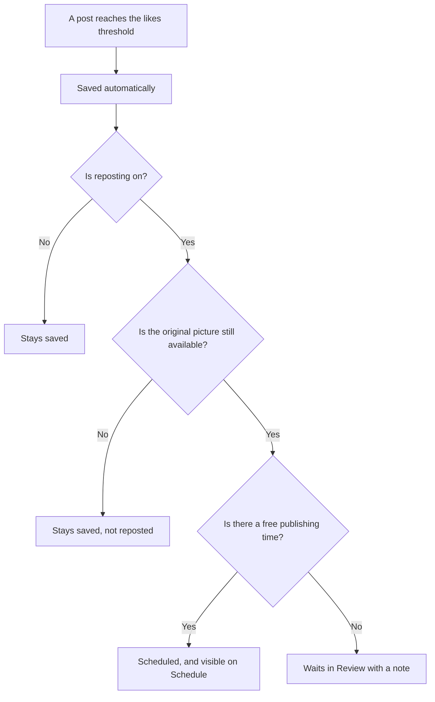

## 1. Executive summary

- **Product**: Automatic save and repost
- **Status**: Review
- **Last updated**: 15 September 2026

Posts that reach a set number of likes are saved automatically, and can be
reposted a set number of days later. Both are set per Page. Reposts appear on
the Schedule screen weeks ahead, where they can be cancelled.

## 2. Problem & opportunity

- **Problem**: The Overview screen lets the content team save high-performing
  posts and repost them later. Both actions are manual, and the client reports
  that neither is being used, so posts that performed well are not given a
  second run.
- **Opportunity**: Measured on 15 September 2026, History Retraced had 30 posts
  above 1,000 likes in the previous 30 days, 26 of which could be reposted
  today. Each is proven content that currently runs only once.
- **Solution**: Per Page, a post that reaches a set number of likes is saved
  automatically. Where reposting is on, the identical post is scheduled again a
  set number of days after it was first published, at the first free publishing
  time, and shown on the Schedule screen where it can be cancelled.

## 3. User requirements

- **Primary users**:
  - **Account owner**: sets the likes threshold and repost delay for each Page.
  - **Content operator**: sees upcoming reposts on Schedule and cancels any that
    should not go out.
- **Key use cases**:
  1. Set a Page to save posts at 1,000 likes and repost them after 30 days.
  2. See a high-performing post saved without anyone pressing Save.
  3. See the repost on the Schedule screen weeks before it is published.
  4. Cancel a repost that is no longer appropriate.
  5. Understand why a saved post was not reposted.
- **Success criteria**: High-performing posts return on schedule with no manual
  action, and the team is never surprised by a repost.

### Agreed decisions

| Question | Decision |
|---|---|
| What counts as a "like"? | Reactions: the figure Facebook shows beneath a post. |
| Is the delay counted from the original publish date? | Yes. If that date has already passed, the next free time is used. |
| Can a repost be reposted again? | No. Otherwise a popular post would return every month indefinitely. |
| Does a repost go through Review? | No. It is scheduled directly, as requested, and remains visible and cancellable on Schedule. |

### User flow

### Expected volume

Measured on 15 September 2026 over the previous 30 days. History Retraced is
currently the only Page with posts above 1,000 likes; the highest-performing
post on any other Page had 34.

| Likes threshold | History Retraced posts that qualify | Reposts per month, approximately |
|---|---|---|
| 1,000 | 30 | 30, about one a day |
| 2,000 | 13 | 13 |
| 5,000 | 4 | 4 |

For comparison, History Retraced publishes about eight new posts a day.

## 4. Product requirements

### Must have features

- **Per-Page settings**: A likes threshold for saving, where blank means off, and
  a repost option with a delay of 1 to 90 days that applies only while saving is
  on.
  - *Acceptance criteria*: Given a blank threshold, then no posts are saved
    automatically for that Page. A delay outside 1 to 90 days is refused.
- **Automatic save**: Every post that reaches the threshold and is not already
  saved is saved and marked as saved automatically.
  - *Acceptance criteria*: Given a threshold of 1,000 and an unsaved post with
    1,000 likes, when the Page is next checked, then the post is saved and
    marked as automatic.
- **Identical repost**: The repost uses the original caption, first comment and
  picture.
  - *Acceptance criteria*: Given a scheduled repost, then its caption, first
    comment and picture match the original exactly.
- **Scheduling rule**: The repost is scheduled at the first free publishing time
  on or after the original publish date plus the delay.
  - *Acceptance criteria*: Given a post published on 1 September with a 30-day
    delay, then the repost is scheduled at the first free time on or after
    1 October. Given that date has already passed, then the next free time is
    used.
- **No repeat reposts**: A repost is never reposted again.
  - *Acceptance criteria*: Given a post whose caption matches a post already
    saved for the Page, then it is not saved automatically.
- **Visible and cancellable**: Reposts are scheduled without Review and appear
  on the Schedule screen.
  - *Acceptance criteria*: Given a scheduled repost, then it is listed on
    Schedule and can be cancelled there before it is published.
- **Page isolation**: Statistics belonging to a different Page are ignored.
  - *Acceptance criteria*: Given statistics that include another Page's posts,
    then none of those posts is saved or reposted.
- **Automatic saves only**: Only posts saved automatically are reposted.
  - *Acceptance criteria*: Given a post saved by hand, then it is never reposted
    automatically.

### Should have features

- **No free time**: If no publishing time is free, the repost is placed in
  Review with a note, for the operator to publish by hand. Priority: high.
- **Repost status on Overview**: Saved posts show whether they were saved
  automatically, and either their repost date or the reason they cannot be
  reposted. Priority: medium.

## 5. Technical specifications

- **Architecture**: Runs inside the existing app, with no separate scheduler.
  Each Page is checked whenever the content team opens the app, at most once
  every six hours per Page, because neither Metricool nor Facebook notifies the
  app when a post passes a number of likes.
- **Dependencies**:
  - Metricool post statistics, available for each post's first 30 days.
  - Metricool's planner, for free publishing times and scheduling.
  - The app's public image storage, so a reposted picture still loads when it is
    published.
- **Performance**: One statistics read per Page per check. Reposts are scheduled
  weeks in advance, so the time of the check does not affect when a repost is
  published.

## 6. Success metrics

- **Primary**: Likes on a repost as a share of its original's likes.
- **Secondary**:
  - Reposts scheduled per Page per month.
  - Reposts cancelled by the team, a sign the threshold is set too low.
  - Save and Repost actions still taken by hand.
- **Timeline**: First review 30 days after launch, then monthly.

## 7. Risks & mitigation

| Risk | Impact | Mitigation |
|---|---|---|
| Reposts crowd out new content | About 30 reposts a month at 1,000 likes on History Retraced | Choose each threshold using the expected volume table; review after 30 days |
| A popular post returns indefinitely | Repetitive feed | A repost is never reposted again |
| A Page's statistics belong to another Page (currently Hot Tub Timeout) | Posts reposted to the wrong Page | Posts belonging to another Page are ignored; the Metricool connection is corrected |
| Pictures from the previous tool have expired | 4 of the current 30 cannot be reposted | Those posts are saved but not reposted |
| A repost goes out without review | An inappropriate post is published | Reposts appear on Schedule weeks ahead and can be cancelled |
| The app is not opened for a Page for 30 days | A qualifying post is missed | Regular use; a daily scheduled check can be added later |
| No publishing time is free | The repost is not scheduled | It waits in Review with a note |

## 8. Open questions

| Question | Status |
|---|---|
| What likes threshold and repost delay should each Page use? | Open |
| Does the client confirm that reposts may be scheduled without review? | Open |
| Hot Tub Timeout's Metricool connection returns History Retraced's statistics. When will it be corrected? | Open |

## 9. Out of scope

- Reposting the same post more than once.
- Reposting posts saved by hand.
- Updating a saved post's figures after its first 30 days.
