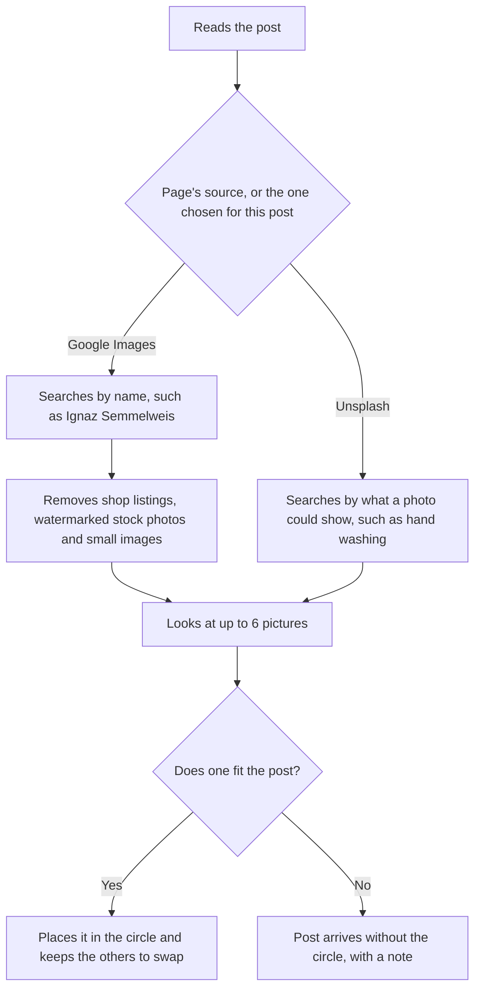

## 1. Executive summary

- **Product**: AI inset finder
- **Status**: Approved
- **Last updated**: 16 September 2026

The AI finds a suitable picture for a post's circular inset and places it, so
the content team no longer searches for one by hand. Each Page chooses where the
AI looks: Google Images for real people, places and events, or Unsplash for
stock photos. First released on 15 September 2026 with Unsplash; Google Images
and the choice of source were added on 16 September 2026.

## 2. Problem & opportunity

- **Problem**: Each post's picture can include a small circular inset photo. The
  client reports that the content team sources these by hand, typically through
  Google image search, which adds a manual search to every post that uses one.
  A single photo library does not suit every Page: history and news posts need
  the actual person or event, which stock libraries do not have, while fitness
  and recipe posts need general stock photos.
- **Opportunity**: Remove that search from production entirely, while keeping
  the operator free to change source, swap, search or upload when the AI's
  choice is not right.
- **Solution**: The AI writes a short search from the post, looks at up to six
  matching pictures from the Page's chosen source, chooses the one that fits
  best and places it in the circle, keeping the others as alternatives.

## 3. User requirements

- **Primary users**:
  - **Content operator**: creates and reviews posts, and is responsible for each
    post's picture.
- **Key use cases**:
  1. Generate posts with a suitable inset already in place.
  2. Set, per Page, whether the AI searches Google Images or Unsplash.
  3. Use the other source for one run or one post, without changing the Page.
  4. Swap to one of the alternative pictures with one click.
  5. Search with the operator's own keywords when none of the alternatives fit.
  6. Upload a picture by hand when nothing suitable is found.
- **Success criteria**: The operator publishes posts with a suitable inset, from
  a source that suits the Page, without opening a browser to search for one.

### Agreed decisions

| Decision | Detail |
|---|---|
| Each Page chooses its source | Every Page starts on Google Images. Pages that need stock photos, such as fitness and recipe Pages, are switched to Unsplash in Settings. |
| Google Images is used knowing the pictures are not ours | Agreed on 16 September 2026. Pictures from Google belong to whoever published them, and the post carries no photo credit. |
| The source can be changed for one run or one post | Beside Find inset when generating, and beside the search box in Review. It starts on the Page's setting and does not change it. |

### How it works

Google Images is searched by name because it holds pictures of the actual
subject. Unsplash has no pictures of named people, so the AI searches it for
what a photo could show instead.

### Where it is available

| Location | Action |
|---|---|
| Settings, Inset pictures | Choose **Google Images** or **Unsplash** for the Page. |
| Generation bar | Tick **Find inset**, beside **No image**, and choose the source for this run. |
| Manual page | Tick **Find inset** and choose the source, on both the topic and the write-it-yourself forms. |
| Review, inset panel | Choose the source beside the search box. It applies to **Find with AI** and **Search**. |
| Review, inset panel | **Find with AI** for a post without a picture. |
| Review, inset panel | Select one of **the alternatives** to swap pictures. |
| Review, inset panel | **Search** by keyword and select from the results. |

## 4. Product requirements

The finder, alternatives and keyword search were delivered on 15 September 2026.
The choice of source and Google Images were delivered on 16 September 2026.

### Must have features

- **Find inset when generating**: A Find inset option on the generation bar and
  the Manual page, beside No image.
  - *Acceptance criteria*: Given Find inset is ticked, when a post is generated,
    then the post arrives with an inset picture in place, or with a note that
    none was found.
- **Find with AI in Review**: A Find with AI action in the Review inset panel.
  - *Acceptance criteria*: Given a post without an inset, when the operator
    selects Find with AI, then a picture is placed in the circle.
- **Source per Page**: A setting in Settings that chooses Google Images or
  Unsplash for the Page.
  - *Acceptance criteria*: Given a Page set to Unsplash, when the operator
    selects Find with AI on one of its posts, then the picture comes from
    Unsplash.
- **Source per run and per post**: A source choice beside Find inset when
  generating, and beside the search box in Review, starting on the Page's
  setting.
  - *Acceptance criteria*: Given a Page set to Google Images, when the operator
    chooses Unsplash for one run, then that run's insets come from Unsplash and
    the Page's setting is unchanged.
- **AI choice**: The AI chooses the picture that best fits the post, or none.
  - *Acceptance criteria*: Given no picture suits the post, then no picture is
    placed.
- **Never blocks a post**: When no picture fits, the post is still delivered.
  - *Acceptance criteria*: Given no suitable picture, then the post arrives with
    its text and main picture, without the inset, and with a note.

### Should have features

- **Alternatives**: The other pictures considered are kept on the post, so the
  operator can swap in one click without a new search. An alternative keeps its
  own source, so an Unsplash photo is handled as one even on a Page set to
  Google Images. Priority: high.
- **Keyword search**: The operator can search by their own keywords in the
  Review inset panel and select from the results. Priority: high.
- **Google results filtered**: Shop listings, watermarked stock photo sites
  (such as Getty Images, Alamy and Shutterstock) and pictures under 600 pixels
  wide are left out. When a website blocks the full-size picture, Google's
  smaller preview is used instead. Priority: high.

## 5. Technical specifications

- **Architecture**: Runs inside the existing app. The chosen picture is copied
  into the app's own image storage, so it still loads when Facebook fetches the
  post at publishing time.
- **Dependencies**:
  - Google Images, through SerpAPI, a paid search service, for Pages and posts
    set to Google Images.
  - Unsplash, a library of free stock photos that can be used in posts, on its
    free tier, for Pages and posts set to Unsplash.
  - Google Gemini, the app's existing AI provider, to write the search and
    choose the picture. A search on Unsplash uses one extra AI request, to write
    a general search in place of a name.
- **Performance**: About 17 seconds to find and place a photo from Unsplash.
  The time for Google Images has not yet been measured.
- **Limits**: Unsplash's free tier allows 50 requests an hour, which is about 25
  finds. SerpAPI's free plan allows 250 searches a month, and repeating the same
  search within an hour does not count.

| Action | Google Images (SerpAPI searches) | Unsplash (requests) |
|---|---|---|
| Find with AI | 1 | 2 |
| Swap to an alternative | 0 | 1 |
| Keyword search | 1 | 1 |

### Image source evaluation

| Option | Outcome |
|---|---|
| Google Custom Search | Not available. The service is closed to new customers and shuts down on 1 January 2027. |
| Google Images through SerpAPI | Selected for Pages about real people, places and events. Finds the actual subject; the pictures belong to whoever published them. |
| Unsplash | Selected for Pages that need stock photos. A large library of free photos that can be used in posts, with nothing of named people. |
| Wikipedia | Trialled. Strong for well-known people and places, but lacks general photos for the fitness and recipe Pages. |
| Wikimedia Commons | Trialled on 16 September 2026. Free to use, but limited to pictures people have donated. |
| Brave image search | Considered. Cheaper than SerpAPI, with the same issue that the pictures belong to whoever published them. |

## 6. Risks & mitigation

| Risk | Impact | Mitigation |
|---|---|---|
| A Google picture belongs to its publisher and carries no credit | A copyright complaint about a post | Agreed trade-off; watermarked stock photo sites are excluded; Pages where this matters can use Unsplash |
| The monthly SerpAPI allowance runs out | Google Images finds fail until it resets or the plan is upgraded | Repeat searches within an hour are free; a Page can be switched to Unsplash; insets can be uploaded by hand |
| SerpAPI stops working (Google took legal action against it in January 2026) | No Google Images finds | Pages can be switched to Unsplash; insets can be uploaded by hand |
| The hourly Unsplash limit is reached | Unsplash finds fail until the hour resets | About 25 finds an hour covers current volume; a higher limit is available once photographers are credited |
| A website blocks the full-size Google picture | A smaller preview is placed | The operator can swap, search or upload |
| The AI chooses an unsuitable picture | A weak inset on a post | Every post is reviewed; the source, alternatives, keyword search and upload are one step away |
| No suitable picture exists | Post without an inset | The post is still delivered, with a note |
| Unsplash is unavailable | No Unsplash finds | Posts are still delivered; the source can be changed or insets uploaded by hand |

## 7. Open questions

| Question | Status |
|---|---|
| Should posts with a Google Images inset carry a credit for the publisher? | Open |
| Which SerpAPI plan does the expected monthly volume need? | Open |
| Which Pages should be switched to Unsplash? | Open |

## 8. Out of scope

- Crediting photographers or publishers on the post.
- Finding the main picture (hero) with Google Images or Unsplash.
- Searching both sources at once.
