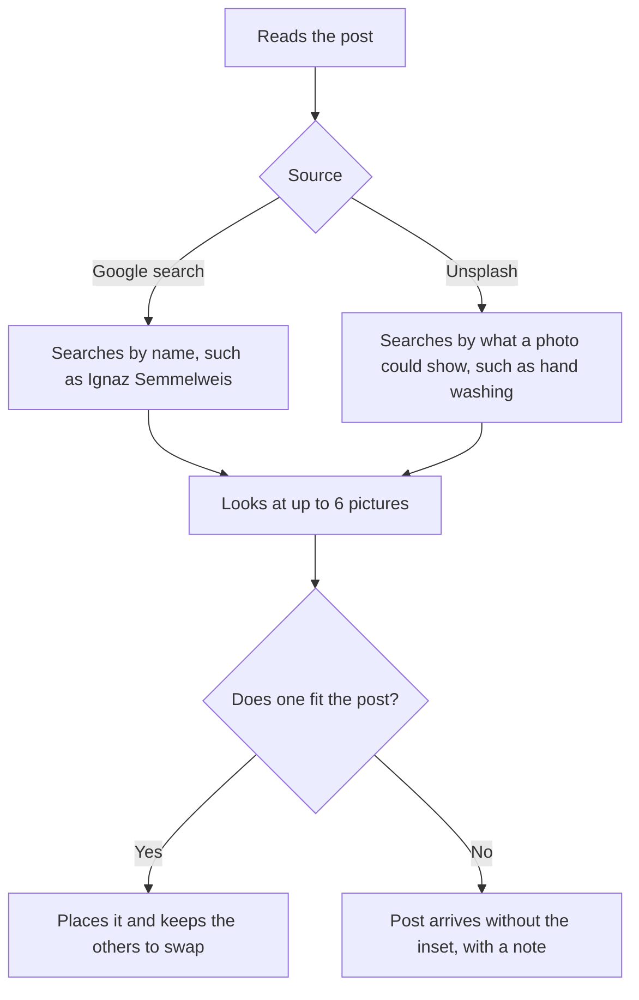

## 1. Executive summary

- **Product**: AI inset finder
- **Status**: Approved
- **Last updated**: 17 September 2026

The AI finds a suitable picture for a post's circular inset and places it, so
the content team no longer searches for one by hand. Each Page chooses where the
AI looks: Google search (SerpAPI) for real people, places and events, or
Unsplash for stock photos.

## 2. Problem & opportunity

- **Problem**: The content team sources inset photos by hand, usually through
  Google image search, adding a manual search to every post that uses one. No
  single source suits every Page: history and news posts need the actual person
  or event, while fitness and recipe posts need general stock photos.
- **Solution**: The AI writes a short search from the post, looks at up to six
  pictures from the chosen source, places the one that fits best, and keeps the
  others as alternatives.

## 3. User requirements

- **Primary user**: the content operator, who creates and reviews posts and is
  responsible for each post's picture.
- **Key use cases**:
  1. Generate posts with a suitable inset already in place.
  2. Choose a source per Page, and change it for one run or one post.
  3. Swap to an alternative, search by keyword, or upload by hand.

### How it works

### Where it is available

| Location | Action |
|---|---|
| Settings, Inset pictures | Choose the Page's source. |
| Generation bar and Manual page | Tick **Find inset** and choose the source for this run. |
| Review, inset panel | Choose the source, then **Find with AI** or **Search** by keyword. |
| Review, inset panel | Select an alternative to swap pictures. |

## 4. Product requirements

### Must have features

- **Find inset when generating**: A Find inset option on the generation bar and
  the Manual page.
  - *Acceptance criteria*: Given Find inset is ticked, when a post is generated,
    then it arrives with an inset in place, or with a note that none was found.
- **Find with AI in Review**: A Find with AI action in the Review inset panel.
  - *Acceptance criteria*: Given a post without an inset, when the operator
    selects Find with AI, then a picture is placed.
- **Source per Page**: A setting that chooses Google search (SerpAPI) or
  Unsplash. Every Page starts on Google search.
  - *Acceptance criteria*: Given a Page set to Unsplash, when the operator finds
    an inset for one of its posts, then the picture comes from Unsplash.
- **Source per run and per post**: A source choice when generating and in
  Review, starting on the Page's setting.
  - *Acceptance criteria*: Given a Page set to Google search, when the operator
    chooses Unsplash for one run, then that run uses Unsplash and the Page's
    setting is unchanged.
- **Never blocks a post**: When no picture fits, the post is still delivered.
  - *Acceptance criteria*: Given no suitable picture, then the post arrives
    without the inset and with a note.

### Should have features

- **Alternatives**: The other pictures considered are kept on the post for a
  one-click swap. Priority: high.
- **Keyword search**: The operator can search by their own keywords in Review.
  Priority: high.
- **Filtered Google results**: Shop listings, watermarked stock photo sites and
  pictures under 600 pixels wide are left out. Priority: high.

## 5. Technical specifications

- **Architecture**: Runs inside the existing app. The chosen picture is copied
  into the app's own image storage, so it still loads when Facebook fetches the
  post.
- **Dependencies**: Google search (SerpAPI), Unsplash, and Google Gemini to
  write the search and choose the picture.
- **Rights**: Pictures from Google search belong to whoever published them, and
  posts carry no photo credit. Unsplash photos are free to use.
- **Limits**: SerpAPI's free plan allows 250 searches a month. Unsplash's free
  tier allows 50 requests an hour.

| Action | Google search (SerpAPI searches) | Unsplash (requests) |
|---|---|---|
| Find with AI | 1 | 2 |
| Swap to an alternative | 0 | 1 |
| Keyword search | 1 | 1 |

## 6. Open questions

| Question | Status |
|---|---|
| Should posts with a Google search inset credit the publisher? | Open |
| Which SerpAPI plan does the monthly volume need? | Open |
| Which Pages should use Unsplash? | Open |
