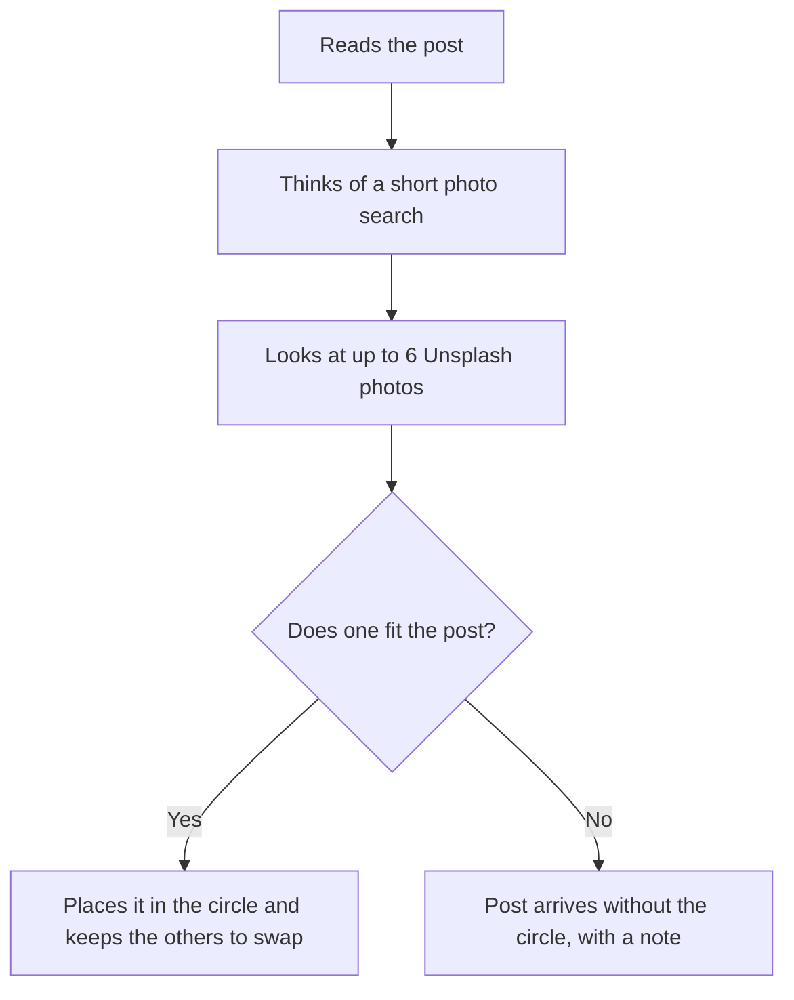

## 1. Executive summary

- **Product**: AI inset finder
- **Status**: Approved
- **Last updated**: 15 September 2026

The AI finds a suitable photo for a post's circular inset and places it, so the
content team no longer searches for one by hand. Released on 15 September 2026.

## 2. Problem & opportunity

- **Problem**: Each post's picture can include a small circular inset photo. The
  client reports that the content team sources these by hand, typically through
  Google image search, which adds a manual search to every post that uses one.
- **Opportunity**: Remove that search from production entirely, while keeping
  the operator free to swap, search or upload when the AI's choice is not right.
- **Solution**: The AI writes a short photo search from the post, looks at up to
  six matching photos, chooses the one that fits best and places it in the
  circle, keeping the others as alternatives.

## 3. User requirements

- **Primary users**:
  - **Content operator**: creates and reviews posts, and is responsible for each
    post's picture.
- **Key use cases**:
  1. Generate posts with a suitable inset already in place.
  2. Swap to one of the alternative photos with one click.
  3. Search with the operator's own keywords when none of the alternatives fit.
  4. Upload a photo by hand when nothing suitable is found.
- **Success criteria**: The operator publishes posts with a suitable inset
  without opening a browser to search for one.

### How it works

A typical search is a short phrase such as "doctor washing hands".

### Where it is available

| Location | Action |
|---|---|
| Generation bar | Tick **Find inset**, beside **No image**, before generating. |
| Manual page | Tick **Find inset**, beside **No image**, before generating. |
| Review, inset panel | **Find with AI** for a post without a photo. |
| Review, inset panel | Select one of **the alternatives** to swap photos. |
| Review, inset panel | **Search** by keyword and select from the results. |

## 4. Product requirements

All requirements below were delivered on 15 September 2026.

### Must have features

- **Find inset when generating**: A Find inset option on the generation bar and
  the Manual page, beside No image.
  - *Acceptance criteria*: Given Find inset is ticked, when a post is generated,
    then the post arrives with an inset photo in place, or with a note that none
    was found.
- **Find with AI in Review**: A Find with AI action in the Review inset panel.
  - *Acceptance criteria*: Given a post without an inset, when the operator
    selects Find with AI, then a photo is placed in the circle.
- **AI choice**: The AI chooses the photo that best fits the post, or none.
  - *Acceptance criteria*: Given no photo suits the post, then no photo is
    placed.
- **Never blocks a post**: When no photo fits, the post is still delivered.
  - *Acceptance criteria*: Given no suitable photo, then the post arrives with
    its text and main picture, without the inset, and with a note.

### Should have features

- **Alternatives**: The other photos considered are kept on the post, so the
  operator can swap in one click without a new search. Priority: high.
- **Keyword search**: The operator can search by their own keywords in the
  Review inset panel and select from the results. Priority: high.

## 5. Technical specifications

- **Architecture**: Runs inside the existing app. The chosen photo is copied
  into the app's own image storage, so it still loads when Facebook fetches the
  post at publishing time.
- **Dependencies**:
  - Unsplash, a library of free stock photos that can be used in posts, on its
    free tier.
  - Google Gemini, the app's existing AI provider, to write the search and
    choose the photo.
- **Performance**: About 17 seconds to find and place a photo. Unsplash's free
  tier allows 50 searches an hour, which is about 25 finds.

| Action | Searches used |
|---|---|
| Find with AI | 2 |
| Swap to an alternative | 1 |
| Keyword search | 1 |

### Image source evaluation

| Option | Outcome |
|---|---|
| Google image search | Not available. The service is closed to new customers and shuts down on 1 January 2027. |
| Wikipedia | Trialled. Strong for well-known people and places, but lacks general photos for the fitness and recipe Pages. |
| Unsplash | Selected. A large library of free stock photos that can be used in posts. |

## 6. Risks & mitigation

| Risk | Impact | Mitigation |
|---|---|---|
| The hourly Unsplash limit is reached | Finds fail until the hour resets | About 25 finds an hour covers current volume; a higher limit is available once photographers are credited |
| The AI chooses an unsuitable photo | A weak inset on a post | Every post is reviewed; alternatives, keyword search and upload are one step away |
| No suitable photo exists | Post without an inset | The post is still delivered, with a note |
| Unsplash is unavailable | No finds | Posts are still delivered; insets can be uploaded by hand |
