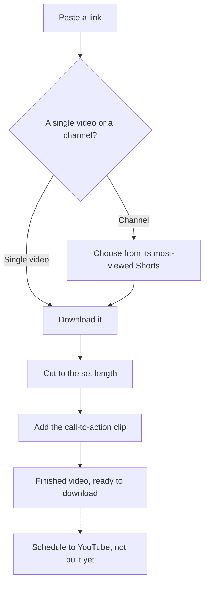

## 1. Executive summary

- **Product**: Shorts tool
- **Status**: Approved
- **Last updated**: 15 September 2026

The Shorts tool turns existing YouTube videos into short clips with the team's
call-to-action clip at the end, inside the main app. Producing videos (stage 1)
is delivered. Publishing them to YouTube through Metricool (stage 2) has not
started.

## 2. Problem & opportunity

- **Problem**: The previous YouTube tool ran as several separate services: a web
  app, a separate processing server and a job queue service. Each was another
  thing to run, pay for and repair, and the tool sat outside the main app.
- **Opportunity**: Rebuilding the tool inside the main app keeps the same
  workflow with fewer services to run and maintain, and puts video production
  beside the rest of the content workflow.
- **Solution**: A Shorts workspace in the main app that downloads a video, cuts
  it to a set length, appends a call-to-action clip and keeps the finished video
  ready to download. Publishing to YouTube follows in stage 2.

## 3. User requirements

- **Primary users**:
  - **Content operator**: produces short videos and posts them to YouTube.
- **Key use cases**:
  1. Turn a single YouTube video or Short into a finished clip.
  2. Pick the most-viewed Shorts from a channel and produce several at once.
  3. Add a new call-to-action clip to the library and use it.
  4. Download a finished video from History.
  5. See which of a channel's videos perform best.
- **Success criteria**: A finished, downloadable video is produced from a link
  with no editing software.

### User flow

### Screens

| Screen | Purpose |
|---|---|
| Produce | Paste a link, select Shorts from a channel, choose or add a call-to-action clip, and start production. |
| History | Every video produced, newest first, with playback and download. |
| Overview | A channel's videos ranked by views, with a comparison against the previous period. |
| Settings | Manage the library of call-to-action clips. |

## 4. Product requirements

### Must have features

- **Produce from a link** (stage 1, delivered): A finished video is produced from
  a link to a single YouTube video or Short.
  - *Acceptance criteria*: Given a valid YouTube link, when production
    completes, then a finished video appears in History, ready to play and
    download.
- **Channel selection** (stage 1, delivered): A channel link lists the channel's
  most-viewed Shorts for selection.
  - *Acceptance criteria*: Given a channel link, then its Shorts are listed by
    view count, and only the selected ones are produced.
- **Cut and append** (stage 1, delivered): Each video is cut to a set length and
  a call-to-action clip from the library is appended.
  - *Acceptance criteria*: Given no length is chosen, then the video is cut to 3
    seconds. Any length from 1 to 60 seconds is accepted. The chosen
    call-to-action clip plays at the end.
- **History** (stage 1, delivered): Every video produced is listed, newest first.
  - *Acceptance criteria*: Given a completed video, then it can be played and
    downloaded from History.
- **Schedule to YouTube** (stage 2, not started): Finished videos are scheduled
  to YouTube through Metricool.
  - *Acceptance criteria*: Given a finished video and a publishing time, when the
    operator schedules it, then it appears in Metricool's planner for that
    channel.
- **Publication tracking** (stage 2, not started): The app records whether each
  scheduled video was published.
  - *Acceptance criteria*: Given a scheduled video whose time has passed, then
    the app shows whether it was published or failed.

### Should have features

- **Channel overview** (stage 1, delivered): A channel's videos ranked by views,
  compared with the previous period. Priority: medium.
- **Schedule actions** (stage 2, not started): Pause, retry, publish now or
  delete a scheduled video. Priority: medium.

## 5. Technical specifications

- **Architecture**: Runs inside the main app, replacing the previous tool's
  separate web app, processing server and job queue service. Finished videos
  are kept in public storage, so YouTube can fetch them when a scheduled post is
  published.
- **Dependencies**:
  - YouTube, as the source of the videos.
  - The app's video storage, with a 50MB limit per call-to-action clip.
  - Metricool, for channel statistics now and scheduling in stage 2.
- **Performance**: Videos are produced in the background, with progress shown on
  screen. Current volume is a handful of videos a day.

## 6. Risks & mitigation

| Risk | Impact | Mitigation |
|---|---|---|
| YouTube blocks downloads from servers | Videos fail to download | The app retries in several different ways; a later retry usually succeeds |
| Publishing remains manual until stage 2 | Extra work to post each video | Finished videos are ready to download; stage 2 removes the step |
| A call-to-action clip exceeds 50MB | The upload is refused | Keep clips short, or compress them before uploading |

## 7. Open questions

| Question | Status |
|---|---|
| When should stage 2, publishing to YouTube, be scheduled? | Open |
